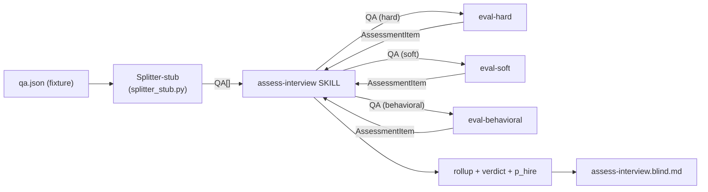

# Skill: Assess Interview (multi-agent, Phase 2)

## Версия

Текущая версия 2.0 Включай версию в отчёт.

## Назначение

Один прогон = одна папка интервью → один markdown-отчёт `assess-interview.blind.md` в той же папке.

Реализует AR-pipeline (`md/arch_agents.md` §1) на стадии Phase 2:



Содержимое отчёта (упрощено по `md/spec.md` §3 ревизия 06-05; расширения постponed):

1. Summary table (быстрый sniff-test).
2. **Verdict** (HIRE / NO_HIRE) + **p_hire** (0..100).
3. Per-question `AssessmentItem[]` по схеме `md/arch_agents.md` §5.2.
4. **Pipeline trace** — observability.

Не использует KB / corpus, не сравнивает с другими интервью кандидата, не делает with-feedback mode (отложено в следующую мини-итерацию).

## Соответствие spec.md / arch_agents.md

Реализует тот же scope требований, что `feedback-report` (E3-4 «Отчёт по интервью», `md/spec.md` §7), но на multi-agent runtime. Различия:

- **Splitter** — заглушка `.claude/skills/assess-interview/splitter_stub.py` (читает `<folder>/qa.json`); реальный Splitter — Phase 1 Риты, заменит `Bash(splitter_stub.py)` на `Agent(subagent_type="splitter")` в Шаге 2. Stub сейчас лежит внутри скилла как его внутренняя деталь; при появлении других потребителей (KB-pipeline) — переедет в общую `tools/`.
- **Evaluator** — три субагента `eval-{hard,soft,behavioral}` в `.claude/agents/`. Каждый получает один `QA` + контекст (vacancy, cv) и возвращает один `AssessmentItem` JSON.
- **Aggregator** — в этом orchestrator-skill'е (Шаги 5, 5.5). Не выносится в субагент по `md/arch_agents.md` §8 (теряется глобальный взгляд).

Не реализуется в этой итерации (см. план `~/.claude/plans/jolly-gliding-rocket.md`):

- KBRetriever (`md/arch_agents.md` Phase 3).
- with-feedback mode.
- EvalLogger / traces на диск.
- Versioning субагентов.
- Кеширование результатов.

## Вход

**Обязательный аргумент:** путь к папке интервью.

**Опциональный флаг:** `qa=<path>` — override фикстуры (передаётся в `splitter_stub.py --fixture`). Полезно для acceptance test и сравнения разных фикстур.

- Если `args` пуст → AskUserQuestion с перечнем папок: `transcripts/mock-*` плюс любые `transcripts/*-*-*` с файлом `transcript.txt`.
- Mode фиксируется = `blind` (with-feedback не реализован).

Папка должна содержать:
- `qa.json` (или передан через `qa=<path>`) — обязательно;
- `vacancy.txt`, `cv.md` — опционально, передаются в evaluator-ов как контекст;
- `transcript.txt` — опционально, нужен только для self-check verbatim grep'абельности.

## Конфигурация

- **Рабочий каталог:** корень репо (`git rev-parse --show-toplevel`).
- **Splitter-stub:** `.claude/skills/assess-interview/splitter_stub.py` (Python 3, stdlib only). CLI: `python .claude/skills/assess-interview/splitter_stub.py <folder> [--fixture <path>]`.
- **Evaluator-субагенты:** `.claude/agents/eval-hard.md`, `eval-soft.md`, `eval-behavioral.md`. Запуск через `Agent` tool с `subagent_type=eval-<type>`.
- **Schema референс:**
  - `QA` — `md/arch_agents.md` §5.1.
  - `AssessmentItem` — `md/arch_agents.md` §5.2.
  - `AlignmentReport` (минимальный) — `md/arch_agents.md` §5.3 / `md/spec.md` §3.
  - Score-критерии — `md/assessors.md`.
- **Output:**
  - blind → `<folder>/assess-interview.blind.md`
  - Коллизия — `assess-interview.blind.v2.md`, `.v3.md` и т.д.

## Алгоритм

### Шаг 0: Парсинг входа

1. Выделить позиционный аргумент — путь к папке.
2. Распарсить `qa=<value>` если есть.
3. Mode фиксируется = `blind` (если пользователь передал `mode=with-feedback` — отказать с сообщением «with-feedback не реализован в Phase 2; используй feedback-report skill»).

### Шаг 1: Валидация входа

Поведение при разной заполненности — `md/spec.md` §3.1.

1. Папка существует. Если нет — стоп.
2. Перечислить наличные файлы из `{cv.md, vacancy.txt, transcript.txt}`. Все опциональны на этом шаге.
3. Существование `qa.json` **не проверяется здесь** — это ответственность Шага 2 (`splitter_stub.py` вернёт exit 2 если фикстуры нет).

### Шаг 2: Splitter (mocked)

Bash-tool: `python .claude/skills/assess-interview/splitter_stub.py <folder>` (с `--fixture <path>` если был override через `qa=<path>`).

- Exit 0 → распарсить stdout как JSON-массив; это `QA[]`.
- Exit 2 → стоп с пробросом stderr пользователю («положи `<folder>/qa.json` или жди Phase 1 Splitter'а Риты»).
- Exit 3 → стоп с пробросом stderr (схема нарушена; показать конкретные ошибки).

**Точка замены при Phase 1 (Рита).** Когда реальный Splitter-агент будет готов, этот один Bash-tool сменится на:
```
Agent(subagent_type="splitter", prompt=<transcript_text>)
```
с тем же выходным контрактом `QA[]` JSON. Остальной алгоритм не меняется.

### Шаг 3: Q&A extraction → пропускается

Делегировано Splitter-stub'у в Шаге 2. См. `md/arch_pipeline.md` §2 ① (общая часть pipeline).

### Шаг 4: Dispatch в evaluator-субагенты

Это **ключевой** шаг — Шаг 4 текущего `feedback-report` целиком переезжает в субагенты; здесь только plumbing.

1. Прочитать `vacancy.txt` (если есть) → `vacancy_text`. Если нет — `vacancy_text = ""`.
2. Прочитать `cv.md` (если есть) → `cv_text`. Если нет — `cv_text = ""`.
3. Для каждого `qa` из `QA[]` определить `subagent_type`:
   - `qa.type == "hard_skill"` или `"hard"` → `eval-hard`;
   - `qa.type == "soft_skill"` или `"soft"` → `eval-soft`;
   - `qa.type == "behavioral"` → `eval-behavioral`.
4. **Параллельный диспатч.** В одном assistant-сообщении выполнить N `Agent` tool calls, по одному на каждый QA. Prompt каждого вызова — JSON-сериализованная строка:
   ```json
   {"qa": <QA-объект>, "vacancy_text": "<содержимое vacancy.txt>", "cv_text": "<содержимое cv.md>"}
   ```
   Concurrency cap — **8–10 одновременных**. Если QA пар больше 15 → батчами по 8–10. Это пока эвристика (см. open question 3 в `~/.claude/plans/jolly-gliding-rocket.md`).
5. Для каждого ответа субагента:
   - Извлечь JSON `AssessmentItem` (если обёрнут в код-блок ``` ```json ``` — снять).
   - Валидировать схему по `md/arch_agents.md` §5.2: наличие `qa`, `assessor_kind`, `assessor_name`, `score.{question_fit, focus, clarity, completeness, factual_correctness}`, `expected_answer`, `comment`, `aggregate`.
   - Если схема нарушена → один retry того же субагента с явной коррекцией («предыдущий ответ нарушил схему: …; верни валидный JSON»).
   - При повторной неудаче → записать в отчёт placeholder с `aggregate="missing"` и пометкой «evaluator failed»; продолжить.
6. Собрать `AssessmentItem[]` в порядке исходного `QA[]` (по `qa.question.transcript_time`).

**Параллельность Agent tool calls** (`md/arch_agents.md` §9 open question) — подтвердить эмпирически на первых прогонах. Если параллельность не работает — fallback на последовательный цикл; логировать в `## Pipeline trace`.

### Шаг 5: Markdown-render

`AssessmentItem[]` уже готов; здесь только рендер.

1. Сортировать items по `qa.question.transcript_time` (уже отсортированы после Шага 4.6, но на всякий случай).
2. Сгенерировать **summary table** + per-question блоки (формат — см. Шаг 7).

Mode = `blind` → секция `### Interviewer's signal` отсутствует. Слово `feedback` не должно встречаться в теле (кроме имени файла, если случайно).

### Шаг 5.5: Verdict + p_hire

Идентично `feedback-report` Шаг 5.5 (стартовая эвристика, действует до прогона на нескольких кейсах):

1. **Решение** — ровно одно из `HIRE` / `NO_HIRE`.
2. **Стартовая эвристика для verdict**:
   - `NO_HIRE`, если **≥1 `aggregate ∈ {weak, missing}`** среди items с `qa.type ∈ {hard_skill, hard}` или `qa.interview_stage ∈ {tech_qa, technical_qna, tech_coding, technical_coding, tech_case, technical_case, system_design}` (критичные hard-вопросы).
   - `HIRE` иначе.
   - Все `adequate`, нет явных weak/missing, нет ярких strong → `HIRE` по умолчанию.
3. **p_hire** — целое 0..100, согласовано с verdict (`≥50` ⇔ `HIRE`).
4. **Калибровка p_hire** (внутренний руководящий принцип, не показываем в отчёте):

   | Картина | p_hire ориентир |
   |---|---|
   | ≥1 missing/weak в core hard_skill QA + нет компенсирующих strong | 15–35 |
   | Mostly adequate, без явных red flags, без ярких strong | 40–55 |
   | ≥2 strong в JD-relevant областях + только мелкие weak в периферии | 60–75 |
   | Bar-raising: strong по hard_skill ядру + нет weak | 75–90 |

5. **Обоснование** — 3-5 буллетов (за / против / главный фактор).

### Шаг 6: Self-check

Базовый чек-лист (по `md/spec.md` §3, `md/assessors.md`, E3-4):

- [ ] Каждый `AssessmentItem.qa` имеет `transcript_time` в обоих LinkedText.
- [ ] Цитаты verbatim — grep'абельны в `transcript.txt` (если файл есть).
- [ ] `qa.type` ∈ `{hard_skill, hard, soft_skill, soft, behavioral}`.
- [ ] `qa.interview_stage` и `qa.topic_tag` заполнены.
- [ ] `score.{question_fit, focus, clarity, completeness, factual_correctness}` заполнены.
- [ ] `aggregate`-ярлык согласован с triplet по правилу `_shared-evaluator-rules.md`.
- [ ] При `aggregate ∈ {weak, adequate}` задан `weakness_kind ∈ {vague, off-topic, factual_error, incomplete}`.
- [ ] `rationale` обоснован цитатой/наблюдением.

**Multi-agent специфичные дополнения:**

- [ ] Каждый `AssessmentItem.assessor_name` начинается с `eval-{hard,soft,behavioral}@` — sanity-check, что dispatch реально сходил в субагента (а не один общий agent).
- [ ] Распределение `assessor_name` по типам соответствует распределению `qa.type` в `QA[]` (не смешано).
- [ ] Распределение `aggregate` правдоподобно: не все items одного ярлыка; если все `strong` — подозрительно (evaluator может галлюцинировать).
- [ ] Для `qa.type = behavioral`: `score.star` (4 binary) и `score.amazon_spid` (4 шкалы 0..3) заполнены; в `comment` есть пометка про `md/spec.md` §8.
- [ ] Для `qa.type ∈ {hard_skill, hard, soft_skill, soft}`: `score.star = null`, `score.amazon_spid = null`.

**Blind-mode:**

- [ ] Слова `feedback`, «интервьюер отметил», «совпадает с заметками интервьюера» нигде в теле отчёта.
- [ ] Verdict и p_hire присутствуют; `p_hire ≥ 50` ⇔ `HIRE`.

Если хоть один пункт не выполнен — исправить перед записью.

### Шаг 7: Запись результата

1. Путь: `<folder>/assess-interview.blind.md`. Коллизия → `.v2.md`, `.v3.md`.
2. **Frontmatter:**
   ```yaml
   ---
   author: claude-code-assess-interview-v0.1
   source_folder: <folder>
   mode: blind
   pipeline: phase-2-evaluator-only
   generated_at: <YYYY-MM-DD>
   inputs_present:
     - qa.json (fixture)
     - cv.md            # если есть
     - vacancy.txt      # если есть
     - transcript.txt   # если есть
   spec_compliance:
     scope: candidate-context
     covers: [E1-4, E1-5, E3-4]
     divergences: [behavioral-evaluation]
     postponed: [E3-5, E3-6, E3-7, KB-grounding, with-feedback-mode]
   ---
   ```
3. **Структура тела:**
   ```
   # Assess Interview Report (blind, multi-agent v0.1) — <Candidate> × <Company> (<YYYY-MM-DD>)

   ## Summary table
   | #  | Тема (topic_tag) | type        | interview_stage | aggregate | weakness_kind | Time  | Assessor       |
   |----|------------------|-------------|-----------------|-----------|---------------|-------|----------------|
   | Q1 | experimentation  | hard_skill  | tech_qa         | adequate  | incomplete    | 00:34 | eval-hard      |

   ## Verdict
   - **Решение:** HIRE | NO_HIRE
   - **p_hire:** NN
   - **За:** ...
   - **Против:** ...
   - **Главный фактор:** ...

   ## Assessment Items

   ### Q1 — <topic_tag> (<type> / <interview_stage>, <time>)
   - **question** [`MM:SS`]: «verbatim quote»
   - **candidate_answer** [`MM:SS → MM:SS`]: «verbatim quote, можно `…`»
   - **expected_answer**: ...
   - **type**: hard_skill
   - **interview_stage**: tech_qa
   - **topic_tag**: experimentation
   - **assessor_name**: eval-hard@<date>
   - **score**:
     - question_fit: true / focus: true
     - clarity: 2 / completeness: 2 / factual_correctness: 3 → aggregate: adequate
     - (для type=behavioral: star + amazon_spid)
     - weakness_kind: incomplete
     - rationale: ...
   - **comment**: ...

   ## Pipeline trace
   - Splitter: tools/splitter_stub.py (deterministic mock; fixture: <path>)
   - Evaluator dispatch: N hard / M soft / K behavioral; parallel
   - Aggregator: this orchestrator session
   ```
4. После записи — короткий ответ пользователю: путь + summary (количество Q, распределение по type, verdict, p_hire).

## Нюансы

- **Концепт:** этот skill — orchestrator (стадия ③ AR-pipeline'а, `md/arch_agents.md` §4.1); вся «оценочная работа» в субагентах.
- **Параллельность.** В Phase 2 рассчитываем на параллельный dispatch через несколько `Agent` tool calls в одном сообщении. Если эмпирически параллельность не работает — fallback на последовательный цикл, логируем в `## Pipeline trace` (вместо `parallel` пишем `sequential`). Это open question `md/arch_agents.md` §9.
- **Concurrency cap.** Для интервью с >15 QA пар — батчами по 8–10. Эвристика, корректируется после первых прогонов.
- **Drift в субагентах.** `_shared-evaluator-rules.md` (в этой папке скилла, `shared-evaluator-rules.md`) — source of truth для правил оценки. В трёх eval-* субагентах общий блок копипастен. При обновлении правил — обновить во всех 4 файлах одновременно. Self-check на drift не реализован в этом skill (open question).
- **Mode.** Только `blind`. With-feedback — следующая мини-итерация (orchestrator-only изменение, evaluator-ы остаются mode-agnostic).

## Ограничения

- Один прогон = одна папка, blind-only.
- Не сравнивает с другими интервью кандидата (`MemoryState` postponed, `md/spec.md` §8).
- Не использует Knowledge Base / curated corpus / `Requirements` / `Rubric` (Phase 3).
- Не редактирует входные файлы.
- Требует `<folder>/qa.json` — без фикстуры (или `--fixture` override) запуск падает с exit 2.

## Пример сессии

```
user: /assess-interview transcripts/mock-avito-product-analyst-middle-2024-04-04
assistant:
  [parse] folder=transcripts/mock-..., mode=blind
  [validate] папка существует, файлы: transcript.txt
  [splitter-stub] read 12 items from transcripts/mock-.../qa.json; types: behavioral=2, hard_skill=8, soft_skill=2; validation: OK
  [dispatch] 12 evaluator calls in parallel: 8 eval-hard / 2 eval-soft / 2 eval-behavioral
  [collect] AssessmentItem[12]; распределение aggregate: 1 strong / 7 adequate / 4 weak / 0 missing
  [verdict] NO_HIRE, p_hire = 35 (≥1 weak в core hard_skill)
  [self-check] OK; assessor_name распределён корректно по type
  wrote: transcripts/mock-.../assess-interview.blind.md
  Summary: 12 Q (8/2/2 hard/soft/behavioral); NO_HIRE @ p_hire 35; pipeline=phase-2-evaluator-only
```
