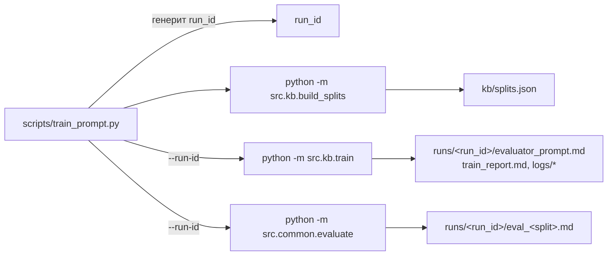

# Skill: Scoring Prompt Trainer

## Назначение

Один прогон = один `build_splits → train → evaluate` цикл MIPROv2 над hard-QA golden set'ом. Все артефакты одного прогона живут в `runs/<run_id>/`, где `run_id = YYYY-MM-DD_HH-MM-SS` (локальная TZ, генерируется обёрткой и симметрично прокидывается в `train` и `evaluate` через `--run-id`).

После прогона `runs/<run_id>/evaluator_prompt.md` подключается как system-prompt к субагенту `.claude/agents/scoring-evaluator.md`. Папка `runs/` целиком в `.gitignore`.

## Архитектура



## Запуск

```bash
python scripts/train_prompt.py [options]
```

Параметры (`python scripts/train_prompt.py --help`):

- `--run-id STR` — переопределить run_id (default: now() в локальной TZ).
- `--smoke` — быстрый цикл: 2 source_id, 17/7 QA (вместо 6/57/24).
- `--num-trials INT` — MIPROv2 num_trials (default 3).
- `--num-candidates INT` — MIPROv2 num_candidates (default: зеркалит num-trials).
- `--prompt-model STR` — proposer LM: `haiku` | `sonnet` | `opus` | `gpt-4o-mini` | `gemini-flash` | полный id (default: `sonnet`).
- `--no-phoenix` — отключить Phoenix UI (JSONL trace всё равно пишется).
- `--eval-splits {test,train,both}` — какие split'ы прогнать в evaluate (default: `test`).
- `--skip-eval` — только build+train, без evaluate.

## Артефакты одного прогона (`runs/<run_id>/`)

- `evaluator_prompt.md` — обученный system prompt + frontmatter с метриками.
- `train_report.md` — MAE per metric/source, worst-20 cases, bootstrap CI.
- `logs/train.jsonl` — per-call cost/tokens/latency (CostCallback).
- `logs/train.trace.jsonl` — полные prompt+response per LM call (PromptTracer).
- `eval_<split>.md` — отчёт evaluate.py (MAE per metric/source_id, top-20 worst).

## Прерогативы

- **Phoenix UI** на http://localhost:6006 во время прогона (project: `evaluator-train-<run_id>`). Требует `pip install -e ".[tracing]"`.
- **Re-evaluate существующего прогона:** `python -m src.common.evaluate --run-id <id> --split test|train`.
- **Если python падает с ошибкой — не правь сам.** Сообщи о падении.
