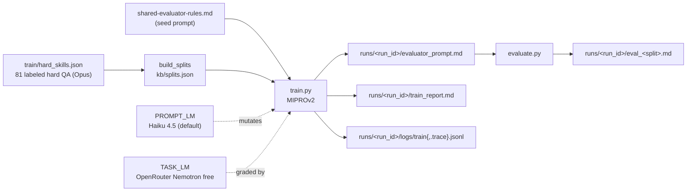

# Skill: Scoring Prompt Trainer (Phase 3)

## Идентификация прогонов

Каждый запуск `train.py` создаёт новую папку `runs/<YYYY-MM-DD_HH-MM-SS>/` (timestamp в локальной TZ, фиксируется один раз в начале запуска). Имя папки = `run_id`; оно же пишется в frontmatter prompt'а и в заголовок отчёта. Семантического `vN`-версионирования больше нет.

## Назначение

Один прогон = один train→test цикл MIPROv2 над hard-QA golden set'ом. Артефакты:

- `kb/splits.json` — фиксированный train/test индекс (детерминированно по seed=42; один раз, не перетирается).
- `runs/<run_id>/evaluator_prompt.md` — обученный system prompt + frontmatter с метриками.
- `runs/<run_id>/train_report.md` — MAE per metric/source, worst-20 cases, bootstrap CI.
- `runs/<run_id>/logs/train.jsonl` — per-call cost/tokens/latency (CostCallback).
- `runs/<run_id>/logs/train.trace.jsonl` — полные prompt+response per LM call (PromptTracer).
- `runs/<run_id>/eval_<split>.md` — отчёт evaluate.py (пишется рядом с prompt'ом, см. Шаг 3).

После прогона артефакт `runs/<run_id>/evaluator_prompt.md` подключается как system-prompt к субагенту `.claude/agents/scoring-evaluator.md` (живёт параллельно с eval-{hard,soft,behavioral}, не ломает Phase 2 binary-контракт).

Папка `runs/` целиком в `.gitignore`. Старые `kb/evaluator_prompt_v*.md` и `logs/train_v*.jsonl` оставлены как исторические артефакты предыдущей схемы.

### Observability (опционально)

- **Phoenix UI** на http://localhost:6006 — интерактивное дерево compile→trial→LM call. Требует `pip install -e ".[tracing]"`. Отключается флагом `--no-phoenix`. Project name в Phoenix: `evaluator-train-<run_id>`.

## Архитектура (контекст)



Подробности — см. план `~/.claude/plans/elegant-chasing-planet.md` (architecture diagrams, decisions D1-D14, risks R1-R8).

## Prerequisites

1. `.env` с `ANTHROPIC_API_KEY` и `OPENROUTER_API_KEY` (см. `.env.example`).
2. `pip install -e .` (deps: dspy-ai>=2.5, anthropic>=0.40). Для Phoenix UI: `pip install -e ".[tracing]"`.
3. Golden set уже существует: `train/hard_skills.json` (81 labeled QA, 8 unscored auto-excluded).

## Шаги

### Шаг 1 — Split

```bash
python -m src.train.build_splits [--smoke]
```
Пишет `kb/splits.json`. Smoke: 2 source_id → 17/7 QA. Full: 6 source_ids → 57/24 QA.

### Шаг 2 — Train

```bash
python -m src.train.train --budget light
```

Запускает DSPy MIPROv2. Параметры (из `src/train/llm_factory.py`):
- task_model: `openrouter/nvidia/nemotron-3-super-120b-a12b:free`
- prompt_model: `anthropic/claude-haiku-4-5-20251001` (default; override `--prompt-model {sonnet|gpt-4o-mini|gemini-flash}`)
- num_threads=4 (под free-tier 20 req/min)
- num_retries=5 (exp backoff)

Бюджет: light ~$1/smoke на Haiku (~$3 на Sonnet), full пропорционально. Time: ~10-30 min.

В начале запуска stdout печатает путь к свежей папке `runs/<run_id>/`, куда сложатся `evaluator_prompt.md`, `train_report.md`, `logs/train.jsonl`, `logs/train.trace.jsonl`.

### Шаг 3 — Evaluate (опционально, отдельно от train)

```bash
python -m src.train.evaluate --prompt runs/<run_id>/evaluator_prompt.md --split test
```

Пишет `runs/<run_id>/eval_test.md` (рядом с prompt'ом) с MAE per metric/source_id и top-20 worst cases. Override места: `--out <path>`.

