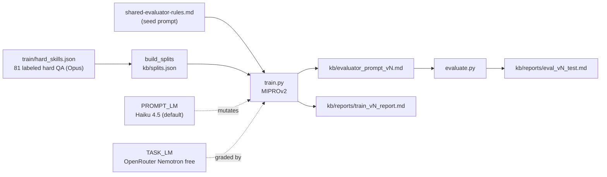

# Skill: Scoring Prompt Trainer (Phase 3, v1)

## Версия

v1. Включай номер версии в отчёт (`out-version vN`).

## Назначение

Один прогон = один train→test цикл MIPROv2 над hard-QA golden set'ом → **три** артефакта:

- `kb/splits.json` — фиксированный train/test индекс (детерминированно по seed=42)
- `kb/evaluator_prompt_v<N>.md` — обученный system prompt + frontmatter с метриками
- `kb/reports/train_v<N>_report.md` — MAE per metric/source, worst-20 cases, bootstrap CI

После прогона артефакт `kb/evaluator_prompt_v<N>.md` подключается как system-prompt к субагенту `.claude/agents/scoring-evaluator.md` (живёт параллельно с eval-{hard,soft,behavioral}, не ломает Phase 2 binary-контракт).

### Observability артефакты (опционально)

- `logs/train_v<N>.jsonl` — per-call cost/tokens/latency (CostCallback, всегда пишется).
- `logs/train_v<N>.trace.jsonl` — полные prompt+response per LM call (PromptTracer, всегда пишется). Не в git (`logs/` в `.gitignore`).
- **Phoenix UI** на http://localhost:6006 — интерактивное дерево compile→trial→LM call. Требует `pip install -e ".[tracing]"`. Отключается флагом `--no-phoenix`.

## Архитектура (контекст)



Подробности — см. план `~/.claude/plans/elegant-chasing-planet.md` (architecture diagrams, decisions D1-D14, risks R1-R8).

## Prerequisites

1. `.env` с `ANTHROPIC_API_KEY` и `OPENROUTER_API_KEY` (см. `.env.example`).
2. `pip install -e .` (deps: dspy-ai>=2.5, anthropic>=0.40). Для Phoenix UI: `pip install -e ".[tracing]"`.
3. Golden set уже существует: `train/hard_skills.json` (81 labeled QA, 8 unscored auto-excluded).

## Шаги

### Шаг 1 — Split

```bash
python -m src.train.build_splits [--smoke]
```

Пишет `kb/splits.json`. Smoke: 2 source_id → 17/7 QA. Full: 6 source_ids → 57/24 QA.

**Проверь** что `excluded_unscored = 8` в выводе — иначе golden set изменился, остановись и сверь с `train/hard_skills.json`.

### Шаг 2 — Train

```bash
python -m src.train.train --budget light --out-version v1
```

Запускает DSPy MIPROv2. Параметры (из `src/train/llm_factory.py`):
- task_model: `openrouter/nvidia/nemotron-3-super-120b-a12b:free`
- prompt_model: `anthropic/claude-haiku-4-5-20251001` (default; override `--prompt-model {sonnet|gpt-4o-mini|gemini-flash}`)
- num_threads=4 (под free-tier 20 req/min)
- num_retries=5 (exp backoff)

Бюджет: light ~$1/smoke на Haiku (~$3 на Sonnet), full пропорционально. Time: ~10-30 min.

Пишет `kb/evaluator_prompt_v1.md` (system prompt + frontmatter) и `kb/reports/train_v1_report.md`.

### Шаг 3 — Evaluate (опционально, отдельно от train)

```bash
python -m src.train.evaluate --prompt kb/evaluator_prompt_v1.md --split test
```

Пишет `kb/reports/eval_v1_test.md` с MAE per metric/source_id и top-20 worst cases.


## Acceptance criteria

| Метрика | Smoke | Full |
|---|---|---|
| `test_mae` | < 0.9 | < 0.7 |
| `accuracy_pm1` | > 0.75 | > 0.8 |
| `test_mae_ci_95` width | — | < 0.5 |
| `test_failures` (parse errors) | < 30% от теста | < 30% от теста |

Если не сходится — фиксируй в отчёте, эскалируй пользователю: (a) вернуть Haiku как task_model, либо (b) расширить golden до 15+ source_ids.

## Что делает скилл (для оркестратора)

2. Убедись, что `train/hard_skills.json` существует и в нём есть `items[].reference_score.factual_correctness != null`
3. Запусти `python -m src.train.build_splits` (или `--smoke` если user явно попросил)
4. Запусти `python -m src.train.train --budget <auto-pick> --out-version <next-version>`
5. Запусти `python -m src.train.evaluate --prompt kb/evaluator_prompt_<vN>.md --split test`

## Out of scope (v1)

- Vacancy/CV из signature убраны (D14) — labeling policy их игнорирует
- Soft и behavioral QA не тренируются (golden labels пока только для hard)
- Session-level split — добавим в Phase 3.5, когда будет ≥15 source_ids
- Авто-фоллбэк на Haiku при провале free — намеренно отсутствует (D10), явный fail предпочтительнее
