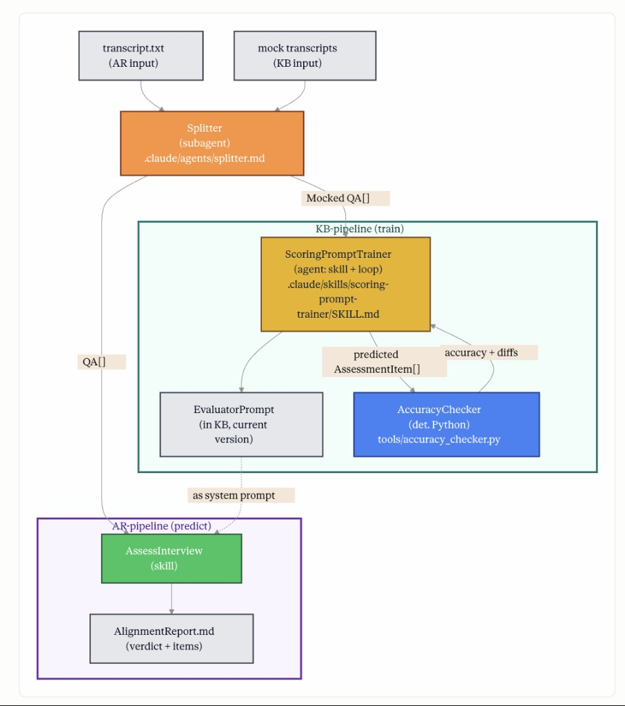

# Post-Interview Debrief Assistant — project report

**Course:** Intro to AI Agents — Data Sanity (Belgrade, 2026)  
**Team:** AM Best Offer — Anton Voskobovich, Margarita Markova  
**Mentor:** Alex Svetkin  

This document is the **final project report** and system overview for reviewers and defense.  
Last updated: 2026-05-21

**Repo map:** [`README.md`](../README.md)

---

## Introduction

**Product.** Post-Interview Debrief Assistant is an **AI workflow** that helps a candidate review a finished job interview. It takes a job interview transcript (and optionally a CV and job description), runs a fixed pipeline, and returns a **debrief report**: per-question scores and comments plus an overall hire recommendation.

**Who it is for.** Candidates who already have a recording or transcript and want a structured post-mortem before the next interview round — especially in **data science, analytics, and related technical roles**. It is not a mock-interview simulator or a recruiter tool; you supply your own materials.

**Why we built it.** Both authors are job-hunting and need systematic feedback on the past interviews: how each answer matched expectations and what to improve — using DS/analytics evaluation standards, not generic career advice.

**Why a plain LLM chat is not enough.** Results are hard to reproduce, lack a fixed schema, skip quality checks on extraction and scoring, and rely on unclear sources. We use a **curated knowledge base** of interviews we trust instead of open-web retrieval.

### Main output (what the user actually gets)

For **course grading** (“meaningful end-to-end output”), the deliverable is **not** the intermediate JSON — it is the **debrief report**:

| Stage | Artifact | Who consumes it |
|-------|----------|-----------------|
| Splitter | `*.vN.qa-split.json` (+ validation report) | KB train, internal QA |
| Evaluator (per Q) | scores on factual / focus / clarity → weak / adequate / strong | Aggregator |
| **Assess interview** | **`feedback-report.blind.md`** or **`assess-interview.blind.md`** | **Candidate** — summary table, per-question feedback, **HIRE / NO_HIRE**, hire probability |

Example debrief already in repo: `data/knowledgebase/raw/mock-interviews/karpov/data-scientist-junior-karpov-2022-03-30/`.

### Alignment with course rubric (Technical Implementation, 20 pts)

| Rubric criterion (max) | How we address it | Where in this doc |
|------------------------|-------------------|-------------------|
| Approach (workflow / agent, 0–5) | Fixed **prompt-chaining** pipeline + generator–evaluator loop on Splitter; KB train for Evaluator — not a single spaghetti script | *System design*, *How we built* |
| Architecture (0–4) | Splitter / KB / AR modules, separate skills + `src/kb`, `src/ar` | *How data is organized* |
| End-to-end + meaningful output (0–4) | Transcript → Q&A → scores → debrief; mock path validated, real path demonstrated | *Main output*, *End-to-end examples* |
| Metrics + interpretation (0–4) | Splitter Coverage/Topic/semantic; Evaluator MAPE, accuracy ±1 on held-out test | *Evaluation, logging, and tests* |
| Unit + integration tests (0–2) | `pytest tests/` on metrics and loggers; deterministic splitter checks on artifacts | same section |
| Logging LLM I/O (0–1) | `pipeline-log.md`, `validation-report.md`, `runs/<run_id>/` | *Logging* |

*Interface (10 pts)* and *Presentation (20 pts)* are separate: demo via skills (`/splitter`, feedback-report) or screenshots; this file is the **checkpoint / defense report**.


## System design

### Tools in the pipeline

After an interview, the candidate has a transcript and often a CV and job description. The system always runs the same chain: **split dialogue → score each answer → write one debrief report**.

```text
transcript.txt (+ optional cv.md, vacancy.txt)
        │
        ▼
   ┌─────────┐
   │ Splitter│  →  structured Q&A (JSON)
   └─────────┘
        │
        ▼
   ┌──────────┐
   │ Evaluator │  →  score per question (weak / adequate / strong)
   └──────────┘
        │
        ▼
   ┌──────────────────┐
   │ Assess interview │  →  debrief report (Markdown)
   └──────────────────┘
```

**Splitter** — **extraction.** Reads `transcript.txt` (and optional `timecodes.txt`) and produces `*.qa-split.json`: for each item, **interviewer question**, **candidate answer**, **question type** (hard / soft / behavioral), **topic**, **interview stage**, and timestamps. On mock sessions, if the instructor states an expected answer in the recording, we also store **reference answer** and **interviewer feedback**; on real interviews those fields are often empty. Implementation: five-step workflow in [`.claude/skills/splitter/`](../.claude/skills/splitter/) — Python prepares prompts and validates; the model fills JSON in step 2 and (for YouTube mocks) runs a semantic check in step 5. Each run is versioned (`vN`); failed validation triggers a **new version** with a full re-extraction, not a patch on old JSON.

**Evaluator** — **scoring.** Takes one Q&A (plus optional CV and job description) and judges the answer. The debrief shows **weak / adequate / strong** per question. Under the hood the prompt scores **factual correctness**, **focus** (on-topic vs drifting), and **clarity** ([`spec/assessors.md`](spec/assessors.md)); the three labels are rolled up from these axes. On the knowledge base, scores are tuned against human **reference_score** labels on mock Q&A (see *How we built the system* below).

**Assess interview** — **reporting.** Rolls all per-question assessments into one Markdown file (e.g. `feedback-report.blind.md`): summary table, per-question feedback (question, your answer, expected answer, comment), and **HIRE / NO HIRE** with hire probability in blind mode. Implemented as `.claude/skills/feedback-report/` and `.claude/skills/assess-interview/` (multi-agent variant routes hard / soft / behavioral to different evaluator prompts).

**Workflow, not an open agent.** The model does not choose the next step. Steps are chained in a fixed order (**prompt chaining**). Splitter uses a **generator–evaluator loop**: produce Q&A → validate → correct until checks pass. **Python** handles prepare scripts, chapter alignment, verdict gates, train/test splits, and metric reports.

### How data is organized

Information lives in **three modules**:

- **Candidate Context** — one candidate’s materials: CV, vacancies, interview transcripts, and generated debriefs. This is where a **real** debrief runs: materials in, report out.

- **Knowledge Base (KB)** — corpus of 70+ mock interviews from YouTube (data science, analytics, ML, etc.). Used to validate Splitter and to train/test the Evaluator on labeled mock Q&A (reference answer and reference score where instructors provide ground truth).

- **Assessment & Recommendations (AR)** — scoring and reporting logic (Evaluator + assess interview).

The candidate sees only the result of the debrief. Splitter validation and KB train metrics are internal.



*Figure: both **KB (train)** and **AR (predict)** use the same **Splitter**. Today Splitter runs as a **Claude Code / Cursor skill** (`.claude/skills/splitter/SKILL.md`); the “subagent” label on the diagram is legacy.*

---

## How we built the system

### Interview corpus
We assembled a **knowledge base of 70+ YouTube interview sessions**. Most are **staged mocks** with an instructor who asks questions and explains expected answers; a smaller part are **breakdowns or recordings of real rounds**.

- **Domains:** data science, analytics, ML engineering, system design, behavioral, data engineering, and BI  
- **Levels:** junior through senior; **mostly junior and middle**  
- **Employers in cases:** Amazon, Meta, Google, Uber, Avito, Sber, and other Russian and international companies

**Sources:**
- **Karpov.Courses & Yandex Praktikum** — Russian DS/DA/ML education channels; mock interviews with a live instructor  
- **Interview Query (Jay Feng)** — mocks for US / global tech  
- **Vadim Novoselov** — breakdowns and recordings of **real** interviews at Russian companies  
- **interviewing.io, DataInterview, Data Engineers PRO** — English-language mock / prep channels (ML, analytics, data engineering)  

**Download tool.** To add sessions to the corpus we built **`download-transcript`** ([`src/transcriptdownloader/main.py`](../src/transcriptdownloader/main.py)). It takes a **YouTube video URL or playlist URL**, fetches subtitles and metadata, and writes **one folder per session** under `data/knowledgebase/raw/` (naming rules in [`data/knowledgebase/raw/README.md`](../data/knowledgebase/raw/README.md)).

**Output files:**
- **`transcript.txt`** — full subtitle text as plain dialogue (no timestamps); used when timecodes are not required.
- **`timecodes.txt`** — the same subtitles with **YouTube-style timestamps** (`[mm:ss]` or `[hh:mm:ss]`) on each line; preferred input for alignment and for the Splitter.
- **`video.md`** *(optional)* — video title, description, and **chapter list** when YouTube provides chapters. Used **after** Q&A extraction to validate mock sessions; **not** passed into the Splitter extraction step.
- **`link.txt`** — original YouTube URL for traceability.

**Important constraint:** YouTube exposes **only one subtitle track** — there are **no separate speaker labels** (no diarization). The transcript does not mark “interviewer” vs “candidate”; **who said what is reconstructed later by the Splitter**, using prompts and validation rather than audio or speaker separation.

### Splitter (Margarita)

**Purpose.** Turn a raw interview transcript into a **structured list of Q&A pairs** — one JSON file per run, with a fixed shape: interviewer question, candidate answer, question type, topic, interview stage, timestamps, and (on mocks) reference answer / interviewer feedback when the instructor states them in the recording.

**How we run it.** Five-step pipeline in [`.claude/skills/splitter/`](../.claude/skills/splitter/) (Cursor or Claude Code: **`/splitter`**). Each run gets a version label **`vN`** and four main artifacts under `data/knowledgebase/splitted/`: `*.qa-split.json`, `*.qa-split.xlsx`, `*.validation-report.md`, `*.pipeline-log.md`.

---

| Step | What happens | Tool | Validation (goal) |
|------|----------------|------|-------------------|
| **1 Prepare** | Bundle system prompt, JSON schema, transcript → `pipeline-log.md` with `LLM_INPUT_STEP_2` | Python | — |
| **2 Extract Q&A** | LLM reads transcript only → writes `*.vN.qa-split.json` (full re-extraction per `vN`) | **LLM** | **Check 1:** valid JSON + matches `splitter_output_schema.json` |
| **3 Excel** | JSON → `.xlsx` for human review | Python | — |
| **4 Chapter alignment** | Compare Q&A timestamps to `video.md` chapters (mocks only; model never saw `video.md` in step 2) | Python | **Check 2:** **Coverage** ≥90% (question chapters found in JSON); **Topic consistency** ≥90% (`question_topic` fits interview section) |
| **5 Semantic check** | LLM reviews JSON vs chapters: field meanings, speaker roles, fit to chapter titles | **LLM** | **Check 3:** semantic match (wording / who said what); merged into `validation-report.md` |

**After all steps:** `splitter_verdict.py` → overall **passed / failed** on the validation report.

**Modes**

| Mode | When | Steps that run | Validation |
|------|------|----------------|------------|
| **`split_and_validate`** | **Mock interviews from YouTube** — folder has **`video.md`** (description + chapter timestamps) | 1 → 2 → 3 → **4 → 5** | Full report: JSON schema, **Coverage** / **Topic consistency** vs chapters, semantic LLM check |
| **`split_only`** | **Real interviews** (or any session **without** `video.md`) — no public chapter map to compare against | **1 → 2 → 3** only | **Check 1 only:** valid JSON + schema. No Coverage / Topic consistency / step 5 — we **cannot** validate extraction against a YouTube-style description because that reference file is missing |

**Why this split matters.** On mocks, the instructor’s video description gives an independent checklist (“which question blocks should exist”). We use it **only after** extraction (steps 4–5), so the model is not guided by the answer key. On real rounds we usually have **transcript (+ optional timecodes) only** — there is no `video.md`, so we can split and schema-check, but not score alignment to chapters.

**Example validation report (mock, all checks):**  
[data-scientist-junior-karpov-2022-03-30.v11.validation-report.md](data/knowledgebase/splitted/mock-interviews/karpov/data-scientist-junior-karpov-2022-03-30/data-scientist-junior-karpov-2022-03-30.v11.validation-report.md) — 36 Q&A pairs, Coverage 100%, Topic consistency 100%, overall **✅ passed**.

**Known limitation (long sessions, live coding).** YouTube subtitles have **no speaker diarization** — turns are not labeled “interviewer” vs “candidate”. The Splitter prompt assumes **alternating blocks** (interviewer chunk → candidate chunk → …). On **long technical segments with live coding** (screen commentary, interviewer and candidate talking over the same stretch), the model sometimes **merges or mis-assigns** lines: feedback from the instructor lands in `candidate_answer`, or adjacent turns are “swallowed”. Chapter validation (steps 4–5) catches **missing question blocks** and some semantic errors, but not all speaker-boundary mistakes. **We do not plan a full re-run of all mock interviews before code freeze**; corpus is frozen for training; targeted prompt fixes are optional. Follow-up: diarization pre-step ([`docs/spec/diarization.md`](spec/diarization.md)) if misattribution on eval set &gt;10%.

### Evaluator and prompt training (Anton)

**Goal:** a scoring **prompt** that agrees with expert labels on mock technical Q&A, then the same prompt (or skill equivalent) scores **your** interview in the AR path.

**Data pipeline**

1. **Corpus of Q&A** — `build-train-hard-skills` collects **hard-skill** items from latest `*.qa-split.json` across `splitted/` into `data/knowledgebase/train/hard_skills.json` (today: **244** items from many sessions).
2. **Golden labels** — `label-train-hard-skills` adds **reference_score** using instructor `reference_answer` / `interviewer_feedback` where available (**169** labeled, **75** without enough signal → `null`; stats in the JSON header).
3. **Train / test split** — `src/kb/build_splits.py`: **70% / 30%** at **session** level (`source_id`), stratified by publisher so test keeps a mix of sources (no leakage of Q&A from the same interview across splits). Spec: [`docs/spec/train.md`](spec/train.md).
4. **Prompt tuning** — `python3 -m src.kb.kb` (`ScoringPromptTrainer` / DSPy) optimizes the evaluator prompt to minimize **MAPE** vs reference labels on train; quality on **held-out test** is reported as **accuracy ±1** (exact or adjacent bucket on the score scale) and related metrics in `runs/<run_id>/` (gitignored).

**What is scored (criteria).** Each answer is judged on **factual correctness**, **focus**, and **clarity** (see [`spec/assessors.md`](spec/assessors.md)); debriefs show **weak / adequate / strong**. This matches the checkpoint plan (three interpretable axes; relative **MAPE** for prompt selection).

**Prediction (what you use).** On a candidate folder, **`feedback-report`** or **`assess-interview`** reads transcript (+ CV/JD), uses structured Q&A (from Splitter or fixture), and writes `feedback-report.blind.md` / `AlignmentReport`-style output. Sample debriefs: `[private]/…`. KB train artifacts wire in as **EvaluatorPrompt** when the trained prompt is plugged into the assess path; training runs and best prompt versions live under `runs/` (not committed).

**Status:** Splitter and debrief skills are **done** on real interviews; **KB prompt training** is **in progress** (pipeline and labels exist; final reported test metrics to be frozen for defense).

## Evaluation, logging, and tests

*This section maps directly to rubric: “validation set + metrics” and “tests + logging”.*

### What we measure and what the numbers mean

**Splitter (mock interviews with `video.md`)**

- **JSON schema check** — after step 2, the file must parse as JSON and match `splitter_output_schema.json` (required fields, valid enums). *Goal: downstream tools never break on malformed structure.*
- **Coverage** — among YouTube **question chapters** (timestamps in `video.md` that mark a real interview question), what fraction has at least one extracted Q&A nearby in time (±90 s). *Goal: we did not miss whole question blocks from the public outline of the mock.* Example: **100% (20/20)** on [Karpov junior DS v11 validation report](data/knowledgebase/splitted/mock-interviews/karpov/data-scientist-junior-karpov-2022-03-30/data-scientist-junior-karpov-2022-03-30.v11.validation-report.md).
- **Topic consistency** — for Q&A tied to a chapter, does `question_topic` in JSON belong to the allowed topics for that **interview section** (from the video description, e.g. A/B section → `Experimentation`, `Statistics`)? *Goal: extracted pairs sit in the right thematic bucket, not only “close in time”.* Example: **100%** on the same report.
- **Semantic check (step 5)** — LLM review of field meanings (question vs answer vs feedback) vs chapter context. *Goal: catch wrong speaker attribution and obvious semantic mismatches.*

**Evaluator (KB train on labeled hard-skill Q&A)**

- **Golden set** — pre-labeled **reference_score** on mock Q&A: expert (Opus) reads **`interviewer_feedback`** and **`reference_answer`** from the Splitter JSON and assigns **factual_correctness**, **focus**, **clarity** (scale 1–10 in latest runs; debrief still shows weak / adequate / strong). Stored in `data/knowledgebase/train/hard_skills.json` — **169** labeled of **244** hard-skill items; **75** `null` when instructor signal is too weak.
- **Train / test split** — **70% / 30%** of Q&A at **session** level (`source_id`), stratified by publisher (no Q&A from the same interview in both splits). Example from latest train run: **118 train / 51 test** Q&A.
- **MAPE** (train optimization) — mean absolute error vs reference, expressed as a **relative** score; DSPy MIPROv2 **maximizes** agreement on the train split when choosing prompt wording and few-shot demos.
- **Test score** (held-out) — `1 − MAE / score_range` on test (higher = better); reported with **95% bootstrap CI**. Example: **0.86** [0.832, 0.884].
- **Accuracy ±1** (held-out **test**) — fraction of test items where each axis is **exactly** the reference or **one point away**. Example: **0.719 (72%)**.
- **Per-session test table** — average test score by `source_id` (which mock interviews are hardest for the *scorer*, not which candidate was “worst”).
- **Worst N cases** — individual Q&A where **predicted** scores diverged most from **reference** (debug list, not a ranking of candidates).

**→ Anton — fill before defense:** paste latest numbers from `runs/<run_id>/train_report.md` and `eval_test.md`:

```text
[TBD — Anton]
run_id:
train / test counts:
test score (+ CI):
accuracy ±1:
task_model / prompt_model:
path to evaluator_prompt.md:
2–3 sentences interpreting worst sessions (e.g. yegor DA, junior DS) vs best (ab_testing)
```

### End-to-end example (mock interview — Margarita / shared)

**Input (KB raw):**  
`data/knowledgebase/raw/mock-interviews/karpov/data-scientist-junior-karpov-2022-03-30/` — `transcript.txt`, `timecodes.txt`, `video.md`, `link.txt`.

**After `/splitter` (KB splitted):**  
`data/knowledgebase/splitted/mock-interviews/karpov/data-scientist-junior-karpov-2022-03-30/data-scientist-junior-karpov-2022-03-30.v11.qa-split.json` — **36** Q&A items; validation [report](data/knowledgebase/splitted/mock-interviews/karpov/data-scientist-junior-karpov-2022-03-30/data-scientist-junior-karpov-2022-03-30.v11.validation-report.md) **✅ passed**.

**Main output of this stage:** structured Q&A JSON — the **primary artifact** for training and (after assess) for scoring.

**If this mock were scored for a candidate:** same JSON → Evaluator → `feedback-report.blind.md` (summary table + per-question scores + HIRE/NO_HIRE). We do not treat mock folders as candidate debriefs; the **shape** of the final file is the same as in Candidate Context.

### End-to-end example (real interview — Anton)

**→ Anton — fill before defense:** one **Candidate Context** folder (e.g. Avito system design), list: inputs (`transcript.txt`, `cv.md`, `vacancy.txt`), whether split is `split_only` or re-used JSON, path to **`feedback-report.blind.md`** or `assess-interview.*`, and 2–3 sentences on verdict / p_hire. *Placeholder: `[TBD — Anton: one real E2E walkthrough with paths and screenshot or quote from Summary table]`.*

### Logging

We log enough to **reproduce and audit** LLM steps without relying on chat history:

- **Splitter:** `*.vN.pipeline-log.md` — run manifest, artifact paths, embedded **`LLM_INPUT_STEP_2`** and **`LLM_INPUT_STEP_5`** (exact prompts/context sent to the model); step durations where recorded.
- **Splitter validation:** `*.vN.validation-report.md` — human-readable checks 1–3 plus metrics.
- **KB train:** `runs/<run_id>/` — prompt versions, evaluation CSVs, cost/trace hooks via `src/kb/` loggers (see `tests/kb/test_score_logger.py`, `test_prompt_tracer.py`).

### Automated tests

**Unit tests** — one function / one rule in isolation (no full pipeline, usually no LLM).

**Integration tests** — **two or more real modules together** on **fixed fixtures** (small JSON, fake predictions), asserting the **combined** behavior matches expectations — **without paid API calls** in CI.

| Type | What it proves | Example in repo |
|------|----------------|-----------------|
| Unit | Metric math is correct | `tests/common/test_dspy_modules.py` — `mae_metric` returns 5.0 on perfect match |
| Integration | Eval runner + metrics pipeline on fixture data | `tests/common/test_eval_runner.py` |
| Unit | Loggers write expected CSV/trace rows | `tests/kb/test_score_logger.py`, `test_prompt_tracer.py` |

Run from repo root:

```bash
pytest tests/
```

**Splitter** quality is validated by **deterministic scripts + human-readable reports** on real `*.qa-split.json` (schema, chapter coverage, `splitter_verdict.py`) — not only pytest. Optional follow-up: golden JSON fixtures in `tests/splitter/`.

### Logging

| Component | What is logged | File / location |
|-----------|----------------|-----------------|
| Splitter step 2 | Full prompt + transcript slice sent to LLM | `*.vN.pipeline-log.md` → `<!-- LLM_INPUT_STEP_2 -->` |
| Splitter step 5 | Semantic validation prompt + model JSON | `*.vN.pipeline-log.md` → `LLM_INPUT_STEP_5`; excerpt in `validation-report.md` |
| Splitter run | Step manifest, paths, durations | `<!-- PIPELINE_MANIFEST -->` in pipeline-log |
| KB train | Per-call tokens/cost; prompt mutations per MIPRO trial | `runs/<run_id>/logs/train.jsonl`, `train.trace.jsonl` (gitignored) |
| KB train | Aggregate scores per trial | `runs/<run_id>/logs/train.scores.csv` |

*Principle:* anyone can audit **what went into the model** and **what it returned** without replaying the IDE chat.

---

## Handoff checklist (Anton — please review before defense)

**Report & repo**

- [ ] Read **[`docs/PROJECT_OVERVIEW.md`](PROJECT_OVERVIEW.md)** (this file) — intended as checkpoint report + presentation backbone.
- [ ] Read **[`README.md`](../README.md)** — entry point and repo map.
- [ ] Fact-check paths, counts (244 / 169 / 75), and KB train metrics; fill **TBD** blocks above (metrics + real E2E).

**Technical**

- [ ] Confirm latest **`evaluator_prompt.md`** is referenced in assess / feedback-report path (or document gap for defense).
- [ ] Add **one real Candidate Context E2E** (inputs → report path → 2–3 sentences on verdict). Sample folder exists under `[private]/…`.
- [ ] Optional: attach screenshot or quote from Summary table of `feedback-report.blind.md`.

**Scope / freeze (agreed with Rita)**

- [ ] **No full re-split** of entire mock corpus before freeze; KB corpus from current `splitted/` is enough.
- [ ] Soft / behavioral prompt training — **out of freeze scope** (hard-skill only for KB metrics at defense).

**Splitter feedback from Rita**

- Long **live-coding** mocks: speaker boundaries are fragile (no diarization); see *Known limitation* under Splitter. If Anton sees systematic mislabeling in **train** labels, flag which `source_id`s to exclude.

*Rita: away until ~20:00; pushed README + PROJECT_OVERVIEW updates. Splitter may get a small prompt tweak today; will not re-run all mocks.*

---