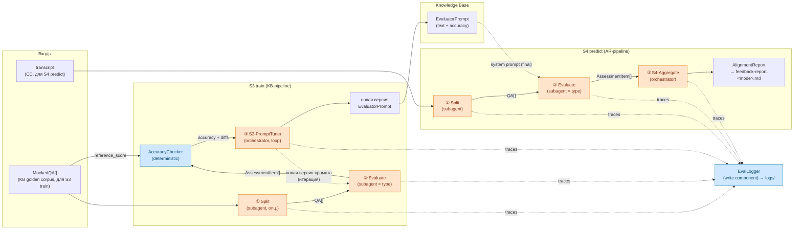

## 1. Контекст и место в системе

Документ описывает **внутреннюю архитектуру двух end-to-end pipeline'ов** проекта (ML-метафора 2026-05-11):

- **AR-pipeline = S4 predict** — `transcript → AlignmentReport` (модуль Assessment and Recomendations, реализующий E3-4 «Отчёт по интервью» в [[spec_postponed]] §7).
- **KB-pipeline = S3 train** — `MockedQA[] (с reference_score) → EvaluatorPrompt + accuracy на test`.

Оба pipeline'а делят **общую часть обработки транскрипта** (① Splitter + ② Evaluator), описанную в [[arch_pipeline]]; здесь — то, чем они различаются (стадия ③) и как живут в Claude Code runtime. «Что» делает система — в [[spec]]; «как» pipeline'ы это собирают — здесь.

Граница ответственности:
- [[spec]] — артефакты, сценарии (S3 / S4), user stories, критерии оценки; модули описаны концептуально.
- [[arch_pipeline]] — generic-контракт общей части (стадии ①②, контракт `EvaluatorPrompt` между S3 и S4).
- **arch_agents** (этот документ) — оба pipeline'а целиком: декомпозиция на агенты и детерм. компоненты, AR-specific стадия ③ (S4-Aggregator → `AlignmentReport`), KB-specific стадия ③ (S3-PromptTuner + AccuracyChecker), контракты, runtime-выбор, фазированная миграция от монолитного скилла.
- [[feedback-report SKILL]] — текущая монолитная реализация AR-pipeline (S4); источник правил Q&A extraction и scoring rubric, которые мы выносим в общую часть.

Финальные выходы:
- **S4**: `AssessmentItem[]` + минимальный `AlignmentReport` (`verdict ∈ {HIRE, NO_HIRE}` + `p_hire ∈ [0, 100]`, см. [[spec]] §3), собранный из кейса кандидата (CC) и обученного `EvaluatorPrompt` (KB).
- **S3**: новая версия `EvaluatorPrompt` с метаданными (train/test accuracy) + traces для отчёта 14.05 (см. [[spec_postponed]] §7 E2-6 «Accuracy на test»).

Расширенный AR-отчёт (`AssessmentTopic`, `Recommendation[]`, `topic_assessments`, `strengths/gaps_summary`) — postponed, см. [[requirements_postponed]] §5.

## 2. Ключевые решения

Три решения. Каждое — с явным why, чтобы при пересмотре не потерять мотивацию.

### 2.1. Multi-agent поверх монолита

Оба pipeline'а реализуются как **orchestrator-workers** цепочки (S4: Splitter → Evaluator-per-type → S4-Aggregator; S3: Splitter → Evaluator → S3-PromptTuner с loop по корпусу), не как один LLM-вызов со structured output.

**Why:**
- Модульность как ценность сильнее, чем cost-optimization на горизонте MVP (CLAUDE.md принцип 7: loose coupling / high cohesion).
- Менторское требование операционной изоляции LLM-вызовов ([[spec]] §4 invariant): каждый агент = свой контекст, свой промпт, свой возможный размер модели. Особенно важно для S3 — train-loop повторно вызывает Evaluator на разных версиях `EvaluatorPrompt`, и общий контекст с PromptTuner'ом сломал бы измерение.
- Контракты между агентами — явные артефакты (`QA`, `AssessmentItem`, `EvaluatorPrompt` — см. [[spec]] §3), что упрощает измерение accuracy и тестирование.

**Tradeoff:** больше LLM-вызовов (S4: 5–10 на интервью; S3: 5–10 × количество тренировочных итераций × объём golden-корпуса). Покрывается выбором runtime (см. 2.2) и smaller-моделями на дешёвых стадиях.

### 2.2. Runtime — Claude Code subagents, не LangGraph

AR-pipeline живёт внутри Claude Code (skill + subagents в `.claude/`), не как отдельный Python-сервис на LangGraph + Anthropic API.

**Why:**
- С 2026-04-04 Anthropic запретил использовать Max-подписку с Agent SDK / внешними harness-ами ([[billing]]). LangGraph + Anthropic API на Sonnet × 5–10 вызовов на интервью бьёт по бюджету.
- Claude Code subagents работают по подписке и покрывают нужные фичи: per-agent system prompt, tool restrictions, разные модели на агента, изоляция контекста.
- Совпадает со [[spec]] §8: «ядро запускается в Claude Code skill (POC) на горизонт до 14.05».

**Tradeoff («перевёрнутая вселенная»):** оркестратор — LLM, не код, поэтому детерминизм слабее, чем в LangGraph state-machine. Лечится явным protocol в системном промпте orchestrator'а. Производственный SaaS-деплой откладывается; для защиты курса этого хватает.

**Migration safety net:** контракты (`QA`, `AssessmentItem`, `AlignmentReport` — терминология [[spec]] §3) — обычные dataclass-shaped JSON, переносимые на Agent SDK / LangGraph 1:1. То есть Claude Code сейчас не блокирует production потом. Postponed-расширения (`AssessmentTopic`, `Recommendation`, `topic_assessments`, `strengths/gaps_summary`) — добавятся как новые dataclass'ы без слома существующих.

### 2.3. Общая часть переиспользуется S3 и S4

Стадии ① Splitter и ② Evaluator вынесены в **общую часть обработки транскрипта** ([[arch_pipeline]]) и переиспользуются обоими pipeline'ами:

- **S4 (predict)** запускает общую часть **один раз** с финальной версией `EvaluatorPrompt` из KB; стадия ③ — S4-Aggregator → `AlignmentReport`.
- **S3 (train)** запускает общую часть **в loop** на golden-корпусе `MockedQA[]`, на каждой итерации с новой кандидатной версией `EvaluatorPrompt`; стадия ③ — S3-PromptTuner (редактирует промпт по ошибкам) + AccuracyChecker (измеряет accuracy на train- и test-сабсете).

**Why:**
- §2.3 [[spec]] фиксирует структурную похожесть S3 и S4: оба обрабатывают транскрипт через одну и ту же extraction+scoring цепочку, отличаются только тем, что делается с `AssessmentItem[]` на выходе.
- DRY: Splitter уже работает в feedback-report SKILL на mock-интервью — тот же агент бесплатно даёт S3-train extraction-стадию, без копирования кода.
- Граница «общее vs специфичное» проходит ровно по стадии ③: всё, что зависит от наличия `AlignmentReport` vs `EvaluatorPrompt` как выхода, — здесь; всё, что нужно обоим pipeline'ам, — в [[arch_pipeline]].

**Tradeoff:** в S3 train-loop стадия ② вызывается N × M раз (N итераций промпта × M интервью в train-сабсете) — это основная стоимость S3. Митигация: smaller-модель на ② (Haiku вместо Sonnet) при подборе промпта, переключение на Sonnet только на финальной валидации.

## 3. Концепт: агент ≠ детерм. компонент

Терминологическая оговорка: слово «модуль» в [[spec]] §2 закреплено за тремя верхнеуровневыми концептами (CC, KB, AR). Здесь, на уровне реализации, говорим о **компонентах** — кирпичиках, из которых собраны S3 и S4. Компоненты делятся на два типа.

Разделение, без которого «модульность» сводится к «много LLM-вызовов» без архитектурной выгоды.

| Ось | Что это | Где живёт | Пример |
|---|---|---|---|
| **Агент** | Узел с собственным LLM-вызовом и промптом | `.claude/agents/<name>.md` или orchestrator-сессия скилла | Splitter, eval-hard, S3-PromptTuner |
| **Детерм. компонент** | Юнит кода с явным контрактом, без LLM | Python-скрипт, вызывается как Bash tool | AccuracyChecker, EvalLogger |

Ключевое следствие на новой архитектуре: **измерение accuracy — детерм. компонент, не агент**. PromptTuner не «считает accuracy сам», он вызывает `accuracy_checker.py predicted.json reference.json` и получает число. Это даёт:
- PromptTuner тестируется без LLM-измерения (просто сравнивает scores);
- метрика accuracy воспроизводима (никакого NLP-подхода типа LLM-as-judge — закрыто 11-05);
- результат логируется как обычный артефакт (см. §7 Phase 3 / §4.2).

### 3.1. Сводка компонентов

Тип компонента определяет, где он живёт, как тестируется и кто его меняет. Агенты — недетерминированные (вывод зависит от модели и промпта); детерминированные компоненты — обычный код, поведение воспроизводимо.

Колонка «Принадлежность» отделяет общую часть (используется обоими pipeline'ами, см. [[arch_pipeline]]) от S3-/S4-specific компонентов.

| Компонент | Тип | Где живёт | Принадлежность | Роль |
|---|---|---|---|---|
| **Splitter** | агент (LLM, subagent) | `.claude/agents/splitter.md` | общая часть ([[arch_pipeline]] §2) | стадия ① — extraction `QA[]` ([[spec]] §3) |
| **eval-hard** | агент (LLM, subagent) | `.claude/agents/eval-hard.md` | общая часть ([[arch_pipeline]] §2) | стадия ② — assessor для `type=hard` → `AssessmentItem`; system prompt = `EvaluatorPrompt` |
| **eval-soft** | агент (LLM, subagent) | `.claude/agents/eval-soft.md` | общая часть ([[arch_pipeline]] §2) | стадия ② — assessor для `type=soft` (включая бывшие behavioral) → `AssessmentItem`; system prompt = `EvaluatorPrompt` |
| **S4-Aggregator** | агент (LLM, orchestrator-сессия) | `.claude/skills/feedback-report/SKILL.md` | **S4-specific** | стадия ③ S4 — rollup `AssessmentItem[]` → `AlignmentReport` (verdict + p_hire + items), markdown-render. Расширения — postponed. |
| **S3-PromptTuner** | агент (LLM, orchestrator-сессия) | `.claude/skills/train-evaluator/SKILL.md` (новый, см. §6) | **S3-specific** | стадия ③ S3 — берёт текущий `EvaluatorPrompt`, accuracy на train-сабсете, диффы predicted vs `reference_score`; редактирует промпт (вносит правила, примеры) и запускает следующую итерацию. Loop до стабилизации accuracy. |
| **AccuracyChecker** | детерм. компонент (Python, без LLM) | `tools/accuracy_checker.py` | **S3-specific** | сравнивает `AssessmentItem.score` с `MockedQA.reference_score` per-критерий (factual_correctness / focus / clarity) и усреднённо; выдаёт JSON `{per_criterion: {...}, overall: float}`. Используется S3-PromptTuner на каждой итерации + на финальном test-сабсете. |
| **EvalLogger** | детерм. компонент (Python, без LLM) | `tools/eval_logger.py` | общая часть | cross-cutting write в logs/; применим к обоим pipeline'ам (traces, latency, model) |
| **HighlighterRenderer** | детерм. компонент (Python, без LLM) | `tools/highlighter.py` | общая часть | визуальная регрессия Splitter ([[spec_postponed]] §7 E2-6): раскраска transcript.txt по разбивке на `QA.question` / `QA.candidate_answer` / отброшенные сегменты. HTML/markdown за <5 сек. Применим к обоим pipeline'ам. |
| **Skill boilerplate (S4)** | детерм. код (без LLM) | Шаги 0, 1, 6, 7 в `.claude/skills/feedback-report/SKILL.md` | S4-specific | parse args / validate / read `EvaluatorPrompt` из KB / self-check / write file. |
| **Skill boilerplate (S3)** | детерм. код (без LLM) | Шаги 0, 1, write в `.claude/skills/train-evaluator/SKILL.md` | S3-specific | parse args / load golden corpus / split train/test / save new `EvaluatorPrompt` версии в KB. |

Принципиальное:
- **S4-Aggregator и S3-PromptTuner — единственные агенты, живущие в orchestrator-сессиях**, не в subagent'ах. S4-Aggregator нуждается в глобальном взгляде на все `AssessmentItem` (для калибровки `verdict` / `p_hire`). S3-PromptTuner нуждается в глобальном взгляде на корпус ошибок (чтобы редактировать промпт системно, а не локально).
- Все детерминированные компоненты вызываются стадиями через Bash tool без LLM-кружочка.
- **KBRetriever (rubric/similar items) удалён** решением 11-05: в новой архитектуре retrieval из KB сводится к чтению одного файла (`EvaluatorPrompt` text), что является частью skill boilerplate (S4), а не отдельным компонентом.

## 4. Декомпозиция

Два pipeline'а, делящие общую часть. На диаграмме сверху — S4 (predict), снизу — S3 (train); общая часть ① Splitter + ② Evaluator показана дважды для наглядности (физически — те же subagent'ы).

Цветовая кодировка: **оранжевые узлы** — LLM-агенты (недетерминированные); **голубые** — детерминированные компоненты/код; нейтральные — данные на границах (CC, KB, артефакты).



Симметрия: оба pipeline'а проходят через одну и ту же общую часть (① + ②). Различие — что делается с `AssessmentItem[]` на выходе ②:
- S4 — агрегирует в `AlignmentReport` для пользователя.
- S3 — сравнивает с `MockedQA.reference_score` через AccuracyChecker; PromptTuner редактирует `EvaluatorPrompt` по диффам и крутит loop.

`EvaluatorPrompt` в KB — единственная точка контакта между двумя pipeline'ами (контракт §5.3).

### 4.1. Стадии S4 predict (AR-pipeline)

| # | Стадия | Где живёт | Input | Output | Принадлежность | Source в монолите |
|---|---|---|---|---|---|---|
| ① | **Split** | `.claude/agents/splitter.md` | transcript.txt + speaker rules | `QA[]` | общая часть ([[arch_pipeline]] §2) | Шаги 2, 3 |
| ② | **Evaluate** | `.claude/agents/eval-{hard,soft}.md` | `QA` + `EvaluatorPrompt` (как system prompt) | `AssessmentItem` (`assessor_kind=ai`, `score`, `comment`) | общая часть ([[arch_pipeline]] §2) | Шаг 4 |
| ③ | **S4-Aggregate** | `.claude/skills/feedback-report/SKILL.md` (главная сессия) | `AssessmentItem[]` + JD + (опц.) feedback | минимальный `AlignmentReport` (`verdict` + `p_hire` + `items`) + markdown-render | **S4-specific** | Шаги 5, 5.5 |

«Где живёт» — это и есть выбор runtime: первые две стадии вынесены в субагенты ради изоляции контекста (общая часть, переиспользуется S3-train'ом), третья остаётся в orchestrator'е, потому что нуждается в **глобальном взгляде** на все `AssessmentItem` (cross-question patterns, verdict calibration). Subagent на этом месте просто скопирует контекст без выгоды.

Боилерплейт скилла S4 (parse args, validate files, **read `EvaluatorPrompt` from `kb/evaluator_prompt.md`**, self-check, write file — Шаги 0, 1, 6, 7 монолита) живёт в orchestrator вокруг pipeline'а.

### 4.2. Стадии S3 train (KB-pipeline)

| # | Стадия | Где живёт | Input | Output | Принадлежность |
|---|---|---|---|---|---|
| ① | **Split (опц.)** | `.claude/agents/splitter.md` | mock-транскрипт | `QA[]` | общая часть |
| ② | **Evaluate** | `.claude/agents/eval-{hard,soft}.md` | `QA` + текущая (кандидатная) версия `EvaluatorPrompt` | `AssessmentItem` (`assessor_kind=ai`) | общая часть |
|  — | **AccuracyChecker** (det.) | `tools/accuracy_checker.py` | predicted `AssessmentItem.score` + `MockedQA.reference_score` | `{per_criterion: {...}, overall: float, diffs: [...]}` | **S3-specific** |
| ③ | **S3-PromptTuner** | `.claude/skills/train-evaluator/SKILL.md` (главная сессия) | текущий `EvaluatorPrompt` + accuracy + diffs | новая версия `EvaluatorPrompt`; **loop**: повторяет ②+AccuracyChecker до стабилизации accuracy. На финальной валидации — accuracy на отложенном test-сабсете. | **S3-specific** |

`Split` помечен «опц.» — если `MockedQA[]` уже размечены руками (`question` + `candidate_answer` + reference_*), Splitter можно пропустить и сразу подавать в Evaluator. Решение — см. [[arch_pipeline]] §6 «Контракт `MockedQA` в общей части».

Train-loop протокол (детали в SKILL.md):
1. Загрузить golden-корпус → split train (~70%) / test (~30%) детерминированно по `interview_id`.
2. Загрузить текущий `EvaluatorPrompt` (или стартовый baseline).
3. Запустить ②+AccuracyChecker на train-сабсете → собрать (predicted vs reference) diffs.
4. PromptTuner анализирует diffs → редактирует текст промпта (вносит правила, примеры) → новая версия.
5. Повтор шагов 3-4 до достижения порога / стабилизации / лимита итераций.
6. На финале — запустить ②+AccuracyChecker на отложенном test-сабсете → записать `test_accuracy` в новую версию `EvaluatorPrompt`. Это число — метрика для отчёта 14.05 (см. [[spec_postponed]] §7 E2-6).

Овер-фит-риск (mentor 11-05) митигируется тем, что test-сабсет PromptTuner **не видит** в loop: и сами интервью, и reference scores выкладываются только на финальном измерении.

### 4.3. Cross-cutting компоненты (детерминированные)

Три компонента-шлюза. Без LLM, реализуются как Python-скрипты, вызываются стадиями (или offline) через Bash tool.

| Компонент | Где живёт | Сигнатура | Используется стадиями | Источник в монолите |
|---|---|---|---|---|
| **AccuracyChecker** | `tools/accuracy_checker.py` | `compare(predicted: AssessmentItem[], reference: MockedQA[]) -> AccuracyReport` | стадия ③ S3 (PromptTuner loop + final test) | новое (Phase 3) |
| **EvalLogger** | `tools/eval_logger.py` | `log(stage, input, output, model, latency)` | стадии ①, ②, ③ в обоих pipeline'ах | новое (Phase 2) |
| **HighlighterRenderer** | `tools/highlighter.py` | `render(transcript_path, qa_items) -> html` | offline (валидация Splitter) | новое (Phase 1, [[spec_postponed]] §7 E2-6) |

## 5. Контракты

Четыре типа на границах между узлами. JSON-сериализуемые dataclasses, чтобы переносились между runtime'ами (Claude Code → Agent SDK / LangGraph) без изменений.

### 5.1. QA (выход Splitter)

Каноническое implementation-определение `QA` живёт здесь — на этот раздел ссылается [[arch_pipeline]] §3 (общий контракт, не дублируется). Контракт generic: используется S4 (predict) и S3 (train).

Определён в [[spec]] §3 как сырая пара вопрос-ответ с классификацией, без оценки. Splitter заполняет все классификационные поля; `type` / `interview_stage` / `topic_tag` могут быть tentative — Evaluator на стадии ② может уточнить.

```yaml
QA:
  question: LinkedText
  candidate_answer: LinkedText
  type: QuestionType                # hard | soft (поведенческие классифицируются как soft, см. [[assessors]])
  interview_stage: InterviewStage   # fit_hr | technical_qna | technical_coding | technical_case | system_design | behavioral | manager_round
  topic_tag: TopicTag               # SQL | Python | Statistics | Experimentation | Product_Metrics | ML | Data_Modeling | Communication | Stakeholder_Management | Prioritization | Conflict | Leadership | Ownership | Collaboration | Adaptability
```

Значение `behavioral` в `QuestionType` удалено решением 11-05 (см. [[spec_postponed]] §8). `behavioral` в `InterviewStage` остаётся — это маркер позиции в воронке интервью, не качества вопроса.

### 5.2. AssessmentItem (выход Evaluator)

Каноническое implementation-определение `AssessmentItem` живёт здесь — на этот раздел ссылается [[arch_pipeline]] §3 (общий контракт, не дублируется). Контракт generic: используется S4 (predict, → S4-Aggregator) и S3 (train, → AccuracyChecker сравнивает с `MockedQA.reference_score`).

Определён в [[spec]] §3 как оценка одного `QA` конкретным assessor'ом. Evaluator получает `QA` + `EvaluatorPrompt` (system prompt) и возвращает `AssessmentItem` с `assessor_kind = ai`, заполненной структурой `Score` (3 бинарных критерия, см. [[assessors]]) и `comment`. Производные поля для агрегации (`aggregate`, `weakness_kind`, `rationale`) — implementation-уровень S4-Aggregator'а, не часть контракта.

```yaml
AssessmentItem:
  qa: QA   # ссылка на исходный QA (или inline для удобства pipeline'а)
  assessor_kind: ai | human   # ai: Evaluator в S4/S3; human: golden-разметка в MockedQA.reference_score
  assessor_name: str   # например, "eval-hard@v3" или "anton"
  score:                            # см. [[assessors]] — 3 бинарных критерия равного веса
    factual_correctness: bool
    focus: bool
    clarity: bool
  comment: text   # 2-3 предложения assessor'а; для weak ответа — формулировка проблемы

  # производные поля S4-Aggregator'а (implementation-уровень, не в spec; для калибровки verdict)
  aggregate: strong | adequate | weak | missing
  weakness_kind: vague | off-topic | factual_error | incomplete | null
  rationale: text   # one-line обоснование aggregate-ярлыка
```

Поле `comment` — комментарий самого assessor'а; в новой архитектуре нет judge-уровня (`Evaluation` отменён 11-05), поэтому ambiguity «assessor.comment vs judge.comment» снята.

В S3 train-loop AccuracyChecker сравнивает `AssessmentItem.score` (вывод Evaluator) с `MockedQA.reference_score` поэлементно (3 бинарных совпадения → 0 / 1/3 / 2/3 / 1 на айтем), агрегируя per-критерий и усреднённо.

### 5.3. EvaluatorPrompt (артефакт-контракт S3 → S4)

Каноническое определение `EvaluatorPrompt` — артефакта-выхода S3 train и входа S4 predict (см. [[spec]] §3, [[arch_pipeline]] §3).

```yaml
EvaluatorPrompt:
  text: str            # сам текст system prompt'а для eval-{hard,soft}; полное содержимое (rubric, edge cases, few-shot)
  version: str         # семантическая или git-hash, например "v3" или "a1b2c3d"
  trained_on: str      # git commit / dataset version (MockedQA[] корпуса)
  train_accuracy:      # accuracy на ~70% сабсете golden-корпуса
    factual_correctness: float
    focus: float
    clarity: float
    overall: float
  test_accuracy:       # accuracy на отложенном ~30% test-сабсете — метрика для отчёта 14.05
    factual_correctness: float
    focus: float
    clarity: float
    overall: float
  parent_version: str | null   # предыдущая версия, на основе которой PromptTuner редактировал
```

Хранение: `kb/evaluator_prompt.md` с frontmatter (метаданные) и body (text). Открытый вопрос — версионирование (git tags vs frontmatter) — см. §9.

### 5.4. AlignmentReport (финальный выход S4-Aggregator)

Минимальный rollup `AssessmentItem[]`, определён в [[spec]] §3.

```yaml
AlignmentReport:
  verdict: HIRE | NO_HIRE   # только blind-режим; в with-feedback не выводится (см. SKILL Шаг 5.5)
  p_hire: int               # 0..100, целое; уверенность модели; согласован с verdict (≥50 ⇔ HIRE). Только blind-режим.
  items: AssessmentItem[]
```

Правило вычисления `verdict` + `p_hire` (S4-Aggregator-агентом, на знаниях модели по всему набору `items`): фиксируется в SKILL Шаг 5.5; стартовая эвристика — «есть ≥1 `aggregate ∈ {weak, missing}` среди критичных вопросов → NO_HIRE; `p_hire` калибруется по таблице ориентиров». Точное правило + калибровка — открытый вопрос (см. §9).

**Postponed (`AssessmentTopic`, `Recommendation[]`, `topic_assessments`, `strengths_summary` / `gaps_summary`)** — см. [[requirements_postponed]] §5. Контракт `AlignmentReport` расширяется новыми полями без слома существующих.

## 6. Mapping на текущий feedback-report

Таблица описывает миграцию монолитного feedback-report SKILL в декомпозированный AR-pipeline. KB-pipeline (S3) — отдельная задача с собственным entry-point'ом, не в scope этого документа (см. [[arch_pipeline]] §4 «Потребители»).

Эволюция, не переписывание (CLAUDE.md принцип 6). Каждая клетка таблицы — что фактически переезжает.

| Шаг текущего скилла | Куда переезжает | Phase |
|---|---|---|
| Шаг 0 (parse args, mode) | остаётся в orchestrator | — |
| Шаг 1 (validate files) + read `EvaluatorPrompt` из KB | остаётся в orchestrator (read новое) | 2 |
| Шаг 2 (read + speaker rules) | → **splitter** system prompt | 1 |
| Шаг 3 (Q&A extraction, dedup, filters) | → **splitter** system prompt | 1 |
| Шаг 4 (per-item type + score + comment) | → **eval-{hard,soft}** system prompts (контент промпта = `EvaluatorPrompt` из KB) | 2 |
| Шаг 5 (rollup `AssessmentItem[]` → markdown) | остаётся в orchestrator (упрощён: JD-rollup + Recommendation[] postponed) | — |
| Шаг 5.5 (verdict HIRE/NO_HIRE + p_hire) | остаётся в orchestrator (упрощён: только verdict + p_hire) | — |
| Шаг 6 (self-check) | остаётся в orchestrator | — |
| Шаг 7 (write file) | остаётся в orchestrator | — |

Что критично перенести в Splitter одним блоком (иначе качество просядет): пять эвристик из Шагов 2–3 — dual-track ASR dedup (≥85% общего текста, окно 30 сек), backchannels filter, meta-turns filter, парафраз ≠ самостоятельный ход, uplift-реплики не разрывают ответ.

Поле `expected_answer` в выходе Шага 4 удалено (решение 11-05); вместе с ним из рендера убрана соответствующая колонка (см. [[spec_postponed]] §7 E3-4).

## 7. Фазированная миграция

Каждая фаза — рабочее приложение на выходе. Принцип: один разрез за раз, acceptance test на каждом этапе.

Колонка «Общая часть / specific» отражает: фазы 1–2 готовят общую часть и автоматически разблокируют оба pipeline'а; фаза 3 — добавляет S3 train-loop поверх готовой общей части.

### Phase 1 — выносим Splitter (общая часть)

- создать `.claude/agents/splitter.md` с вшитыми правилами Шагов 2 + 3 текущего скилла;
- выход — `QA[]` ([[spec]] §3); у этого типа нет `score` по определению;
- скилл вызывает `Agent(subagent_type="splitter")`, остальное (Шаги 4–7) делает inline как раньше;
- **общий ресурс:** Splitter сразу переиспользуется S3 train-loop'ом — реализуется здесь, S3 получает его бесплатно;
- **acceptance:** на `transcripts/mock-karpov-junior-ds-2022` число Q-A пар и их `transcript_time` совпадают с валидатором (тайм-коды YouTube) ≥95%. Verbatim цитаты grep'абельны в transcript.txt.

### Phase 2 — выносим Evaluator с разделением по type (общая часть)

- создать `.claude/agents/eval-hard.md`, `eval-soft.md` (без eval-behavioral — тип удалён 11-05);
- system prompt **не вшит в файл агента**, а **подгружается из `kb/evaluator_prompt.md`** в момент вызова (Шаг 1 скилла читает, прокидывает в `Agent(prompt=...)`); это делает Evaluator зависимым от KB-артефакта (контракт §5.3);
- стартовый `EvaluatorPrompt` v0 — извлечён из Шага 4 текущего монолита, упрощён до 3 бинарных критериев ([[assessors]]);
- скилл диспатчит items в parallel по type через `Agent` tool;
- разные модели на агента опционально (Haiku для soft, Sonnet для hard);
- **общий ресурс:** Evaluator готов к использованию в S3 train-loop сразу после Phase 2;
- **acceptance:** распределение `score` по 3 критериям на тестовом кейсе сравнимо с Phase 1 (±1 на категорию).

### Phase 3 — S3 train-loop (KB-pipeline специфика)

- создать `tools/accuracy_checker.py` — сравнение `AssessmentItem.score` с `MockedQA.reference_score`;
- создать skill `.claude/skills/train-evaluator/SKILL.md` (S3 entry-point) — PromptTuner + loop по golden-корпусу с train/test split;
- golden-корпус — размеченный `MockedQA[]` из `transcripts/mock-*` (см. [[spec_postponed]] §7 E2-2);
- **acceptance:** PromptTuner за ≤10 итераций повышает `test_accuracy.overall` с baseline (v0) ≥ +0.1 без overfit'а (т.е. `train_accuracy - test_accuracy < 0.1`).
- **deliverable для отчёта 14.05:** новая версия `EvaluatorPrompt` + таблица train/test accuracy per-критерий ([[spec_postponed]] §7 E2-6).

### Phase 4 (post-MVP) — миграция runtime, если понадобится прод

- применимо к обоим pipeline'ам (общая часть и stage-③ переезжают вместе);
- если Streamlit Cloud / SaaS deploy актуален — переехать на Agent SDK / LangGraph;
- благодаря контрактам §5 это переименование импортов + замена subagent dispatch на graph nodes;
- subagents .md ↔ системные промпты в Agent SDK — почти 1:1.

## 8. Что НЕ делаем

- **S4-Aggregator как отдельный subagent** — теряет глобальный взгляд на интервью; остаётся в orchestrator.
- **S3-PromptTuner как subagent** — теряет глобальный взгляд на корпус ошибок; остаётся в orchestrator-сессии train-evaluator-скилла.
- **LangGraph в MVP** — billing запрещает (см. 2.2).
- **eval-behavioral как отдельный subagent** — тип `behavioral` удалён из `QuestionType` решением 11-05; поведенческие вопросы идут в `eval-soft`.
- **KBRetriever (rubric / similar items)** — удалён решением 11-05: вся KB-нагрузка перенесена в текст `EvaluatorPrompt`. Чтение промпта — file read в boilerplate, не отдельный компонент.
- **LLM-as-judge / regression-`Evaluation`** — отменено 11-05; вместо него детерминированный AccuracyChecker (см. §4.3).
- **Streaming / pagination между агентами** — для 5–10 items на интервью не нужно.
- **Кеширование результатов агентов** — на горизонте MVP не нужно; добавим, если cost станет видимым.
- **AR-Advanced (`AssessmentTopic`, `Recommendation`, structured `AlignmentReport` с aligned/partial/missing rollup + `topic_assessments` + `strengths/gaps_summary`)** — postponed, см. [[requirements_postponed]] §5. S4-Aggregator на стадии ③ выдаёт только минимальный `AlignmentReport` (`verdict + p_hire + items`).
- **Регрессия на пользовательских (own) интервью** — train/test ограничен `transcripts/mock-*`, чтобы не размечать собственные (mentor 11-05). Применение к own-интервью — отдельный шаг с disclaimer'ом «домен не покрыт».

## 9. Открытые вопросы

- [ ] Как `EvalLogger` пишет traces — JSONL per-run или одна агрегированная таблица? Зависит от того, как S3 train-loop будет читать historical accuracy между итерациями.
- [ ] Параллельный dispatch evaluators в Claude Code: подтвердить эмпирически, что несколько `Agent` tool calls в одном сообщении действительно идут параллельно, не последовательно. Особенно критично для S3 (loop × M интервью).
- [ ] **Mode propagation** (`blind` / `with-feedback`) — где живёт переключатель? Сейчас orchestrator знает; должен ли он передавать mode в каждого evaluator явным полем или агент остаётся mode-agnostic? S3 mode-agnostic (нет blind/with-feedback), это AR-pipeline-internal вопрос. Связано с [[arch_pipeline]] §6. Лежит ближе к Phase 2.
- [ ] **Versioning subagents и `EvaluatorPrompt`**: когда `.claude/agents/eval-hard.md` меняется (структура промпта) — это не то же, что когда меняется `kb/evaluator_prompt.md` (контент). Нужно ли версионировать оба независимо? Решение в Phase 3.
- [ ] **Splitter dedup / grouping политика** (06-05): дробление по умолчанию vs опциональная группировка похожих вопросов с явным маркером — какой контракт у `QA[]` на этот счёт? Применимо и к S3 train. Acceptance Phase 1 уточнить.
- [ ] **HIRE/NO_HIRE rule + калибровка p_hire** (06-05): по какому правилу S4-Aggregator выводит `AlignmentReport.verdict` и как калибрует `p_hire`? Стартовая эвристика — «есть ≥1 weak/missing aggregate среди критичных вопросов → NO_HIRE, иначе HIRE» — но «критичные» нужно определить (по `QA.interview_stage` / `topic_tag`?). Калибровка `p_hire` — таблица ориентиров в SKILL Шаг 5.5. Решение к Phase 2.
- [ ] **PromptTuner edit strategy**: какие именно операции редактирования промпта PromptTuner делает на каждой итерации? Только добавление few-shot примеров? Редактирование rubric-текста? Удаление неработающих правил? Это влияет на сходимость train-loop. Эмпирически уточнить в Phase 3 (стартовая стратегия — «добавить пример из самого большого diff'а»).
- [ ] **Стартовый baseline `EvaluatorPrompt` v0**: содержимое Шага 4 текущего монолита + 3 бинарных критерия — достаточно ли как baseline, или нужен более информативный стартовый промпт (например, с описанием каждого критерия + 1 положительным и 1 отрицательным примером)?

## 10. Связи

- [[spec]] — `md/spec.md` — что система делает (артефакты, сценарии S3/S4, user stories).
- [[spec_postponed]] — `md/spec_postponed.md` — активные user stories E1–E3 (включая E2-2 «Разметочный датасет», E2-6 «Accuracy на test», E3-4 «Отчёт по интервью»).
- [[arch_pipeline]] — `md/arch_pipeline.md` — общая часть обработки транскрипта (стадии ①②), переиспользуемая S4 (этот документ §4.1) и S3 (этот документ §4.2).
- [[billing]] — `md/billing.md` — billing-ограничение, обосновывающее runtime-выбор (§2.2).
- [[feedback-report SKILL]] — `.claude/skills/feedback-report/SKILL.md` — текущий монолит S4, источник правил для Splitter/Evaluator.
- [[requirements_postponed]] — `md/requirements_postponed.md` — что вынесено за MVP (S1, S2 сценарии, AR-Advanced артефакты).
- [[2026-04-30_AMxMentor]] — `internal-notes/2026-04-30_AMxMentor.txt` — менторское требование операционной изоляции LLM-вызовов.
- [[2026-05-06_Architecture_meeting]] — `internal-notes/2026-05-06_Architecture_meeting.txt` — архитектурная встреча с Маргаритой: переименование контрактов §5.1/§5.2 (`QA` / `AssessmentItem`), HighlighterRenderer как cross-cutting компонент.
- [[2026-05-11_mentor_meeting]] — `internal-notes/2026-05-11_mentor_meeting.txt` — ML-метафора (S3 train, S4 predict), отмена Evaluation/EvalDataset/LLM-as-judge, ввод `EvaluatorPrompt` как артефакта между S3 и S4, упрощение Score до 3 бинарных критериев, удаление behavioral как типа.
