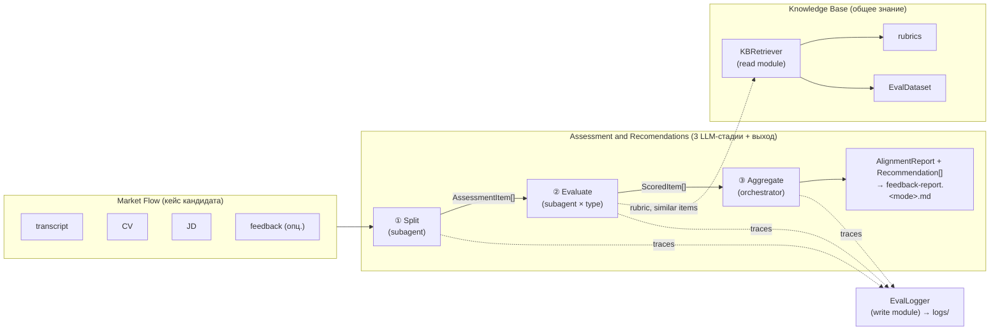

## 1. Контекст и место в системе

Документ описывает **внутреннюю архитектуру модуля Assessment and Recomendations** (AR — третий концепт [[spec]] §2, реализующий историю `E3-4 «Отчёт по интервью»` [[spec]] §7) — как модуль реализован, а не что он делает. «Что» — в [[spec]]; «как» — здесь.

Граница ответственности:
- [[spec]] — артефакты, сценарии, user stories, критерии оценки; модуль AR описан на уровне концепта (§2, §4.3).
- **arch_agents** (этот документ) — внутренняя декомпозиция AR на агенты/модули, контракты между ними, runtime-выбор, фазированная миграция от текущего монолитного скилла.
- [[feedback-report SKILL]] — текущая монолитная реализация AR (E3-4); источник правил Q&A extraction и scoring rubric, которые мы выносим.

3-стадийный pipeline, описанный ниже, — это и есть AR-модуль изнутри: «как» он физически собирает свои артефакты (`AlignmentReport`, `Recommendation[]`) из кейса кандидата (MF) и — в будущем — рубрик/требований корпуса (KB).

## 2. Ключевые решения

Два решения зафиксированы в обсуждении 2026-05-04. Каждое — с явным why, чтобы при пересмотре не потерять мотивацию.

### 2.1. Multi-agent поверх монолита

AR-модуль реализуется как **orchestrator-workers** pipeline (Splitter → Evaluator-per-type → Aggregator), не как один LLM-вызов со structured output.

**Why:**
- Модульность как ценность сильнее, чем cost-optimization на горизонте MVP (CLAUDE.md принцип 7: loose coupling / high cohesion).
- Менторское требование операционной изоляции LLM-вызовов ([[spec]] §4 invariant + E2-6): каждый агент = свой контекст, свой промпт, свой возможный размер модели.
- Контракты между агентами становятся явными артефактами (`AssessmentItem`, `ScoredItem`), что упрощает Eval (E2-6) и тестирование.

**Tradeoff:** больше LLM-вызовов на одно интервью (5–10 вместо 1), выше cost. Покрывается выбором runtime (см. 2.2).

### 2.2. Runtime — Claude Code subagents, не LangGraph

AR-модуль живёт внутри Claude Code (skill + subagents в `.claude/`), не как отдельный Python-сервис на LangGraph + Anthropic API.

**Why:**
- С 2026-04-04 Anthropic запретил использовать Max-подписку с Agent SDK / внешними harness-ами ([[billing]]). LangGraph + Anthropic API на Sonnet × 5–10 вызовов на интервью бьёт по бюджету.
- Claude Code subagents работают по подписке и покрывают нужные фичи: per-agent system prompt, tool restrictions, разные модели на агента, изоляция контекста.
- Совпадает со [[spec]] §8: «ядро запускается в Claude Code skill (POC) на горизонт до 14.05».

**Tradeoff («перевёрнутая вселенная»):** оркестратор — LLM, не код, поэтому детерминизм слабее, чем в LangGraph state-machine. Лечится явным protocol в системном промпте orchestrator'а. Производственный SaaS-деплой откладывается; для защиты курса этого хватает.

**Migration safety net:** контракты (`AssessmentItem`, `ScoredItem`, `AlignmentReport`) — обычные dataclass-shaped JSON, переносимые на Agent SDK / LangGraph 1:1. То есть Claude Code сейчас не блокирует production потом.

## 3. Концепт: агент ≠ модуль

Разделение, без которого «модульность» сводится к «много LLM-вызовов» без архитектурной выгоды.

| Ось | Что это | Где живёт | Пример |
|---|---|---|---|
| **Агент** | Узел с собственным LLM-вызовом и промптом | `.claude/agents/<name>.md` | Splitter, HardSkillEvaluator |
| **Модуль** | Юнит кода с явным контрактом, без LLM | Python-скрипт, вызывается как Bash tool | KBRetriever, EvalLogger |

Ключевое следствие: **KB-retrieval — модуль, не агент**. Workers не «знают про KB», они вызывают `kb_retriever.py rubric <type>` и `kb_retriever.py similar <question>`. Это даёт:
- workers тестируются с моком ретривера;
- стратегия retrieval (embeddings, BM25, гибрид) меняется без правки воркеров;
- KB остаётся одним местом, где политика «как искать» живёт.

## 4. Декомпозиция

Симметрия декомпозиции: **MF слева, AR в центре, KB справа** — AR-модуль (3 LLM-стадии + терминальные артефакты) сшивает кейс кандидата (MF) с общим знанием (KB) и отдаёт `AlignmentReport` + `Recommendation[]` ([[spec]] §2, §3). KBRetriever и EvalLogger — два cross-cutting модуля-шлюза: первый читает из KB, второй пишет в logs.



### 4.1. Стадии AR-модуля

Симметричная развёртка: каждая стадия описана через одни и те же оси.

| # | Стадия | Где живёт | Input | Output | Source в монолите |
|---|---|---|---|---|---|
| ① | **Split** | `.claude/agents/splitter.md` | transcript.txt + speaker rules | `AssessmentItem[]` (без score) | Шаги 2, 3 |
| ② | **Evaluate** | `.claude/agents/eval-{hard,soft,behavioral}.md` | `AssessmentItem` + rubric + similar items | `ScoredItem` | Шаг 4 |
| ③ | **Aggregate** | `.claude/skills/feedback-report/SKILL.md` (главная сессия) | `ScoredItem[]` + JD + (опц.) feedback | `AlignmentReport` + verdict | Шаги 5, 5.5 |

«Где живёт» — это и есть выбор runtime: первые две стадии вынесены в субагенты ради изоляции контекста, третья остаётся в orchestrator'е, потому что нуждается в **глобальном взгляде** на все `ScoredItem` (cross-question patterns, JD-rollup, verdict calibration). Subagent на этом месте просто скопирует контекст без выгоды.

Боилерплейт скилла (parse args, validate files, self-check, write file — Шаги 0, 1, 6, 7 монолита) живёт в orchestrator вокруг AR-модуля, не как отдельные стадии — это плумбинг, не LLM-работа.

### 4.2. Shared modules

Симметричная пара: один читает из KB, другой пишет в logs. Без LLM, реализуются как Python-скрипты, вызываются стадиями через Bash tool.

| Модуль | Где живёт | Сигнатура | Используется стадиями | Источник в монолите |
|---|---|---|---|---|
| **KBRetriever** | `tools/kb_retriever.py` | `get_rubric(type)`, `find_similar(question, k=3)` | ② Evaluate | новое (Phase 3) |
| **EvalLogger** | `tools/eval_logger.py` | `log(stage, input, output, model, latency)` | ①, ②, ③ | новое (Phase 2/3) |

## 5. Контракты

Три типа на границах между узлами. JSON-сериализуемые dataclasses, чтобы переносились между runtime'ами (Claude Code → Agent SDK / LangGraph) без изменений.

### 5.1. AssessmentItem (выход Splitter)

Уже определён в [[spec]] §3. Splitter заполняет минимально: `question`, `candidate_answer`, `type` (tentative — Evaluator может уточнить). Поля `expected_answer`, `llm_score`, `human_comment` — пустые на этом этапе.

### 5.2. ScoredItem (выход Evaluator)

**Новая сущность, в [[spec]] §3 пока нет — добавить отдельной правкой spec.**

```yaml
ScoredItem:
  # унаследовано от AssessmentItem
  question: LinkedText
  candidate_answer: LinkedText
  expected_answer: text
  type: hard_skill | soft_skill | behavioral
  # добавлено Evaluator'ом
  llm_score:
    clarity: 1 | 2 | 3
    completeness: 1 | 2 | 3
    factual_correctness: 1 | 2 | 3
  aggregate: strong | adequate | weak | missing   # производный ярлык, см. SKILL Шаг 4
  weakness_kind: vague | off-topic | factual_error | incomplete | null
  rationale: text                                  # one-line обоснование
  our_comment: text                                # 2-3 предложения
```

Соответствует Шагу 4 текущего скилла, но вынесено в явный контракт. Имя `our_comment` (не `human_comment`) сохраняется — `human_comment` зарезервировано в [[spec]] §3 для разметки `EvalDataset` человеком.

### 5.3. AlignmentReport (выход Aggregator)

Уже определён в [[spec]] §3 и §4.3. Aggregator собирает из `ScoredItem[]`: JD checklist, `aligned/partial/missing` rollup, `Recommendation[]` (сгруппирован по `category`), и в blind-режиме — verdict + P(HIRE).

## 6. Mapping на текущий feedback-report

Эволюция, не переписывание (CLAUDE.md принцип 6). Каждая клетка таблицы — что фактически переезжает.

| Шаг текущего скилла | Куда переезжает | Phase |
|---|---|---|
| Шаг 0 (parse args, mode) | остаётся в orchestrator | — |
| Шаг 1 (validate files) | остаётся в orchestrator | — |
| Шаг 2 (read + speaker rules) | → **splitter** system prompt | 1 |
| Шаг 3 (Q&A extraction, dedup, filters) | → **splitter** system prompt | 1 |
| Шаг 4 (per-item type+score+expected+comment) | → **eval-{type}** system prompts | 2 |
| Шаг 5 (JD rollup, recommendations) | остаётся в orchestrator | — |
| Шаг 5.5 (verdict, P(HIRE)) | остаётся в orchestrator | — |
| Шаг 6 (self-check) | остаётся в orchestrator | — |
| Шаг 7 (write file) | остаётся в orchestrator | — |

Что критично перенести в Splitter одним блоком (иначе качество просядет): пять эвристик из Шагов 2–3 — dual-track ASR dedup (≥85% общего текста, окно 30 сек), backchannels filter, meta-turns filter, парафраз ≠ самостоятельный ход, uplift-реплики не разрывают ответ.

## 7. Фазированная миграция

Каждая фаза — рабочее приложение на выходе. Принцип: один разрез за раз, acceptance test на каждом этапе.

### Phase 1 — выносим Splitter

- создать `.claude/agents/splitter.md` с вшитыми правилами Шагов 2 + 3 текущего скилла;
- выход — `AssessmentItem[]` без `llm_score` / `expected_answer`;
- скилл вызывает `Agent(subagent_type="splitter")`, остальное (Шаги 4–7) делает inline как раньше;
- **acceptance:** на `[private]/avito-20251212` число Q-A пар и их `transcript_time` совпадают с текущим монолитом ±1 пара. Verbatim цитаты grep'абельны в transcript.txt.

### Phase 2 — выносим Evaluator с разделением по type

- создать `.claude/agents/eval-hard.md`, `eval-soft.md`, `eval-behavioral.md` (последний — заглушка, [[spec]] §8);
- скилл диспатчит items в parallel по type через `Agent` tool;
- разные модели на агента опционально (Haiku для soft, Sonnet для hard);
- **acceptance:** распределение `aggregate`-ярлыков на тестовом кейсе сравнимо с Phase 1 (±1 на категорию).

### Phase 3 — добавляем KBRetriever

- создать `tools/kb_retriever.py` с `get_rubric` / `find_similar`;
- evaluators вызывают через Bash;
- KB наполняется в рамках E2-3 «Эксплораторный анализ» и E2-2 «Разметочный датасет» ([[spec]] §7);
- **acceptance:** few-shot из top-3 similar items улучшает agreement с `human_comment` на отложенном `EvalDataset`.

### Phase 4 (post-MVP) — миграция runtime, если понадобится прод

- если Streamlit Cloud / SaaS deploy актуален — переехать на Agent SDK / LangGraph;
- благодаря контрактам §5 это переименование импортов + замена subagent dispatch на graph nodes;
- subagents .md ↔ системные промпты в Agent SDK — почти 1:1.

## 8. Что НЕ делаем

- **Aggregator как отдельный subagent** — теряет глобальный взгляд на интервью; остаётся в orchestrator.
- **LangGraph в MVP** — billing запрещает (см. 2.2).
- **Per-item KB-retrieval до Phase 3** — KB ещё не наполнена (E2-3 не сделан).
- **Behavioral Evaluator с реальной рубрикой** — [[spec]] §8: behavioral как primary focus отложено; subagent существует как заглушка для единообразия dispatch.
- **Streaming / pagination между агентами** — для 5–10 items на интервью не нужно.
- **Кеширование результатов агентов** — на горизонте MVP не нужно; добавим, если cost станет видимым.

## 9. Открытые вопросы

- [ ] Как `EvalLogger` пишет traces — JSONL per-run или одна агрегированная таблица? Зависит от того, как E2-6 будет читать (формат регрессионного отчёта пока не определён).
- [ ] Параллельный dispatch evaluators в Claude Code: подтвердить эмпирически, что несколько `Agent` tool calls в одном сообщении действительно идут параллельно, не последовательно.
- [ ] Mode (`blind` / `with-feedback`) — где живёт его propagation? Сейчас orchestrator знает; должен ли он передавать mode в каждого evaluator явным полем или агент остаётся mode-agnostic, а cross-check с feedback делается в orchestrator? Лежит ближе к Phase 2.
- [ ] Versioning subagents для воспроизводимости Eval (E2-6): когда `.claude/agents/eval-hard.md` меняется, регрессионные результаты надо пере-прогонять. Механизм — git hash файла или явное `version: N` в frontmatter? Решение в Phase 3.

## 10. Связи

- [[spec]] — `md/spec.md` — что система делает (артефакты, сценарии, user stories).
- [[billing]] — `md/billing.md` — billing-ограничение, обосновывающее runtime-выбор (§2.2).
- [[feedback-report SKILL]] — `.claude/skills/feedback-report/SKILL.md` — текущий монолит, источник правил для Splitter/Evaluator.
- [[requirements_postponed]] — `md/requirements_postponed.md` — что вынесено за MVP (S1, S2 сценарии).
- [[2026-04-30_AMxMentor]] — `internal-notes/2026-04-30_AMxMentor.txt` — менторское требование операционной изоляции LLM-вызовов.
