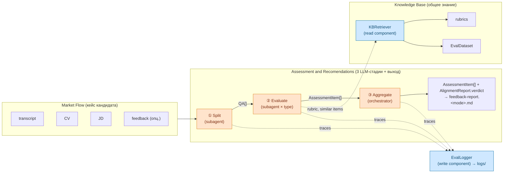

## 1. Контекст и место в системе

Документ описывает **внутреннюю архитектуру модуля Assessment and Recomendations** (AR — третий концепт [[spec]] §2, реализующий историю `E3-4 «Отчёт по интервью»` [[spec]] §7) — как модуль реализован, а не что он делает. «Что» — в [[spec]]; «как» — здесь.

Граница ответственности:
- [[spec]] — артефакты, сценарии, user stories, критерии оценки; модуль AR описан на уровне концепта (§2, §4.3).
- **arch_agents** (этот документ) — внутренняя декомпозиция AR на агенты и детерминированные компоненты, контракты между ними, runtime-выбор, фазированная миграция от текущего монолитного скилла.
- [[feedback-report SKILL]] — текущая монолитная реализация AR (E3-4); источник правил Q&A extraction и scoring rubric, которые мы выносим.

3-стадийный pipeline, описанный ниже, — это и есть AR-модуль изнутри: «как» он физически собирает свой выход (`AssessmentItem[]` + минимальный `AlignmentReport` с `verdict ∈ {HIRE, NO_HIRE}`, см. [[spec]] §3) из кейса кандидата (MF) и — опционально — рубрик/требований корпуса (KB). Расширенный отчёт (`AssessmentTopic`, `Recommendation[]`, `P(HIRE)`) — postponed, см. [[requirements_postponed]] §5.

## 2. Ключевые решения

Два решения зафиксированы в обсуждении 2026-05-04. Каждое — с явным why, чтобы при пересмотре не потерять мотивацию.

### 2.1. Multi-agent поверх монолита

AR-модуль реализуется как **orchestrator-workers** pipeline (Splitter → Evaluator-per-type → Aggregator), не как один LLM-вызов со structured output.

**Why:**
- Модульность как ценность сильнее, чем cost-optimization на горизонте MVP (CLAUDE.md принцип 7: loose coupling / high cohesion).
- Менторское требование операционной изоляции LLM-вызовов ([[spec]] §4 invariant + E2-6): каждый агент = свой контекст, свой промпт, свой возможный размер модели.
- Контракты между агентами становятся явными артефактами (`QA`, `AssessmentItem` — терминология после ревизии 2026-05-06, см. [[spec]] §3), что упрощает Eval (E2-6) и тестирование.

**Tradeoff:** больше LLM-вызовов на одно интервью (5–10 вместо 1), выше cost. Покрывается выбором runtime (см. 2.2).

### 2.2. Runtime — Claude Code subagents, не LangGraph

AR-модуль живёт внутри Claude Code (skill + subagents в `.claude/`), не как отдельный Python-сервис на LangGraph + Anthropic API.

**Why:**
- С 2026-04-04 Anthropic запретил использовать Max-подписку с Agent SDK / внешними harness-ами ([[billing]]). LangGraph + Anthropic API на Sonnet × 5–10 вызовов на интервью бьёт по бюджету.
- Claude Code subagents работают по подписке и покрывают нужные фичи: per-agent system prompt, tool restrictions, разные модели на агента, изоляция контекста.
- Совпадает со [[spec]] §8: «ядро запускается в Claude Code skill (POC) на горизонт до 14.05».

**Tradeoff («перевёрнутая вселенная»):** оркестратор — LLM, не код, поэтому детерминизм слабее, чем в LangGraph state-machine. Лечится явным protocol в системном промпте orchestrator'а. Производственный SaaS-деплой откладывается; для защиты курса этого хватает.

**Migration safety net:** контракты (`QA`, `AssessmentItem`, `AlignmentReport` — терминология [[spec]] §3) — обычные dataclass-shaped JSON, переносимые на Agent SDK / LangGraph 1:1. То есть Claude Code сейчас не блокирует production потом. Postponed-расширения (`AssessmentTopic`, `Recommendation`, `P(HIRE)`) — добавятся как новые dataclass'ы без слома существующих.

## 3. Концепт: агент ≠ детерм. компонент

Терминологическая оговорка: слово «модуль» в [[spec]] §2 закреплено за тремя верхнеуровневыми концептами (MF, KB, AR). Здесь, на уровне реализации AR, говорим о **компонентах** — кирпичиках, из которых AR собран. Компоненты делятся на два типа.

Разделение, без которого «модульность» AR сводится к «много LLM-вызовов» без архитектурной выгоды.

| Ось | Что это | Где живёт | Пример |
|---|---|---|---|
| **Агент** | Узел с собственным LLM-вызовом и промптом | `.claude/agents/<name>.md` | Splitter, HardSkillEvaluator |
| **Детерм. компонент** | Юнит кода с явным контрактом, без LLM | Python-скрипт, вызывается как Bash tool | KBRetriever, EvalLogger |

Ключевое следствие: **KB-retrieval — детерм. компонент, не агент**. Workers не «знают про KB», они вызывают `kb_retriever.py rubric <type>` и `kb_retriever.py similar <question>`. Это даёт:
- workers тестируются с моком ретривера;
- стратегия retrieval (embeddings, BM25, гибрид) меняется без правки воркеров;
- KB остаётся одним местом, где политика «как искать» живёт.

### 3.1. Сводка компонентов AR-модуля

Тип компонента определяет, где он живёт, как тестируется и кто его меняет. Агенты — недетерминированные (вывод зависит от модели и промпта); детерминированные компоненты — обычный код, поведение воспроизводимо.

| Компонент | Тип | Где живёт | Роль в AR |
|---|---|---|---|
| **Splitter** | агент (LLM, subagent) | `.claude/agents/splitter.md` | стадия ① — extraction `QA[]` ([[spec]] §3, ревизия 06-05) |
| **eval-hard** | агент (LLM, subagent) | `.claude/agents/eval-hard.md` | стадия ② — assessor для hard-skill QA → `AssessmentItem` |
| **eval-soft** | агент (LLM, subagent) | `.claude/agents/eval-soft.md` | стадия ② — assessor для soft-skill QA → `AssessmentItem` |
| **eval-behavioral** | агент (LLM, subagent; MVP-заглушка) | `.claude/agents/eval-behavioral.md` | стадия ② — assessor для behavioral QA → `AssessmentItem` (с STAR + Amazon SPID, см. [[assessors]]) |
| **Aggregator** | агент (LLM, orchestrator-сессия) | `.claude/skills/feedback-report/SKILL.md` | стадия ③ — минимальный rollup `AssessmentItem[]` → `AlignmentReport` (verdict + items), markdown-render. Topic-rollup, Recommendation, P(HIRE) — postponed. |
| **KBRetriever** | детерм. компонент (Python, без LLM) | `tools/kb_retriever.py` | cross-cutting read из KB (rubric, similar items) |
| **EvalLogger** | детерм. компонент (Python, без LLM) | `tools/eval_logger.py` | cross-cutting write в logs/ |
| **HighlighterRenderer** | детерм. компонент (Python, без LLM) | `tools/highlighter.py` | визуальная регрессия Splitter ([[spec]] §7 E2-6 ревизия 06-05): раскраска transcript.txt по разбивке на `QA.question` / `QA.candidate_answer` / отброшенные сегменты. HTML/markdown за <5 сек. |
| **Skill boilerplate** | детерм. код (без LLM) | Шаги 0, 1, 6, 7 в SKILL.md | parse args / validate / self-check / write file — плумбинг вокруг AR |

Принципиальное: Aggregator — **единственный агент, живущий в orchestrator-сессии**, не в subagent. Причина — нужен глобальный взгляд на все `AssessmentItem` (см. §4.1) для калибровки общего `verdict ∈ {HIRE, NO_HIRE}` в `AlignmentReport` ([[spec]] §3). Все детерминированные компоненты вызываются стадиями через Bash tool без LLM-кружочка.

## 4. Декомпозиция

Симметрия декомпозиции: **MF слева, AR в центре, KB справа** — AR-модуль (3 LLM-стадии + терминальные артефакты) сшивает кейс кандидата (MF) с общим знанием (KB) и отдаёт `AssessmentItem[]` + минимальный `AlignmentReport` (verdict + items) ([[spec]] §2, §3). KBRetriever и EvalLogger — два cross-cutting компонента-шлюза: первый читает из KB, второй пишет в logs.

Цветовая кодировка ниже: **оранжевые узлы** — LLM-агенты (недетерминированные); **голубые** — детерминированные компоненты/код; нейтральные — данные на границах (MF, KB, артефакты).



### 4.1. Стадии AR-модуля (LLM-агенты)

Симметричная развёртка: каждая стадия описана через одни и те же оси.

| # | Стадия | Где живёт | Input | Output | Source в монолите |
|---|---|---|---|---|---|
| ① | **Split** | `.claude/agents/splitter.md` | transcript.txt + speaker rules | `QA[]` (без оценки) | Шаги 2, 3 |
| ② | **Evaluate** (assessor) | `.claude/agents/eval-{hard,soft,behavioral}.md` | `QA` + rubric + similar items | `AssessmentItem` (с `assessor_kind=ai`, `score`, `expected_answer`, `comment`) | Шаг 4 |
| ③ | **Aggregate** | `.claude/skills/feedback-report/SKILL.md` (главная сессия) | `AssessmentItem[]` + JD + (опц.) feedback | минимальный `AlignmentReport` (`verdict ∈ {HIRE, NO_HIRE}` + `items`) + markdown-render | Шаги 5, 5.5 |

«Где живёт» — это и есть выбор runtime: первые две стадии вынесены в субагенты ради изоляции контекста, третья остаётся в orchestrator'е, потому что нуждается в **глобальном взгляде** на все `AssessmentItem` (cross-question patterns, verdict calibration). Subagent на этом месте просто скопирует контекст без выгоды.

Боилерплейт скилла (parse args, validate files, self-check, write file — Шаги 0, 1, 6, 7 монолита) живёт в orchestrator вокруг AR-модуля, не как отдельные стадии — это плумбинг, не LLM-работа.

### 4.2. Cross-cutting компоненты (детерминированные)

Три компонента-шлюза: один читает из KB, второй пишет в logs, третий рендерит визуальную регрессию. Без LLM, реализуются как Python-скрипты, вызываются стадиями (или offline) через Bash tool.

| Компонент | Где живёт | Сигнатура | Используется стадиями | Источник в монолите |
|---|---|---|---|---|
| **KBRetriever** | `tools/kb_retriever.py` | `get_rubric(type)`, `find_similar(question, k=3)` | ② Evaluate | новое (Phase 3) |
| **EvalLogger** | `tools/eval_logger.py` | `log(stage, input, output, model, latency)` | ①, ②, ③ | новое (Phase 2/3) |
| **HighlighterRenderer** | `tools/highlighter.py` | `render(transcript_path, qa_items) -> html` | offline (валидация Splitter) | новое (Phase 1, [[spec]] §7 E2-6 ревизия 06-05) |

## 5. Контракты

Три типа на границах между узлами. JSON-сериализуемые dataclasses, чтобы переносились между runtime'ами (Claude Code → Agent SDK / LangGraph) без изменений.

### 5.1. QA (выход Splitter)

Определён в [[spec]] §3 (ревизия 06-05) как сырая пара вопрос-ответ с классификацией, без оценки. Splitter заполняет все классификационные поля; `type` / `interview_stage` / `topic_tag` могут быть tentative — Evaluator на стадии ② может уточнить.

```yaml
QA:
  question: LinkedText
  candidate_answer: LinkedText
  type: hard_skill | soft_skill | behavioral
  interview_stage: hr_screening | tech_qa | tech_coding | tech_case | system_design | behavioral | manager_round
  topic_tag: str   # открытый список: experimentation, modeling, system_design, soft_communication, behavioral_situations, ...
```

`QA` — то, что раньше называлось `AssessmentItem` со `state = extracted`. Поле `state` удалено: «состояние» теперь = тип класса (см. [[spec]] §4.2.1).

### 5.2. AssessmentItem (выход Evaluator)

Определён в [[spec]] §3 (ревизия 06-05) как оценка одного `QA` конкретным assessor'ом. Evaluator получает `QA` и возвращает `AssessmentItem` с `assessor_kind = ai`, заполненной структурой `Score` (определена в [[assessors]]), `expected_answer` и `comment`. Дополнительно Evaluator выдаёт производные поля для агрегации (см. SKILL Шаг 4) — они хранятся на implementation-уровне рядом с контрактом.

```yaml
AssessmentItem:
  qa: QA   # ссылка на исходный QA (или inline для удобства pipeline'а)
  assessor_kind: ai | human
  assessor_name: str   # например, "eval-hard@2026-05-06" или "anton"
  score:
    # generic (любой type, см. [[assessors]])
    question_fit: bool
    focus: bool
    clarity: 0..3
    completeness: 0..3
    factual_correctness: 0..3
    # behavioral-only (только при qa.type = behavioral, см. [[assessors]])
    star: { s: bool, t: bool, a: bool, r: bool } | null
    amazon_spid:
      scope: 0..3
      personal_contribution: 0..3
      impact: 0..3
      difficulty: 0..3
    # null для не-behavioral
  expected_answer: text   # эталон; может быть пустым для open questions
  comment: text   # 2-3 предложения assessor'а

  # производные поля Evaluator'а (implementation-уровень, не в spec)
  aggregate: strong | adequate | weak | missing   # ярлык, см. SKILL Шаг 4
  weakness_kind: vague | off-topic | factual_error | incomplete | null
  rationale: text   # one-line обоснование aggregate-ярлыка
```

Поле `comment` ([[spec]] §3) — комментарий самого assessor'а; не путать с `Evaluation.comment` ([[spec]] §3, judge-уровень для EvalDataset).

### 5.3. AlignmentReport (финальный выход Aggregator)

Минимальный rollup `AssessmentItem[]`, определён в [[spec]] §3.

```yaml
AlignmentReport:
  verdict: HIRE | NO_HIRE   # только blind-режим; в with-feedback не выводится (см. SKILL Шаг 5.5)
  items: AssessmentItem[]
```

Правило вычисления `verdict` (Aggregator-агентом, на знаниях модели по всему набору `items`): фиксируется в SKILL Шаг 5.5; стартовая эвристика — «есть ≥1 `aggregate ∈ {weak, missing}` среди критичных вопросов → NO_HIRE, иначе HIRE». Точное правило — открытый вопрос (см. §9).

**Postponed (`AssessmentTopic`, `Recommendation[]`, `P(HIRE)`, `topic_assessments`, `strengths_summary` / `gaps_summary`)** — см. [[requirements_postponed]] §5. Контракт `AlignmentReport` расширяется новыми полями без слома существующих.

## 6. Mapping на текущий feedback-report

Эволюция, не переписывание (CLAUDE.md принцип 6). Каждая клетка таблицы — что фактически переезжает.

| Шаг текущего скилла | Куда переезжает | Phase |
|---|---|---|
| Шаг 0 (parse args, mode) | остаётся в orchestrator | — |
| Шаг 1 (validate files) | остаётся в orchestrator | — |
| Шаг 2 (read + speaker rules) | → **splitter** system prompt | 1 |
| Шаг 3 (Q&A extraction, dedup, filters) | → **splitter** system prompt | 1 |
| Шаг 4 (per-item type+score+expected+comment) | → **eval-{type}** system prompts | 2 |
| Шаг 5 (rollup `AssessmentItem[]` → markdown) | остаётся в orchestrator (упрощён: JD-rollup + Recommendation[] postponed) | — |
| Шаг 5.5 (verdict HIRE/NO_HIRE) | остаётся в orchestrator (упрощён: P(HIRE) postponed) | — |
| Шаг 6 (self-check) | остаётся в orchestrator | — |
| Шаг 7 (write file) | остаётся в orchestrator | — |

Что критично перенести в Splitter одним блоком (иначе качество просядет): пять эвристик из Шагов 2–3 — dual-track ASR dedup (≥85% общего текста, окно 30 сек), backchannels filter, meta-turns filter, парафраз ≠ самостоятельный ход, uplift-реплики не разрывают ответ.

## 7. Фазированная миграция

Каждая фаза — рабочее приложение на выходе. Принцип: один разрез за раз, acceptance test на каждом этапе.

### Phase 1 — выносим Splitter

- создать `.claude/agents/splitter.md` с вшитыми правилами Шагов 2 + 3 текущего скилла;
- выход — `QA[]` ([[spec]] §3 ревизия 06-05; у этого типа нет `score` / `expected_answer` по определению);
- скилл вызывает `Agent(subagent_type="splitter")`, остальное (Шаги 4–7) делает inline как раньше;
- **acceptance:** на `[private]/avito-20251212` число Q-A пар и их `transcript_time` совпадают с текущим монолитом ±1 пара. Verbatim цитаты grep'абельны в transcript.txt.

### Phase 2 — выносим Evaluator с разделением по type

- создать `.claude/agents/eval-hard.md`, `eval-soft.md`, `eval-behavioral.md` (последний — заглушка, [[spec]] §8);
- скилл диспатчит items в parallel по type через `Agent` tool;
- разные модели на агента опционально (Haiku для soft, Sonnet для hard);
- **acceptance:** распределение `aggregate`-ярлыков на тестовом кейсе сравнимо с Phase 1 (±1 на категорию).

### Phase 3 — добавляем KBRetriever

- создать `tools/kb_retriever.py` с `get_rubric` / `find_similar`;
- evaluators вызывают через Bash;
- KB наполняется в рамках E2-3 «Эксплораторный анализ» и E2-2 «Разметочный датасет» ([[spec]] §7);
- **acceptance:** few-shot из top-3 similar items улучшает agreement AI-`AssessmentItem` с human-`Evaluation` на отложенном `EvalDataset` ([[spec]] §4.2 ревизия 06-05).

### Phase 4 (post-MVP) — миграция runtime, если понадобится прод

- если Streamlit Cloud / SaaS deploy актуален — переехать на Agent SDK / LangGraph;
- благодаря контрактам §5 это переименование импортов + замена subagent dispatch на graph nodes;
- subagents .md ↔ системные промпты в Agent SDK — почти 1:1.

## 8. Что НЕ делаем

- **Aggregator как отдельный subagent** — теряет глобальный взгляд на интервью; остаётся в orchestrator.
- **LangGraph в MVP** — billing запрещает (см. 2.2).
- **Per-item KB-retrieval до Phase 3** — KB ещё не наполнена (E2-3 не сделан).
- **Behavioral Evaluator с реальной рубрикой** — [[spec]] §8: behavioral как primary focus отложено; subagent существует как заглушка для единообразия dispatch.
- **Streaming / pagination между агентами** — для 5–10 items на интервью не нужно.
- **Кеширование результатов агентов** — на горизонте MVP не нужно; добавим, если cost станет видимым.
- **AR-Advanced (`AssessmentTopic`, `Recommendation`, structured `AlignmentReport` с aligned/partial/missing rollup, `P(HIRE)`)** — postponed, см. [[requirements_postponed]] §5. Aggregator на стадии ③ выдаёт только минимальный `AlignmentReport` (verdict + items).

## 9. Открытые вопросы

- [ ] Как `EvalLogger` пишет traces — JSONL per-run или одна агрегированная таблица? Зависит от того, как E2-6 будет читать (формат регрессионного отчёта пока не определён).
- [ ] Параллельный dispatch evaluators в Claude Code: подтвердить эмпирически, что несколько `Agent` tool calls в одном сообщении действительно идут параллельно, не последовательно.
- [ ] Mode (`blind` / `with-feedback`) — где живёт его propagation? Сейчас orchestrator знает; должен ли он передавать mode в каждого evaluator явным полем или агент остаётся mode-agnostic, а cross-check с feedback делается в orchestrator? Лежит ближе к Phase 2.
- [ ] Versioning subagents для воспроизводимости Eval (E2-6): когда `.claude/agents/eval-hard.md` меняется, регрессионные результаты надо пере-прогонять. Механизм — git hash файла или явное `version: N` в frontmatter? Решение в Phase 3.
- [ ] **Параметризация pipeline для S3 vs S4** ([[spec]] §5 ревизия 06-05): где хранится переключатель между «S3-режимом» (без JD, выход — пополнение KB) и «S4-режимом» (с JD, выход — `AlignmentReport` для пользователя)? CLI-флаг скилла, режим в frontmatter входной папки, или отдельный entry-point? Решение в Phase 2 после стабилизации Splitter.
- [ ] **Splitter dedup / grouping политика** (тоже 06-05): дробление по умолчанию vs опциональная группировка похожих вопросов с явным маркером — какой контракт у `QA[]` на этот счёт? Acceptance Phase 1 уточнить.
- [ ] **HIRE/NO_HIRE rule** (06-05, после выноса Advanced AR): по какому правилу Aggregator выводит `AlignmentReport.verdict`? Стартовая эвристика — «есть ≥1 weak/missing aggregate среди критичных вопросов → NO_HIRE, иначе HIRE» — но «критичные» нужно определить (по `QA.type` / `interview_stage` / topic_tag?). Точное правило фиксируем в SKILL Шаг 5.5; решение к Phase 2.

## 10. Связи

- [[spec]] — `md/spec.md` — что система делает (артефакты, сценарии, user stories).
- [[billing]] — `md/billing.md` — billing-ограничение, обосновывающее runtime-выбор (§2.2).
- [[feedback-report SKILL]] — `.claude/skills/feedback-report/SKILL.md` — текущий монолит, источник правил для Splitter/Evaluator.
- [[requirements_postponed]] — `md/requirements_postponed.md` — что вынесено за MVP (S1, S2 сценарии).
- [[2026-04-30_AMxMentor]] — `internal-notes/2026-04-30_AMxMentor.txt` — менторское требование операционной изоляции LLM-вызовов.
- [[2026-05-06_Architecture_meeting]] — `internal-notes/2026-05-06_Architecture_meeting.txt` — архитектурная встреча с Маргаритой: переименование контрактов §5.1/§5.2 (`QA` / `AssessmentItem`), HighlighterRenderer как cross-cutting компонент (§3.1, §4.2). Промежуточный артефакт `AssessmentTopic` и расширения `AlignmentReport` последующим решением вынесены в [[requirements_postponed]] §5 для упрощения MVP.
