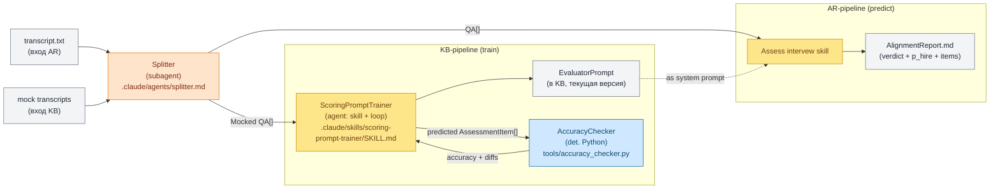

## 1. Контекст и место в системе

Документ описывает **архитектуру двух pipeline'ов** проекта в одной карте:

- **AR-pipeline (predict)** — `transcript → AlignmentReport` (модуль Assessment and Recommendations).
- **KB-pipeline (train)** — `MockedQA[] (с reference_score) → EvaluatorPrompt + accuracy на test` (обучение скоринг-промпта).

Оба pipeline'а делят два общих сервиса — **Splitter** (subagent) и **Evaluator** (skill) — но эти сервисы самостоятельны (имеют собственные entry-point'ы), не «общая часть» внутри какого-то контейнера. Архитектура читается как «инвентарь компонентов + два оркестратора, которые их вызывают», а не «common pipeline → потребители».

Документ реализует §2.5 [[spec]] «Высокоуровневая архитектура»: AR и KB структурно похожи, потому что оба обрабатывают транскрипты, и поэтому extraction (Splitter) и scoring (Evaluator) — общие компоненты.

Граница ответственности:
- [[spec]] — артефакты, сценарии, user stories; концептуальная карта в §2.5.
- **arch_pipeline** (этот документ) — карта всех компонентов AR + KB pipeline'ов, их связи, runtime каждого компонента.
- [[arch_agents]] — детали каждого компонента: контракты (§5), фазированная миграция (§6), что НЕ делаем (§8), открытые вопросы по реализации.

## 2. Архитектура

Архитектура AR + KB pipeline'ов описана здесь целиком — в одном месте, без выделения «общей части» в отдельный концепт. Состоит из четырёх классов компонентов и двух pipeline-оркестраторов.

### 2.1. Инвентарь компонентов

Четыре класса по runtime'у:

| Класс | Что это | Изоляция контекста | Примеры |
|---|---|---|---|
| **subagent** | Отдельный LLM-вызов с собственным system prompt'ом, изолированный контекст | полная (Agent tool вызывает в новой сессии) | Splitter |
| **skill** | Структурированная подсессия Claude Code (`.claude/skills/<name>/SKILL.md`); один или несколько LLM-вызовов в рамках skill-сессии | по skill-сессии (контекст ограничен skill'ом) | Evaluator, AR-Aggregator (feedback-report), ScoringPromptTrainer |
| **agent (orchestrator-skill с loop)** | Тот же skill, но внутри есть цикл обратной связи (читает результат, рефлексирует, пробует снова) | по skill-сессии, цикл внутри | ScoringPromptTrainer (loop по корпусу + редактирование промпта) |
| **детерм. компонент** | Python-скрипт, вызывается через Bash tool; без LLM | — (нет контекста) | AccuracyChecker, HighlighterRenderer |

Полный инвентарь:

| Компонент | Класс | Где живёт | Используется в | Роль |
|---|---|---|---|---|
| **Splitter** | subagent (LLM) | `.claude/agents/splitter.md` | AR + KB | extraction: `transcript.txt → QA[]` |
| **Evaluator** | skill | `.claude/skills/evaluator/SKILL.md` | AR + KB | scoring: `QA + EvaluatorPrompt → AssessmentItem` (single-shot LLM-вызов с `EvaluatorPrompt` как system prompt) |
| **AR-Aggregator** | skill (orchestrator) | `.claude/skills/feedback-report/SKILL.md` | AR only | rollup: `AssessmentItem[] → AlignmentReport` + markdown render |
| **ScoringPromptTrainer** | agent (skill + loop) | `.claude/skills/scoring-prompt-trainer/SKILL.md` (TBD, см. [[arch_agents]] §6 Phase 3) | KB only | train-loop: оценить корпус → AccuracyChecker → отредактировать `EvaluatorPrompt` → повторить |
| **AccuracyChecker** | детерм. компонент | `tools/accuracy_checker.py` | KB only | `compare(predicted: AssessmentItem[], reference: MockedQA[]) → AccuracyReport` |
| **HighlighterRenderer** | детерм. компонент | `tools/highlighter.py` | offline (валидация Splitter), [[spec_postponed]] §7 E2-6 | `render(transcript_path, qa_items) → html` |

### 2.2. Карта связей AR + KB

Единая диаграмма обоих pipeline'ов. Splitter и Evaluator — общие узлы (используются обоими оркестраторами); AR-Aggregator живёт только в AR-цепи, ScoringPromptTrainer и AccuracyChecker — только в KB-цепи.

### 2.3. Точки шва (контракты в полёте)

Где «протекают» данные между компонентами и какой контракт несут:

- **`Splitter → Evaluator`**: `QA[]` — массив QA с `type / interview_stage / topic_tag`, без оценки.
- **`Evaluator → AR-Aggregator`**: `AssessmentItem` — `score (3 bool критерия) + comment + assessor_kind = ai`.
- **`Evaluator → ScoringPromptTrainer`**: тот же `AssessmentItem`, который дальше сравнивается с `MockedQA.reference_score` через AccuracyChecker.
- **`EvaluatorPrompt → Evaluator`**: текст промпта подаётся skill'ом как system prompt в LLM-вызове. В режиме predict (AR) — финальная версия из KB; в режиме train (KB) — текущая итерация, которую трейнер редактирует на каждом цикле.
- **`ScoringPromptTrainer → KB`**: новая версия `EvaluatorPrompt` с `train_accuracy` / `test_accuracy`.

Точные контракты (поля, типы, enum'ы) — [[arch_agents]] §5.

### 2.4. Что делает каждый оркестратор

Два **entry-point'а** — это два оркестрирующих skill'а, которые пользователь / агент запускает напрямую.

- **`feedback-report` (AR-pipeline, predict, [[arch_agents]] §4.1, §5.4).** Принимает путь к папке кейса (`transcripts/<person>-<company>-YYYYMMDD/`); внутри: ① вызывает Splitter через Agent tool → `QA[]`; ② вызывает Evaluator-skill для каждого QA → `AssessmentItem[]`; ③ rollup в `AlignmentReport` (verdict + p_hire) и markdown-render. Финальный выход — `<folder>/feedback-report.<mode>.md`.
- **`scoring-prompt-trainer` (KB-pipeline, train, [[arch_agents]] §4.2, §5.3, новый skill).** Принимает путь к golden-корпусу `MockedQA[]`; внутри loop: ① на каждой итерации вызывает Evaluator-skill для всех `MockedQA` train-сабсета → predicted `AssessmentItem[]`; ② сравнивает с `MockedQA.reference_score` через AccuracyChecker (Bash → `tools/accuracy_checker.py`); ③ читает diff и редактирует `EvaluatorPrompt` (агентская часть — рефлексия); ④ повторяет. На финале — измерение `test_accuracy` на отложенном сабсете и запись новой версии промпта в KB.

`feedback-report` уже существует как монолитный skill (Splitter+Evaluator+Aggregator inline); миграция на декомпозицию — [[arch_agents]] §6 Phase 1–2. `scoring-prompt-trainer` — TBD, [[arch_agents]] §6 Phase 3.

## 3. Соседние концепты, не входящие в архитектуру AR + KB

- **Расширения AlignmentReport** (`AssessmentTopic`, `Recommendation`, `topic_assessments`, `strengths/gaps_summary`) — postponed, [[requirements_postponed]] §5. Сейчас AR-Aggregator выдаёт минимальный `AlignmentReport` (`verdict + p_hire + items`).
- **LLM-as-judge / Evaluation / EvalDataset** — отменены решением 2026-05-11. Регрессионная метрика заменена accuracy на отложенном test-сабсете golden-корпуса (вычисляется AccuracyChecker'ом внутри ScoringPromptTrainer-loop'а, см. [[spec_postponed]] §7 E2-6).
- **`eval-hard` / `eval-soft` как отдельные subagent'ы по `QA.type`** — отменены: один Evaluator-skill читает `EvaluatorPrompt` и применяет его независимо от `type` (различие поведения внутри промпта).

## 4. Открытые вопросы

- [ ] **Mode/scenario propagation в Evaluator.** Orchestrator передаёт (mode `blind|with-feedback`, scenario `train|predict`) кортеж явным полем, или Evaluator остаётся scenario-agnostic, потому что `EvaluatorPrompt` уже несёт всю scenario-специфику? Расширение open question из [[arch_agents]] §9 «Mode propagation».
- [ ] **EvaluatorPrompt storage.** Где живёт текущая версия `EvaluatorPrompt`: `kb/evaluator_prompt.md` в репозитории, frontmatter с `version` + `accuracy`, или БД? Решение в Phase 3 [[arch_agents]].
- [ ] **KB-pipeline entry-point.** Отдельный skill (`scoring-prompt-trainer`) или CLI-флаг feedback-report? Решение приходит вместе с разблокировкой train-loop, см. [[arch_agents]] §6.
- [ ] **Контракт `MockedQA` на входе KB-pipeline.** Splitter формально выдаёт `QA[]`, но в train на вход идут `MockedQA[]` (уже с `reference_answer` + `reference_score`). Splitter в train либо пропускается (вход — уже размеченный `MockedQA[]`), либо запускается на сыром mock-транскрипте, а reference-поля прикладываются стадией-обёрткой. Решение зависит от формата `labeling/`.
- [ ] **Кросс-skill вызов.** Как `ScoringPromptTrainer` (agent) вызывает Evaluator (skill) на каждой итерации loop'а — через `Skill` tool с args, через `Bash → claude /evaluator …`, через прямое чтение `SKILL.md` и инлайн-исполнение в той же сессии? Влияет на изоляцию контекста между итерациями train-loop'а. Решение в Phase 2 [[arch_agents]].
- [ ] **Контракт args Evaluator-skill.** Input — путь к JSON с `QA[]` + путь к `EvaluatorPrompt` файлу, или inline-текст через args? Output — JSON-файл или stdout? Связано с тем, как `ScoringPromptTrainer` собирает batch result для `AccuracyChecker`. Уточнить при создании `.claude/skills/evaluator/SKILL.md`.

## 5. Связи

- [[spec]] — `md/spec.md` — §2.5 «Высокоуровневая архитектура» (концептуальный источник архитектуры), §5 «Сценарии использования».
- [[arch_agents]] — `md/arch_agents.md` — детальная архитектура каждого компонента: контракты `QA` / `AssessmentItem` / `EvaluatorPrompt` / `AlignmentReport` (§5), фазированная миграция от монолитного feedback-report (§6), что НЕ делаем (§8), открытые вопросы по реализации (§9).
- [[requirements_postponed]] — `md/requirements_postponed.md` — §5 Advanced AR (расширения `AlignmentReport`).
- [[2026-05-06_Architecture_meeting]] — `internal-notes/2026-05-06_Architecture_meeting.txt` — архитектурная встреча, на которой родилась идея общих компонентов Splitter + Evaluator.
- [[2026-05-11_mentor_meeting]] — `internal-notes/2026-05-11_mentor_meeting.txt` — ML-метафора (train / predict), отмена Evaluation/EvalDataset/LLM-as-judge, замена их на accuracy на test-сабсете.
