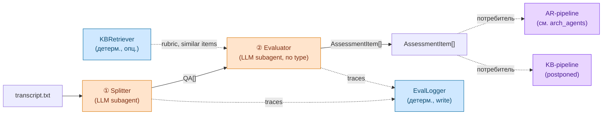

## 1. Контекст и место в системе

Документ описывает **общую часть обработки транскрипта** — две стадии (① Splitter, ② Evaluator), которые переиспользуются двумя end-to-end pipeline'ами:

- **AR-pipeline** (S4, transcript → `AlignmentReport`) — описан в [[arch_agents]].
- **KB-pipeline** (S3, transcript → KB-наполнение) — postponed, см. §4 «Потребители».

Это **building block, не самостоятельный pipeline** — общая часть сама по себе ничего полезного для конечного пользователя не производит, она только превращает транскрипт в `AssessmentItem[]`. Дальше этот вход потребляется одним из двух pipeline'ов.

Документ реализует §2.3 [[spec]] «Архитектурное соображение»: KB и AR структурно похожи, потому что оба обрабатывают транскрипты интервью, поэтому extraction-часть выносится отдельно ради DRY и переиспользования.

Граница ответственности:
- [[spec]] — артефакты, сценарии, user stories; общая часть упомянута в §2.3 и §5.
- **arch_pipeline** (этот документ) — generic-контракт общей части: стадии, потребители, где живёт стадия ③ для каждого потребителя, anti-circularity по AssessmentItem.
- [[arch_agents]] — AR-pipeline целиком (включая стадию ③ S4-Aggregator → `AlignmentReport`); каноническое определение контрактов `QA` / `AssessmentItem` (§5.1 / §5.2).

## 2. Стадии общей части

Две стадии, обе — LLM-агенты (subagent'ы в Claude Code runtime, см. [[arch_agents]] §2.2):

| # | Стадия | Где живёт | Input | Output | Применимо к |
|---|---|---|---|---|---|
| ① | **Splitter** | `.claude/agents/splitter.md` | `transcript.txt` + speaker rules | `QA[]` | AR-pipeline + KB-pipeline |
| ② | **Evaluator** (по type) | `.claude/agents/eval-{hard,soft,behavioral}.md` | `QA` (+ опц. rubric, similar items из KB) | `AssessmentItem` (`assessor_kind = ai`) | AR-pipeline + KB-pipeline |

KB-grounding в стадии ② — **опциональный контракт**: Evaluator принимает `rubric` / `similar items` через KBRetriever, но активируется этот канал только теми pipeline'ами, у которых KB уже наполнена (AR-pipeline ✓, KB-pipeline ✗ — KB пустая, иначе циркулярность, см. §3).

Стадия ③ намеренно отсутствует в общей части — она всегда **потребитель-специфична**:
- **AR-pipeline** — стадия ③ — S4-Aggregator → `AlignmentReport`. См. [[arch_agents]] §4.1.
- **KB-pipeline** — стадия ③ — KB-rollup → пополнение `Requirements` / `Rubric` / частотных таблиц. Postponed, см. §4.

## 3. Контракты

Каноническое определение контрактов живёт в [[arch_agents]] §5 (исторически они были там до выноса общей части). Здесь — лишь напоминание ключевых полей и правил применения.

- **`QA`** — выход Splitter; сырая пара вопрос-ответ с классификацией (`type`, `interview_stage`, `topic_tag`), без оценки. Полное определение — [[arch_agents]] §5.1; концептуальное — [[spec]] §3.
- **`AssessmentItem`** — выход Evaluator; оценка одного `QA` AI-assessor'ом (`assessor_kind = ai`). Полное определение — [[arch_agents]] §5.2; концептуальное — [[spec]] §3.

**Anti-circularity по AssessmentItem (важно для KB-pipeline):**

`AssessmentItem`'ы из KB-pipeline (S3) попадают в KB как **сырые сигналы для human-курации** ([[spec]] §7 E2-3 «Эксплораторный анализ»), а **не** как ground truth. `Requirements` / `Rubric` извлекаются человеком из этих сигналов; только результат человеческой курации становится grounding'ом для AR-pipeline (S4).

Если бы AI-AssessmentItem'ы из S3 шли прямо в KB как rubric — они потом стали бы grounding'ом для самих себя в S4 (cyclic). Поэтому KB-pipeline в S3 работает **без KBRetriever** (см. §2), и его выход проходит human-фильтр перед тем, как попасть в KB-rubrics.

## 4. Потребители

Где живёт стадия ③ end-to-end для каждого pipeline'а:

| Потребитель | Стадия ③ | Выход стадии ③ | Документация |
|---|---|---|---|
| **AR-pipeline** (S4) | S4-Aggregator (LLM, orchestrator-сессия) | `AlignmentReport` (verdict + p_hire + items) → markdown | [[arch_agents]] §4.1, §5.3 |
| **KB-pipeline** (S3) | KB-rollup (агент или детерм. компонент — open question) | `Requirements` / `Rubric` / частотные таблицы → пополнение KB | postponed: ожидается в `arch_kb_pipeline.md` или разделе [[spec]] §7 E2-3 / E2-4 при имплементации |

KB-pipeline в MVP-горизонте до 14.05 не реализован отдельным entry-point'ом. Что уже есть для разблокировки KB-pipeline'а:
- общая часть (стадии ①②) — реализуется в Phase 1–2 [[arch_agents]] §7;
- AssessmentItem'ы пишутся в `transcripts/mock-*` ровно тем же скиллом feedback-report (когда тот вынесет Splitter/Evaluator в субагенты).

Что блокирует KB-pipeline на сегодня:
- нет S3-entry-point'а (CLI-флаг скилла / отдельный skill / режим в frontmatter входной папки) — open question §6;
- не определён формат KB-rollup'а (агент vs детерм. rollup) — open question §6.

## 5. Соседние концепты, не являющиеся частью этой общей части

- **Eval-regression (E2-6)** — отдельный judge-pipeline над `AssessmentItem → Evaluation` (`judge_kind = ai` vs `human`). Операционно изолирован ([[spec]] §7 E2-6: «отдельный (дешёвый) вызов LLM, собственный промпт, отдельное окно контекста — не разделяет state с основным пайплайном»). Не вариация этой общей части — соседний pipeline.
- **KB-курация** — цепочка KB-pipeline-AssessmentItem → human-разметка → `Requirements` / `Rubric` происходит **вне** общей части. Общая часть только производит сырые `AssessmentItem[]`.
- **Расширения AlignmentReport** (`AssessmentTopic`, `Recommendation`, `topic_assessments`, `strengths/gaps_summary`) — postponed, [[requirements_postponed]] §5. Не часть общей части (живут в стадии ③ AR-pipeline'а).

## 6. Открытые вопросы

- [ ] **Mode/scenario propagation в Evaluator.** Orchestrator передаёт (mode `blind|with-feedback`, scenario `S3|S4`) кортеж явным полем, или Evaluator остаётся scenario-agnostic, и KB-grounding активируется через наличие/отсутствие `rubric` / `similar items` в input'е? Расширение open question из [[arch_agents]] §9 «Mode propagation».
- [ ] **KBRetriever интерфейс.** Контракт общий для AR/KB-потребителей или AR-specific (KB-pipeline в S3 его не вызывает)? Решение в Phase 3 [[arch_agents]] §7.
- [ ] **S3-entry-point.** CLI-флаг feedback-report SKILL / отдельный skill / режим в frontmatter входной папки? Решение приходит вместе с разблокировкой KB-pipeline'а.
- [ ] **KB-rollup формат.** Стадия ③ KB-pipeline'а — отдельный subagent (rubric-summary prompt) или детерминированный rollup (Python tool, агрегирующий `AssessmentItem.score` по группам)? Зависит от объёма E2-3 эксплораторного анализа.

## 7. Связи

- [[spec]] — `md/spec.md` — §2.3 «Архитектурное соображение» (концептуальный источник общей части), §5 «Сценарии использования» (S3 / S4).
- [[arch_agents]] — `md/arch_agents.md` — AR-pipeline целиком (потребитель этой общей части); каноническое определение контрактов `QA` / `AssessmentItem`.
- [[requirements_postponed]] — `md/requirements_postponed.md` — §5 Advanced AR (расширения `AlignmentReport`, не относятся к общей части).
- [[2026-05-06_Architecture_meeting]] — `internal-notes/2026-05-06_Architecture_meeting.txt` — встреча, на которой родилось §2.3.
