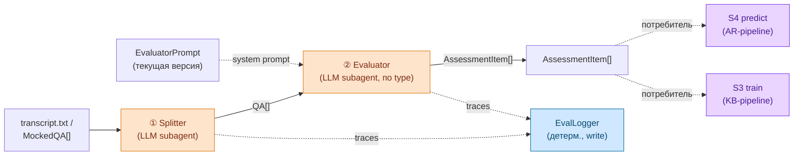

## 1. Контекст и место в системе

Документ описывает **общую часть обработки транскрипта** — две стадии (① Splitter, ② Evaluator), которые переиспользуются двумя end-to-end pipeline'ами:

- **AR-pipeline** (S4, predict) — `transcript → AlignmentReport`. Описан в [[arch_agents]] §4.
- **KB-pipeline** (S3, train) — `MockedQA[] (с reference_score) → EvaluatorPrompt + accuracy на test`. Описан в [[arch_agents]] §4 как parallel branch.

Это **building block, не самостоятельный pipeline** — общая часть сама по себе ничего полезного для конечного пользователя не производит, она только превращает транскрипт (или его QA-проекцию) в `AssessmentItem[]` через выбранный `EvaluatorPrompt`. Дальше этот вход потребляется одним из двух pipeline'ов.

Документ реализует §2.3 [[spec]] «Архитектурное соображение»: KB и AR структурно похожи, потому что оба обрабатывают транскрипты интервью, поэтому extraction- и scoring-часть выносится отдельно ради DRY.

Граница ответственности:
- [[spec]] — артефакты, сценарии, user stories; общая часть упомянута в §2.3 и §5.
- **arch_pipeline** (этот документ) — generic-контракт общей части: стадии, потребители, контракт `EvaluatorPrompt` между S3 и S4.
- [[arch_agents]] — AR-pipeline (S4 predict) целиком + S3 train-loop; каноническое определение контрактов `QA` / `AssessmentItem` (§5.1 / §5.2).

## 2. Стадии общей части

Две стадии, обе — LLM-агенты (subagent'ы в Claude Code runtime, см. [[arch_agents]] §2.2):

| # | Стадия | Где живёт | Input | Output | Применимо к |
|---|---|---|---|---|---|
| ① | **Splitter** | `.claude/agents/splitter.md` | `transcript.txt` + speaker rules | `QA[]` | AR + KB pipeline'ы |
| ② | **Evaluator** (по type) | `.claude/agents/eval-{hard,soft}.md` | `QA` + `EvaluatorPrompt` (текущая версия) | `AssessmentItem` (`assessor_kind = ai`, см. [[spec]] §3) | AR + KB pipeline'ы |

`EvaluatorPrompt` в стадии ② — **обязательный** input: его текст идёт в system prompt Evaluator-агента. В режиме S4 (predict) приходит финальная версия из KB; в режиме S3 (train) — текущая итерация, которую S3-trainer редактирует на каждом цикле.

Стадия ③ намеренно отсутствует в общей части — она всегда **потребитель-специфична**:
- **AR-pipeline** (S4 predict) — стадия ③ — S4-Aggregator → `AlignmentReport`. См. [[arch_agents]] §4.1.
- **KB-pipeline** (S3 train) — стадия ③ — S3-PromptTuner → редактирует `EvaluatorPrompt` и измеряет accuracy на test-сабсете. См. [[arch_agents]] §4.2.

## 3. Контракты

Каноническое определение контрактов живёт в [[arch_agents]] §5 (исторически они были там до выноса общей части). Здесь — лишь напоминание ключевых полей и правил применения.

- **`QA`** — выход Splitter; сырая пара вопрос-ответ с классификацией (`type ∈ {hard, soft}`, `interview_stage`, `topic_tag`), без оценки. Полное определение — [[arch_agents]] §5.1; концептуальное — [[spec]] §3.
- **`AssessmentItem`** — выход Evaluator; оценка одного `QA` AI-assessor'ом (`assessor_kind = ai`). Полное определение — [[arch_agents]] §5.2; концептуальное — [[spec]] §3.
- **`EvaluatorPrompt`** — system prompt Evaluator'а + версия + accuracy на train/test. Контракт между S3 (train, output) и S4 (predict, input). Определён в [[spec]] §3 и [[arch_agents]] §5.3.

`behavioral` как значение `QuestionType` отменён решением 11-05; поведенческие вопросы классифицируются Splitter'ом как `soft` (см. [[assessors]]).

## 4. Потребители

Где живёт стадия ③ end-to-end для каждого pipeline'а:

| Потребитель | Стадия ③ | Выход стадии ③ | Документация |
|---|---|---|---|
| **AR-pipeline** (S4 predict) | S4-Aggregator (LLM, orchestrator-сессия) | `AlignmentReport` (verdict + p_hire + items) → markdown | [[arch_agents]] §4.1, §5.4 |
| **KB-pipeline** (S3 train) | S3-PromptTuner (LLM, orchestrator-сессия) + measure accuracy на test | новая версия `EvaluatorPrompt` + train/test accuracy → пополнение KB | [[arch_agents]] §4.2, §5.3 |

Оба pipeline'а готовы к запуску после Phase 1–2 (общая часть). S3 — самостоятельный entry-point: отдельный skill (или флаг в feedback-report) — см. [[arch_agents]] §6.

## 5. Соседние концепты, не являющиеся частью этой общей части

- **S3 train-loop** (PromptTuner + accuracy на test) — потребитель общей части, не её внутренность. Описан в [[arch_agents]] §4.2.
- **Расширения AlignmentReport** (`AssessmentTopic`, `Recommendation`, `topic_assessments`, `strengths/gaps_summary`) — postponed, [[requirements_postponed]] §5. Не часть общей части (живут в стадии ③ AR-pipeline'а).
- **LLM-as-judge / Evaluation / EvalDataset** — отменены решением 2026-05-11. Регрессионная метрика заменена обычной accuracy на отложенном test-сабсете golden-корпуса (внутри S3, см. [[spec_postponed]] §7 E2-6).

## 6. Открытые вопросы

- [ ] **Mode/scenario propagation в Evaluator.** Orchestrator передаёт (mode `blind|with-feedback`, scenario `S3|S4`) кортеж явным полем, или Evaluator остаётся scenario-agnostic, потому что `EvaluatorPrompt` уже несёт всю scenario-специфику? Расширение open question из [[arch_agents]] §9 «Mode propagation».
- [ ] **EvaluatorPrompt storage.** Где живёт текущая версия `EvaluatorPrompt`: `kb/evaluator_prompt.md` в репозитории, frontmatter с `version` + `accuracy`, или БД? Решение в Phase 3 [[arch_agents]].
- [ ] **S3-entry-point.** Отдельный skill (`train-evaluator`) или CLI-флаг feedback-report? Решение приходит вместе с разблокировкой S3 train-loop, см. [[arch_agents]] §6.
- [ ] **Контракт `MockedQA` в общей части.** Splitter формально выдаёт `QA[]`, но в S3 train на вход общей части идут `MockedQA[]` (уже с `reference_answer` + `reference_score`). Splitter в S3 либо пропускается (вход — уже размеченный `MockedQA[]`), либо запускается на сыром mock-транскрипте, а reference-поля прикладываются стадией-обёрткой. Решение зависит от того, в каком формате администратор KB ведёт `labeling/`.

## 7. Связи

- [[spec]] — `md/spec.md` — §2.3 «Архитектурное соображение» (концептуальный источник общей части), §5 «Сценарии использования» (S3 / S4).
- [[arch_agents]] — `md/arch_agents.md` — AR-pipeline (S4 predict) + S3 train-loop; каноническое определение контрактов `QA` / `AssessmentItem` / `EvaluatorPrompt`.
- [[requirements_postponed]] — `md/requirements_postponed.md` — §5 Advanced AR (расширения `AlignmentReport`, не относятся к общей части).
- [[2026-05-06_Architecture_meeting]] — `internal-notes/2026-05-06_Architecture_meeting.txt` — встреча, на которой родилось §2.3 (общая часть).
- [[2026-05-11_mentor_meeting]] — `internal-notes/2026-05-11_mentor_meeting.txt` — ML-метафора (S3 train, S4 predict), отмена Evaluation/EvalDataset/LLM-as-judge, замена их на accuracy на test-сабсете.
