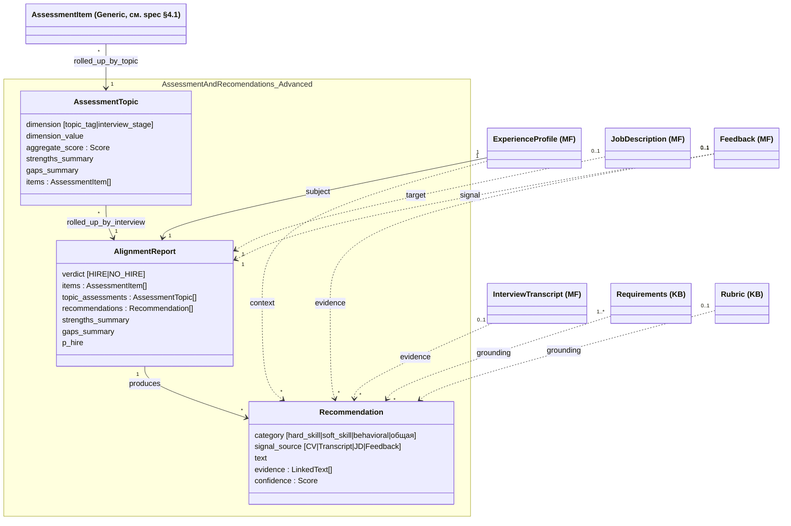

## 1. Контекст

Сюда вынесены **сценарии и user stories**, которые попали в первоначальную постановку [[spec]], но по итогам встречи с ментором 2026-04-30 решено не делать в MVP-горизонте (до 14.05/21.05/23.05).

Документ — пара к [[spec]]:
- `[[spec]]` — то, что **делаем** в MVP;
- этот файл — то, что **не делаем сейчас**, но хотим явно зафиксировать (возможно, вернёмся после защиты).

Нумерация сохранена из spec.md, чтобы внешние ссылки на старые ID не ломались. Если позже сценарий/история возвращается в активный scope — переносится обратно в [[spec]].

## 2. Сценарии (postponed)

Колонки те же, что в [[spec#5. Сценарии использования]]. Колонка **Причина** — почему вынесли.

| ID | Группы | Что есть на входе | Что хочет пользователь | Наш кейс | Причина postponed |
|----|--------|-------------------|-------------------------|----------|-------------------|
| **S1** | MF | Только профиль (CV + ценности + background) | Общие рекомендации по поиску, опираясь на знания агента | Мы до начала отклика | Mentor: «минимальное число сценариев, которые работают хорошо» — fallback на знаниях агента не закрывает ядро ценности |
| **S2** | MF + KB | Профиль + список вакансий | Ранжирование вакансий, акценты для отклика, упражнение «карьерный шкаф» | Мы при выборе, куда откликаться | Не успеваем к 14.05 — отдельный пайплайн ранжирования (см. также §8 [[spec]]) |

## 3. Артефакты на входе (postponed)

Строки матрицы заполненности из [[spec#3.1. Матрица заполненности]], которые соответствовали S1/S2 и потому ушли вместе с ними.

| Кейс | CV | JD | Transcript | Feedback | Что делала бы система | Соответствует |
|------|----|----|------------|----------|------------------------|---------------|
| Состояние до отклика | ✓ | — | — | — | общие рекомендации (fallback на знаниях агента) | S1 |
| Новая заявка, до интервью | ✓ | ✓ | — | — | рекомендации к подготовке, ранжирование | S2 |

## 4. User stories (postponed)

### E1. Market Flow (события воронки)

В MVP **prerequisite на стороне пользователя**: создать папку `transcripts/<person>-<company>-YYYYMMDD/` и положить туда CV, vacancy, transcript, feedback (см. [[spec#1.1. Prerequisite: ручной ввод кейса]]). Истории ниже описывают то, как это могло бы быть автоматизировано — вернёмся после MVP.

**E1-1 «Профиль».** Как кандидат, я хочу создать или обновить расширенный профиль (CV + ценности + принципы + background), чтобы система знала, что я умею, чего хочу и чем отличаюсь от типового кандидата на роль.
- [ ] профиль создаётся инкрементально: можно загрузить только CV, потом добавить заметки
- [ ] обновления накапливаются, не перетирают предыдущее
- [ ] профиль — единственная сущность, без которой система не работает (см. прогрессию в §2 [[spec]])

**Причина postponed:** в MVP пользователь сам создаёт папку кейса. Полноценный инкрементальный ingest профиля — отдельная задача поверх ядра E3-4.

**E1-2 «Новая заявка».** Как кандидат, я хочу зарегистрировать новую заявку (`Кандидат × Вакансия → Application`), чтобы система знала о моём текущем поиске и могла подсказать что-то прицельно под эту компанию.
- [ ] заявка создаётся со стадией `Applied` по умолчанию
- [ ] требуется минимум: заголовок + компания; полный JD опционален
- [ ] новые `Company` / `Vacancy` создаются лениво при первом упоминании

**Причина postponed:** в MVP заявка = папка `transcripts/<person>-<company>-YYYYMMDD/`. Структурированная регистрация — после.

**E1-3 «Смена стадии».** Как кандидат, я хочу зафиксировать смену стадии заявки (`Applied → Screening → Interviewing → Feedback → Offer/Rejected`), чтобы воронка отражала актуальное состояние.
- [ ] переход стадий явный, с датой
- [ ] закрытые заявки (`Offer`/`Rejected`) остаются как история, но не попадают в активные рекомендации

**Причина postponed:** в MVP не делаем явную модель стадий — фактическое состояние воронки реконструируется по наличию `Feedback` у соответствующего раунда (E1-5 [[spec]]). Полноценная модель стадий вернётся, если пайплайн расширится за пределы единичного отчёта.

### E3. Матчинг, рекомендации, контроль качества

Эпик соответствует модулю **Assessment and Recomendations** из [[spec#2. Ключевые понятия]] — выходу системы (рекомендации + структурированный отчёт). Истории ниже — те его расширения, которые в MVP не делаем.

**E3-1 «Свободный диалог».** Как кандидат, я хочу спросить ассистента в свободной форме («на чём сделать акцент в собесе на роль X», «как рассказать о слабом месте Y»), чтобы получать ответы, опирающиеся на Market Flow и/или Knowledge Base.
- [ ] доступно при наличии только профиля (S1) — фолбэк на знания агента
- [ ] при наличии корпуса ответ цитирует Market Flow (E1) и/или Knowledge Base (E2)
- [ ] нет «чистой галлюцинации» из общих знаний LLM без указания источника

**Причина postponed:** свободный диалог требует устойчивого retrieval по KB и грамотного fallback — отдельный пайплайн поверх ядра E3-4. Не успеваем к 14.05.

**E3-2 «Ранжирование вакансий».** Как кандидат, я хочу скинуть N вакансий и получить ранжированный список «куда откликаться первой», чтобы экономить мышление при отклике.
- [ ] метрика ранжирования объяснена (overlap по навыкам, наличие критичных гэпов)
- [ ] для каждой вакансии — на чём сделать акцент в CV/cover letter
- [ ] поддерживается случай, когда у вакансий есть только короткий заголовок без полного JD

**Причина postponed:** соответствует сценарию S2 (тоже postponed). Отдельный пайплайн ранжирования над набором JD — не входит в MVP-ядро (отчёт по конкретному интервью).

**E3-3 «Карьерный шкаф».** Как кандидат, я хочу провести упражнение «карьерный шкаф» (≈10 вакансий → ранжированный список навыков → метч с собственными), чтобы увидеть зону развития.
- [ ] выход: топ-N навыков с частотой и метчем «есть / частично / нет» относительно профиля
- [ ] использует словарь навыков из E2-3 «Эксплораторный анализ» [[spec]]
- [ ] предлагает 2-3 направления развития на основе гэпов

**Причина postponed:** надстройка поверх E3-2 (ранжирование). Без неё — нет смысла без полной агрегации навыков по корпусу вакансий.

**E3-5 «Структура рекомендаций» (postponed; перенесена из spec §7 решением 06-05 «попроще»).** Как кандидат, я хочу видеть рекомендации сгруппированными и со ссылками на источник, чтобы понимать, на основании чего они выданы.
- [ ] рекомендации сгруппированы по `category` (hard_skill / soft_skill / behavioral / общая)
- [ ] для каждой рекомендации видна цитата (`evidence`) и пометка `signal_source` (CV / Transcript / JD / Feedback)
- [ ] рекомендация без `evidence` или без `signal_source` считается багом и не отдаётся пользователю

**Причина postponed:** требует артефакта `Recommendation` (§5 этого файла); MVP-выход — простой `AssessmentItem[]` + `AlignmentReport.verdict`. Возвращается вместе с E3-7.

**E3-6 «Topic rollup» (postponed; новая 06-05).** Как кандидат, я хочу видеть оценку по блокам интервью (experimentation / behavioral / system_design / …), чтобы понимать, какие темы просели целиком, а не только отдельные вопросы.
- [ ] на выходе — `AssessmentTopic[]` по `(interview_round × topic_tag)` и/или `(interview_round × interview_stage)`
- [ ] для каждого блока — `aggregate_score` (по тем же осям, что `AssessmentItem.score`), `strengths_summary`, `gaps_summary`, цитаты из `items`
- [ ] блок без `items` (нет вопросов этой темы) — не отображать

**Причина postponed:** требует артефакта `AssessmentTopic` (§5 этого файла); MVP — плоский список `AssessmentItem[]` без topic-rollup. Возвращается вместе с E3-7.

**E3-7 «Структурированный отчёт» (postponed; вынесен из E3-4 spec'и решением 06-05).** Как кандидат, я хочу видеть отчёт со структурой aligned / partial / missing относительно `Requirements` (KB) и `JD` (MF), плюс калиброванный `P(HIRE)`, чтобы лучше понять gap.
- [ ] секции отчёта: aligned / partial / missing — каждая с цитатами из транскрипта
- [ ] `verdict ∈ {HIRE, NO_HIRE}` уже есть в MVP (см. [[spec]] E3-4); здесь добавляется `P(HIRE)` (целое в `[0, 100]`)
- [ ] вкладывается `topic_assessments: AssessmentTopic[]` (см. E3-6) и `recommendations: Recommendation[]` (см. E3-5)
- [ ] `strengths_summary` / `gaps_summary` — короткий нарратив на отчёт, не на блок

**Причина postponed:** требует Advanced `AlignmentReport` с `topic_assessments` / `recommendations` / `strengths_summary` / `gaps_summary` / `P(HIRE)` — все эти поля определены в §5 этого файла. MVP-вариант `AlignmentReport` ([[spec]] §3) — просто `{verdict, items}`.

## 5. Артефакты-расширения (postponed)

Концепты, вынесенные из [[spec]] §3 AR-блока решением 06-05 («попроще»). Возвращаются вместе со stories E3-5 / E3-6 / E3-7 (§4 этого файла), если потребуется структурированный пользовательский отчёт.

- **AssessmentTopic** — промежуточный rollup `AssessmentItem[]` по `(interview_round, topic_tag)` или `(interview_round, interview_stage)`. Поля: `dimension ∈ {topic_tag, interview_stage}`, `dimension_value`, `aggregate_score` (по тем же осям, что `AssessmentItem.score` — см. [[assessors]]), `strengths_summary`, `gaps_summary`, `items: AssessmentItem[]`.
- **Recommendation** — единица того, что система советует кандидату. Поля: `category ∈ {hard_skill, soft_skill, behavioral, общая}`, `signal_source ∈ {CV, Transcript, JD, Feedback}`, `text` (формулировка), `evidence: LinkedText[]`, `confidence: Score`. Без явного определения этой сущности невозможно сформулировать критерии оценки качества (фидбэк ментора 2026-04-30: «от этого исходит всё остальное, в том числе оценка»).
- **AlignmentReport — Advanced extensions** — поверх MVP-варианта `{verdict, items}` добавляются: `topic_assessments: AssessmentTopic[]`, `recommendations: Recommendation[]`, `strengths_summary`, `gaps_summary`, `P(HIRE) ∈ [0, 100]`. Структура отчёта: aligned / partial / missing относительно `Requirements` и `JD`.

Class-диаграмма Advanced-расширений (для возврата в [[spec]] §4.1, если включаются):

## 6. Связи

- [[spec]] — `md/spec.md` — активный scope MVP
- [[spec#8. Не в scope]] — другие вещи, которые принципиально не делаем (не путать с postponed)
- [[2026-04-30_AMxMentor]] — `internal-notes/2026-04-30_AMxMentor.txt` — встреча, на которой принято решение о сужении MVP
- [[2026-05-06_Architecture_meeting]] — `internal-notes/2026-05-06_Architecture_meeting.txt` — архитектурная встреча; первоначально вводила `AssessmentTopic` / `Recommendation` / расширенный `AlignmentReport`, последующим решением 06-05 они вынесены сюда