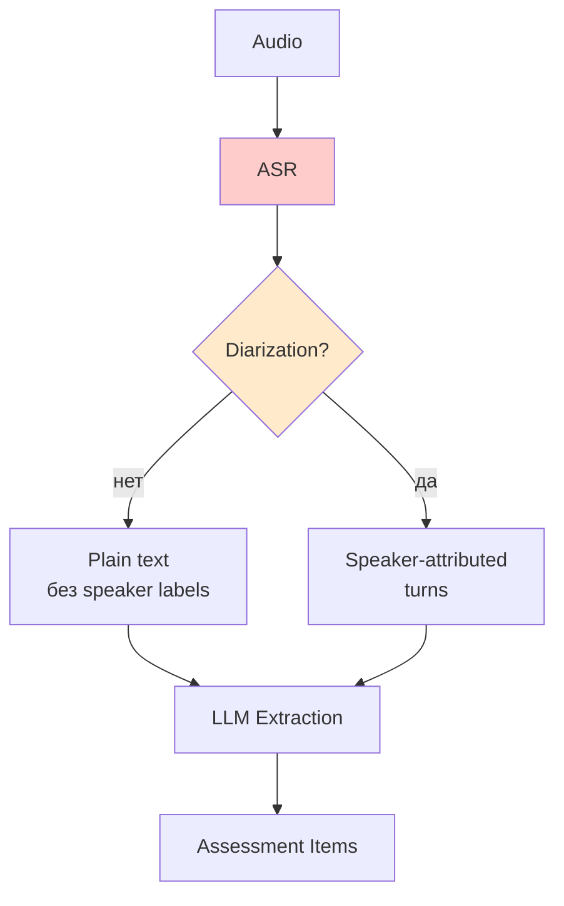
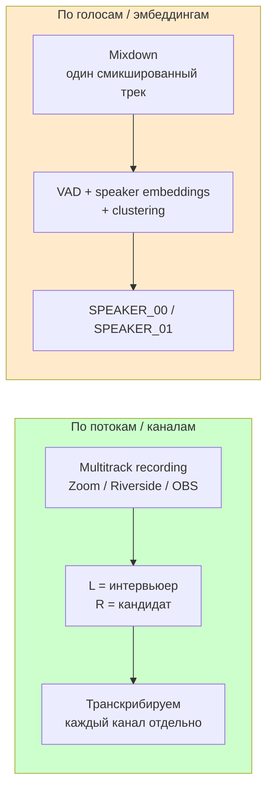

# Влияние диаризации на извлечение Assessment Items

## Контекст

Эксперимент: ручная разметка одного интервью (`junior-data-scientist-собеседование-karpov-courses-20220330`) на Assessment Items. Результат — 19 уверенных + 4 пограничных items в [`assessment_items.csv`](../../transcripts/karpov-courses-собеседования/junior-data-scientist-собеседование-karpov-courses-20220330/assessment_items.csv) и [`assessment_items_doubtful.csv`](../../transcripts/karpov-courses-собеседования/junior-data-scientist-собеседование-karpov-courses-20220330/assessment_items_doubtful.csv).

В процессе разметки выявлены классы ошибок. Заметка отвечает на вопрос: **насколько диаризация снимает эти ошибки.**

Связано с [[diarization]] (общее MVP-решение «отложить до чекпоинта 2026-05-14») — настоящая заметка дополняет тем, на каких именно стадиях pipeline диаризация даёт uplift.

## TL;DR

Диаризация снимает **самый дешёвый класс ошибок** (кто говорит, где границы реплик), но не тронет три самых дорогих:
1. ASR-шум доменных терминов;
2. semantic Q/A pairing внутри одного спикера;
3. correctness scoring.

Грубо: extraction confidence вырастет с ~70% до ~90%, scoring почти не сдвинется.

## Концептуальная модель



Диаризация — это улучшение узла `C`. Она ортогональна качеству `B` (ASR) и `E` (semantic LLM).

## Карта проблем → влияние диаризации

Категории проблем, выявленные в эксперименте (см. также блок «Реализуемость LLM-парсинга» в обсуждении эксперимента):

| Проблема | Без диаризации | С диаризацией | Класс |
|---|---|---|---|
| Q/A boundary detection | угадываю по интонации/маркерам | автоматически: turn = chunk | **решено** |
| Извлечение ответа кандидата | ручная чистка от вставок | `text where speaker == candidate` | **решено** |
| Scaffolding detection | субъективный счёт наводящих фраз | метрика: `interviewer_turns_between(Q, final_A) > 3` | **решено** |
| Teaching vs assessment | эвристика по содержанию | соотношение `interviewer_time / total > 0.7` | **решено** |
| Long-running threads | каша на 20 минут (Q9 group_by_sum) | видно: 30+ turn-пар, кандидат говорит ~20% времени | **решено** |
| ASR-качество доменных терминов | «Шапиро-Уилка» → «шопер мелко» | то же самое | **не решено** |
| Semantic Q/A pairing внутри одного speaker'а | три подвопроса подряд = три Q | то же самое: один chunk, 3 Q | **не решено** |
| Cross-talk / поддакивания | мусор в ответе | технически распознаётся, семантически — нет | **частично** |
| Correctness scoring | независимо от транскрипта | то же | **не решено** |
| Расхождение «реакция интервьюера vs истина» (FULL JOIN=150) | независимый expected_answer обязателен | то же | **не решено** |

## Иллюстрация: эпизод S1 (`id()` и `dict`)

Без диаризации читается как «вопрос → ответ». С диаризацией структура очевидна:

```
[I]: вопрос про foo(dict)
[I]: hint про id()
[I]: hint про напиши print(id(...))
[C]: угу
[I]: hint про .copy()
[C]: понял
```

Авто-флаг `scaffolding=true` ставится по соотношению `interviewer_turns / candidate_turns > 3` без semantic analysis.

## Численная оценка для pipeline

Pipeline (см. [[arch]], раздел про extraction):

| Стадия | Сейчас | + Диаризация | Δ |
|---|---|---|---|
| Section detection | 95% | 95% | 0 |
| Q/A boundary extraction | ~70% | ~95% | **+25 pp** |
| Attribution (чей текст) | ~85% | ~98% | +13 pp |
| Scaffolding flag | manual | automatic | качественный скачок |
| Domain-term ASR | 60% | 60% | 0 |
| Expected answer correctness | независимо от транскрипта | то же | 0 |
| Final score assignment | ~75% | ~80% | +5 pp |

Итого по items: уверенно extracted поднимется с ~80% покрытия до ~92%. По score consistency — от ~75% до ~80%.

## Технические заметки

- **2 спикера + чистая запись 1-на-1** — идеальный кейс для диаризации. WhisperX / pyannote / AssemblyAI на русском дают DER 5–10% на таком сетапе.
- **Стоимость:**
    - WhisperX = бесплатно локально (GPU желательно).
    - AssemblyAI ~$0.01/минута + speaker labels из коробки.
    - Для часового интервью — копейки (см. [[billing]]).
- **Альтернатива без диаризации:** Whisper-large + LLM-based speaker attribution post-hoc по содержанию. Дешевле, но качество ниже на overlap.

## Tradeoffs

| Решение | За | Против |
|---|---|---|
| Не делать до 2026-05-14 (текущий план в [[diarization]]) | минимальный скоуп, проект про prompt/agents/eval | потеря ~15 pp на extraction confidence до тех пор |
| Прикрутить WhisperX сейчас | unblock-ает scaffolding-флаг, чище ответы кандидата | ~1 день работы + GPU/время на инференс |
| Только LLM speaker attribution post-hoc | без новых зависимостей | хуже на overlap и коротких репликах |

## Рекомендация

Диаризация — **must-have** в долгосрочной перспективе, но не silver bullet. Самый высокий ROI получится в комбинации:

```
audio
  → diarization (WhisperX)
  → domain-aware LLM cleanup (DS-промпт)
  → section split
  → Q/A pair extraction (с speaker labels)
  → independent expected_answer (LLM, не доверяет транскрипту)
  → two-signal scoring (interviewer reaction + domain truth)
```

Без диаризации — мучаемся на boundary detection. Без domain-aware ASR — мучаемся на скоринге. Это два независимых улучшения, **диаризация дешевле и даёт больший uplift на extraction**.

Триггер к решению (согласован с [[diarization]]): измерить misattribution на 5–10 интервью; если >10% — за 1 день прикрутить WhisperX как отдельный шаг (yt-dlp → WhisperX → `transcript.txt` с `[SPEAKER_00] ...` / `[SPEAKER_01] ...`). Аддитивно к `scripts/transcript_downloader/`.

## Открытые вопросы

- [ ] измерить misattribution на размеченном эксперименте (этот же junior-DS) — посчитать, сколько ответов в моём CSV содержат фразы интервьюера
- [ ] проверить DER WhisperX на этом транскрипте (ground truth — ручная разметка по моему CSV)
- [ ] оценить, помогает ли диаризация справиться с гранулярностью A/B-кейса (S3 в doubtful)

---

## AI (claude-code, opus-4-7) · 2026-04-30 · Техническое уточнение: что вообще достаётся из YouTube

Дополнение к секции «Технические заметки». Уточняем, **какой именно сигнал доступен** на входе диаризации, когда источник — YouTube.

### Два разных смысла слова «диаризация»

Важно не путать:



**MacWhisper «диаризация» = разделение по каналам.** Тривиально: если в записи L = один спикер, R = другой (типичный экспорт из Zoom/Riverside) — это просто две независимые транскрипции. DER ≈ 0%, потому что разделение происходит ещё до ASR, на физическом уровне.

**YouTube → mixdown.** Что бы ни было в исходниках, на YouTube заливается **один смикшированный стерео-трек**. Per-speaker потоков физически не существует в выкаченном файле — их нельзя «достать», их там нет. См. источник [karpov-courses-собеседования](../../transcripts/karpov-courses-собеседования/) — все интервью в [[transcripts]] — это YouTube-выкачки, значит для них доступна **только** диаризация по голосам.

→ Это меняет численную оценку из таблицы выше: цифры (~95% Q/A boundary, ~98% attribution) актуальны для **mix-аудио + pyannote/WhisperX**, не для multichannel-сетапа. Multichannel был бы ещё выше, но его у нас нет.

### Скачивание аудио из YouTube

`yt-dlp` (уже зависимость [`scripts/transcript_downloader/`](../../scripts/transcript_downloader/)) умеет аудио из коробки:

```bash
# для ASR — wav 16kHz mono, как любят Whisper и pyannote
yt-dlp -f bestaudio -x --audio-format wav \
  --postprocessor-args "-ar 16000 -ac 1" \
  -o "%(id)s.%(ext)s" <url>
```

| Формат | Размер часа | Когда |
|---|---|---|
| `wav 16kHz mono` | ~110 MB | для Whisper/pyannote локально |
| `m4a` (без перекода, `-f bestaudio[ext=m4a]`) | ~15 MB | если ASR-движок сам ест m4a (AssemblyAI/Deepgram) |
| `mp3` | ~30 MB | устаревший дефолт, без причины |

Важно: аудиобинарники в git **не коммитим** — добавить в `.gitignore` (`*.wav`, `*.m4a`, `*.mp3`) или класть в `scratch/audio/`.

### WhisperX-однострочник для диаризации

```bash
huggingface-cli login  # принять условия pyannote/speaker-diarization-3.1

whisperx audio.wav \
  --diarize \
  --hf_token <YOUR_HF_TOKEN> \
  --min_speakers 2 --max_speakers 2 \
  --language ru \
  --output_format srt
```

`--min_speakers 2 --max_speakers 2` — для интервью 1-на-1 фиксируем число спикеров явно, это сильно поднимает точность кластеризации.

### Влияние на план [[diarization]]

Уточнение к триггеру «за 1 день прикрутить WhisperX»: реализация — отдельный скрипт `scripts/diarizer/` (high cohesion, loose coupling — не ломаем `spec.md` существующего downloader'а). Вход: путь к уже выкачанной папке интервью (там есть `video.md` с url). Шаги:

```
audio_dl(url, dir)
  → whisperx(--diarize, --min_speakers=2, --max_speakers=2)
  → align_with(transcript.txt)  # по таймкодам
  → write transcript_diarized.txt  # [03:42] SPEAKER_00: ...
```

Анонимные `SPEAKER_00` / `SPEAKER_01` мапятся на «interviewer / candidate» эвристикой: кто говорит первые 30 секунд = интервьюер.

### Дополнительный tradeoff (к таблице выше)

| Решение | За | Против |
|---|---|---|
| Перезаписать аудио оригинала, если оно есть, вместо YouTube | DER ниже (нет потерь от opus/AAC), потенциально multitrack | требует доступа к оригинальной записи; на части интервью её нет |
| Использовать только YouTube как single source | единообразный pipeline, scripts/transcript_downloader покрывает всё | DER чуть выше из-за компрессии, теряем потенциал multitrack-кейсов |
