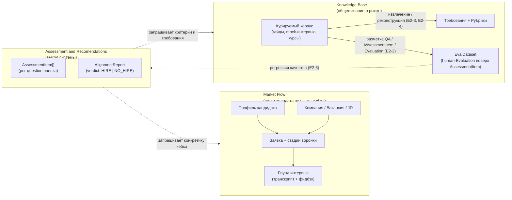
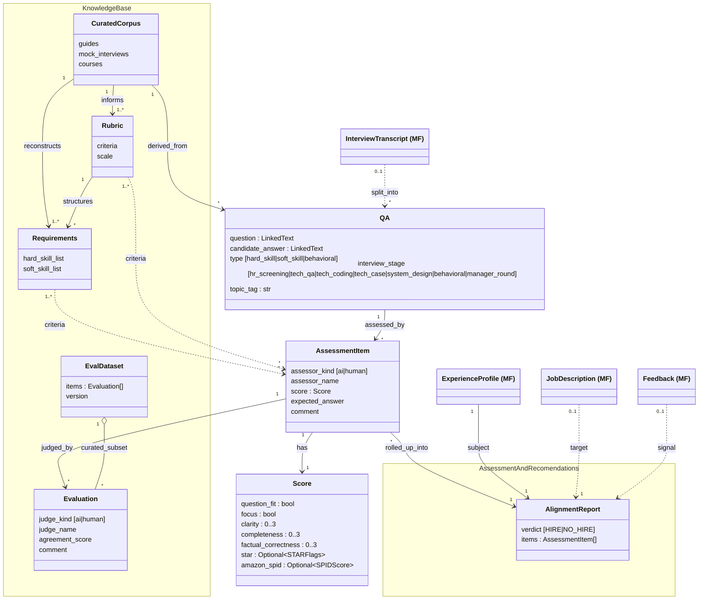
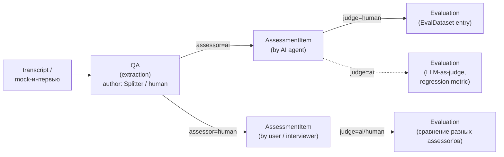
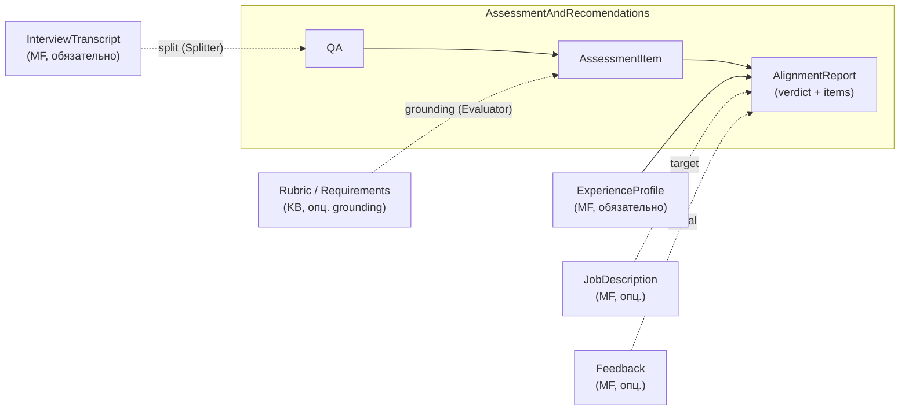

# Спецификация: Interview & Role Alignment Coach

## 1. Контекст и видение

Делаем ассистента, который помогает кандидату на пути «поиск вакансий → подготовка → интервью → рефлексия → следующий раунд».
Видение после встречи 2026-04-25 (Anton + Rita): инструмент строит **мост между двумя концептами** — **Market Flow** (путь конкретного кандидата по рынку найма: его опыт, заявки, интервью) и **Knowledge Base** (общее знание о рынке: рубрики, типовые требования, курируемые материалы).
Узкая постановка из [[project]] — JD + CV + transcript → структурированный отчёт — остаётся ядром MVP, но обрастает функциями реконструкции рубрик из корпуса и контроля качества рекомендаций.
Минимальный вход системы — профиль кандидата (точка входа в Market Flow): даже без Knowledge Base ассистент полезен, опираясь на общие знания LLM; добавление курируемого корпуса делает рекомендации обоснованными источниками.
Пользователи первой волны — сама команда (Anton, Rita): инструмент мы делаем в первую очередь под себя, поэтому собственные кейсы — основной источник требований и тестовых данных. Архитектура должна допускать обобщение на «внешнего кандидата» позже.

Горизонт MVP короткий и зафиксирован дедлайнами курса: чекпоинт-репорт **2026-05-14**, кодфриз **2026-05-21**, защита **2026-05-23** (см. [[project-hub]]). После встречи с ментором 2026-04-30 ([[2026-04-30_AMxMentor]]) scope в §5 и §8 явно сужен под этот горизонт: ментор просил «минимальное число сценариев, которые работают хорошо», и предупредил, что «система может делать слишком много» — это риск не доделать ничего хорошо.

### 1.1. Prerequisite: ручной ввод кейса

В MVP **пользователь сам создаёт папку кейса** в `transcripts/<person>-<company>-YYYYMMDD/` и кладёт туда CV, vacancy, transcript, feedback по схеме CLAUDE.md. Система не реализует автоматическое создание профиля и регистрацию заявки — это prerequisite на стороне пользователя. Полноценные UI / автоматический ingest вынесены в [[requirements_postponed]] (E1-1 «Профиль», E1-2 «Новая заявка»).

## 2. Ключевые понятия

Основной тип данных с которым работает система - это транскрипты интервью, так как там содержится основная информация о интервью. На данном этапе система не работает без транскрипта, поэтому cv, информация о компании, вакансии и т.д. - это дополнительный контекст, который может быть использован для обогащения анализа транскрипта, но бесполезен без него.

Система оперирует тремя концептами. Каждому концепту соответствует один модуль.
- **Assessment and Recomendations** — основной модуль оценка и рекомендации кандидату по подготовке и развитию, а также структурированный отчёт о соответствии профиля кандидата требованиям вакансии.  Модуль запрашивает необходимые данные из Market Flow, может как опираться на Knowledge Base, так и работать без него
- **Market Flow** — чисто информационный модуль, путь конкретного кандидата по рынку найма. Сюда попадает всё, что привязано к кандидату или возникает в его взаимодействии с рынком: профиль, компании, к которым он подаётся, их вакансии и JD, заявки и их стадии, прошедшие раунды интервью с транскриптами и фидбэком. Эволюционирует во времени по мере **событий воронки**: новая заявка, смена стадии, прошедший раунд, полученный фидбэк, обновление профиля.
- **Knowledge Base** — общее знание о рынке найма, не привязанное к конкретному кандидату: курируемые внешние материалы (гайды, mock-интервью с YouTube, курсы), извлечённые из них рубрики и типовые требования. Меняется медленно, общее для всех пользователей.
 Отвечает за генерацию и структурирование общих знаний.

### 2.1 Прогрессия зрелости:
- только Assessment and Recomendations  на знаниях агента (полезно);
- Assessment and Recomendations на основе Knowledge Base -> оценка строится на базе источников (хорошо);
- Assessment and Recomendations на основе Knowledge Base + eval → оценка строится на базе источников и есть метрика работы системы (отлично).

### 2.2. Helicopter view

Высокоуровневая карта: является активным модулем Assessment and Recomendationsтри модуля и использует два осльных (Market Flow, Knowledge Base)

Различия трёх модулей при беглом сравнении:

| Модуль | Что это                                                                 | Кто меняет                        | Скорость изменения | Пример |
|--------|-------------------------------------------------------------------------|-----------------------------------|--------------------|--------|
| **Market Flow** | Путь конкретного кандидата по рынку найма                               | Сам кандидат через события (E1)   | Высокая — каждое событие | Профиль, заявка на Avito, раунд 2 поведенческого интервью с транскриптом |
| **Knowledge Base** | Общее знание о рынке: курируемый корпус и извлечённые рубрики/требования | Курация и обработка корпуса (E2)  | Низкая — медленно растёт от добавления источников | Рубрика behavioral-интервью, типовые вопросы для DA-junior |
| **Assessment and Recomendations** | Выход системы: транскрипт → per-question оценка + общий verdict          | оценка и формирование отчёта (E3) | Производный: пересчитывается на каждый раунд | `AssessmentItem[]` по раунду + `AlignmentReport.verdict ∈ {HIRE, NO_HIRE}` |

Замечание: одна и та же сущность (например, JD на роль DA Senior) встречается в Market Flow и Knowledge Base **по-разному**. Конкретный JD на вакансию Avito, на которую подался Anton, — Market Flow (он привязан к заявке). А типовой профиль роли «DA Senior», агрегированный из 10 mock-интервью, — Knowledge Base. Разделение по ownership/привязке, а не по «сущность объективная или субъективная».

## 2.3 Архитектурное соображение

Так как основное, что обрабатывает система - это транскрипты интервью, то KB и AR будут во многом структурно похожи.
Они будут использовать общий пайплайн, который построен из цепочки агентов

## 3. Артефакты

Все сущности, с которыми оперирует система. Раздел 4 показывает связи между ними.

### **Generic**
- **Транскрипт раунда** — сырой текст вопросов и ответов одного интервью.
- **Фидбэк раунда** — обратная связь интервьюера по интервью.
  **QA** — сырая пара вопрос-ответ. Содержит классификацию, но не содержит оценку 
- **AssessmentItem** — оценка QA конкретным assessor'ом. Один QA может быть оценен несколькими ассессорами. 

### **Market Flow** (информация о конкретном кандидате и его пути по рынку найма):
- **Профиль кандидата** — расширенный контекст: ценности, принципы, background, soft/hard skills. Объединяет `Candidate` + `ExperienceProfile` в модели.
- **CV** — формальная проекция профиля под направление (роли, summary, skills).
- **Компания** — потенциальный работодатель (попадает в систему, когда кандидат к ней присматривается или подаётся).
- **Вакансия** — конкретная позиция в компании.
- **Job Description (JD)** — формальное описание ожиданий вакансии.
- **Заявка (Application)** — связь `Кандидат × Вакансия` с текущей стадией воронки.
- **Раунд интервью (InterviewRound)** — отдельное интервью внутри заявки, с типом и порядком.

### **Knowledge Base**:
  Содержит большой накопленный массив AssessmentItem.
  Имеет внутреннюю систему мета-оценки.
  - **Evaluation** — оценка работы Assessment Item конкретным judge'ем. Это мета-уровень, нужен только для контроля качества (E2-6, §7). Поля: `assessment` (ссылка на AssessmentItem), `judge_kind` ∈ {ai, human}, `judge_name`, `agreement_score` (соответствие assessor-оценки эталонной), `comment` (свободный текст разметчика). Без `Evaluation` система работает; `Evaluation` — отдельный сигнал, попадающий в `EvalDataset` для регрессии.
  - **Размеченный датасет (EvalDataset)** — курируемое подмножество `Evaluation[]` с `judge_kind = human`; используется для автоматической оценки качества (§7, E2-6). Не все `Evaluation` принадлежат EvalDataset — только те, что размечены человеком и отобраны для регрессии.

#### Дополнительная информация (может быть неструктурированой)
- **Курируемый корпус (CuratedCorpus)** — внешние материалы: гайды, mock-интервью с YouTube, курсы (Карпов и т.п.).
- **Требования (Requirements)** — типовые ожидания по ролям, извлечённые/реконструированные из корпуса (hard/soft skill lists).
- **Рубрика (Rubric)** — структурированные критерии оценки ответа на тип вопроса.
- 

### **Assessment and Recomendations**

AR — **активный** модуль (см. §2): сам запрашивает данные из MF (всегда) и KB (опционально). Использует Generic-артефакты, добавляя один свой:

- **QA** *(Generic, см. выше)* — извлекается Splitter'ом из транскрипта; точка входа AR.
- **AssessmentItem** *(Generic, см. выше)* — оценка одного `QA` внутренним AI-assessor'ом по критериям [[assessors]]; `assessor_kind = ai`.
- **AlignmentReport** — минимальный interview-level rollup. Поля: `verdict ∈ {HIRE, NO_HIRE}` (в blind-режиме E3-4) + `items: AssessmentItem[]`. **Без** `AssessmentTopic`, **без** `Recommendation[]`, **без** `P(HIRE)` / `strengths_summary` / `gaps_summary` — всё это вынесено в [[requirements_postponed]] §5 как Advanced AR.

Запрашиваемый контекст из MF: `InterviewTranscript` (обязательно), опц. `JobDescription` / `ExperienceProfile` / `Feedback` (см. §3.1 матрица заполненности).
Запрашиваемый контекст из KB (опционально): `Rubric` / `Requirements` для grounding оценок в Evaluator'е. Регрессионные `Evaluation` поверх production-`AssessmentItem` — отдельный мета-слой (E2-6, §7), не для пользователя.

Pipeline: Splitter → Evaluator → минимальный Aggregator (см. [[arch_agents]] §4).

Расширения (postponed): структурированные отчёты с per-topic rollup, рекомендации, P(HIRE), aligned/partial/missing относительно Requirements — см. [[requirements_postponed]] §5 «Артефакты-расширения».

**Общие value-objects** (не принадлежат ни одному модулю, используются несколькими):
- **LinkedText** — `{text, transcript_time}`. Цитата с привязкой к таймкоду в транскрипте. Используется в `AssessmentItem.{question, candidate_answer}`.

### Матрица заполненности

Для конкретного раунда интервью артефакты `{CV, JD, Transcript, Feedback}` заполнены не всегда. Система должна работать на любом непустом подмножестве, опционально достраивая недостающее реконструкцией.

| Кейс                              | CV | JD | Transcript | Feedback | Что может сделать система                                   |
|-----------------------------------|----|----|------------|----------|-------------------------------------------------------------|
| Mock Карпова с YouTube            | — | — | ✓ | ✓ | агрегирует в корпус (E2-3), реконструирует псевдо-JD (E2-4) |
| Anton: ApprovalMax (без feedback) | ✓ | ✓ | ✓ | — | полный отчёт в blind mode(E3-4)                             |
| Anton: интервью Avito             | ✓ | ✓ | ✓ | ✓ | полный отчёт в blind или feedback mode (E3-4)               |

Кейсы «Состояние до отклика» (соответствует S1) и «Новая заявка, до интервью» (S2) вынесены в [[requirements_postponed]] — в MVP не делаем.

### Критерии работы assessor-ов

[[md/assessors.md]] описывает критерии, по которым human или AI assessor выставляет оценки в `AssessmentItem`.

## 4. Концептуальная модель

Диаграмма Фаулера (концептуальная, не имплементационная). Связи типизированы. Воронка найма представлена через `Application.stage` и упорядоченные `InterviewRound`.

Полная модель содержит много связей, поэтому разбита на три фокусных вида (по правилу модульности и снижения когнитивной нагрузки):

- **§4.1** — единая class-диаграмма (Generic + KB + minimal AR) с package-контурами; **§4.1.1** — lifecycle Eval-артефактов;
- **§4.2** — AR rollup-flow view (компактный flow вместо class-структуры);
- **§4.3** — интра-структура **Market Flow** (пассивный источник, MF не «толкает» данные — AR сам запрашивает).

AR — **активная** сторона: запрашивает данные из MF (всегда) и KB (опционально, для grounding). См. §2 «обратная зависимость».

Ключевой инвариант (см. §2): между MF и KB нет стрелок ни в одну сторону — MF и KB ничего не знают друг о друге; встреча — только внутри AR, и только по инициативе AR.

Замечание про изоляцию Eval-вызова: требование ментора («дело не в том, чтобы это были разные архитектуры, а чтобы контекст не шарили») — это **операционная** изоляция LLM-вызова (отдельный промпт, отдельное окно контекста), а не структурная изоляция артефактов. Generic-артефакты (`QA`, `AssessmentItem`) и KB-мета-артефакты (`Evaluation`, `EvalDataset`) — отдельные сущности уровня данных; операционные требования к их использованию — в E2-6 (§7).

### 4.1. Концептуальная модель данных (Generic + KB + AR)

Единая class-диаграмма всех артефактов системы. Логические границы показаны **package-контурами** (mermaid `namespace`):
- **`KnowledgeBase`** package — KB-specific: курируемый корпус, рубрики, требования, мета-уровень `Evaluation` / `EvalDataset`.
- **`AssessmentAndRecomendations`** package — минимальный AR-output: `AlignmentReport` (verdict + items). Расширения (AssessmentTopic / Recommendation / P(HIRE) / topic_assessments) вынесены в [[requirements_postponed]] §5.
- **Generic** (вне package'ов) — `QA`, `AssessmentItem`, `Score`: используются и KB (наполняется ими в режиме S3, см. §5), и AR (rollup'ятся в `AlignmentReport` в режиме S4). Согласуется с §2.3 (общий pipeline).
- **MF refs** (вне package'ов, помечены `(MF)`) — внешние классы из §4.3, к которым AR обращается за контекстом; внутрь Generic / KB не приходят (инвариант §2).

Чтение диаграммы:
- **Сплошные стрелки** — обязательные структурные связи: KB-цепочка от корпуса, Generic lifecycle (QA → AssessmentItem → Evaluation), AR rollup `AssessmentItem[] → AlignmentReport` и привязка отчёта к `ExperienceProfile` (subject).
- **Пунктирные стрелки** (`..>`) — опциональные/запрашиваемые связи (по §3.1 матрица заполненности): JD/Feedback могут отсутствовать; KB-grounding (Requirements/Rubric → AssessmentItem) — опционален.
- **Aggregation `o--`** между `EvalDataset` и `Evaluation` — EvalDataset курирует только подмножество всех `Evaluation` (с `judge_kind = human`).

Operational-аспект использования `EvalDataset` (отдельная дешёвая модель, изолированный контекст) — в E2-6 (§7), не в концептуальной модели.

#### 4.1.1. Lifecycle Eval-артефактов

Принципиально:
- **`assessor`** создаёт оценку (обычная работа системы — это *production output*).
- **`judge`** оценивает, насколько хорошо assessor сработал (мета-уровень, нужен только для контроля качества E2-6).

Триггеры переходов выражены через эпики/истории, не через имена реализационных компонентов (компоненты — в [[arch_agents]]):
- `transcript → QA`: E2-2 «Разметочный датасет» (для KB), либо Splitter в pipeline E3-4 (для real-time оценки).
- `QA → AssessmentItem`: ассессмент по критериям [[assessors]] (см. §3.2); источник эталона — общие знания модели или KB-рубрика.
- `AssessmentItem → Evaluation`: human-разметка для EvalDataset либо LLM-as-judge для регрессии.

Цепочка `QA → AssessmentItem → Evaluation` используется в регрессии E2-6 — но только подмножество с `judge_kind = human` попадает в `EvalDataset`.

### 4.2. Assessment and Recomendations (rollup-flow view)

Полная class-структура AR — в §4.1 (там же KB и Generic, чтобы видеть rollup-чейн в едином контексте). Здесь — компактный flow rollup'ов и явная семантика «активного AR» (см. §2 «обратная зависимость»).

Чтение:
- **Сплошные стрелки внутри AR** — обязательная rollup-цепочка: `QA` (Splitter) → `AssessmentItem` (Evaluator) → `AlignmentReport` (минимальный Aggregator). Подробности компонентов — [[arch_agents]].
- **Пунктирные стрелки извне** — запросы AR к MF (`split` транскрипта в QA, `target`/`signal` для AlignmentReport) и к KB (`grounding` Requirements/Rubric для Evaluator). Семантически инициатор — AR; направление стрелки — поток данных в AR.
- **Сплошная `MF_P → REP`** — обязательная привязка `AlignmentReport.subject` к `ExperienceProfile`; без subject отчёт некому адресовать.

Расширения rollup-чейна (`AssessmentTopic`, `Recommendation[]`, KB few-shot similar items) — postponed, см. [[requirements_postponed]] §5.
- **Пунктирные стрелки извне** — запросы AR к MF (`split`, `subject/target/signal/evidence`) и к KB (`grounding`, `few-shot`). Семантически инициатор — AR, направление стрелки — поток данных в AR.

Обязательная привязка `AlignmentReport` к `ExperienceProfile` (сплошная стрелка от MF_P) — без `subject` отчёт некому адресовать. Остальные MF-входы опциональны по §3.1.

### 4.3. Market Flow (интра)

Две ветви воронки сходятся в `Application`: слева кандидат со своим профилем и CV, справа компания со своей вакансией и JD. Раунды интервью растут вниз от заявки.

`InterviewRound.type` — **доминирующий тип** раунда (как заявлен компанией в приглашении). Реальный микс типов внутри раунда фиксируется на уровне `QA.interview_stage` (Generic, см. §3): в одном «техническом» раунде могут попасться вопросы tech_qa, tech_coding и behavioral одновременно (встреча 2026-05-06).

## 5. Сценарии использования

В MVP — два сценария: **S3** (наполняет KB) и **S4** (ядро). Решение по итогам встречи с ментором 2026-04-30: «минимальное число сценариев, которые работают хорошо». Сценарии **S1** (только профиль → общие рекомендации) и **S2** (ранжирование вакансий) вынесены в [[requirements_postponed]].

| ID | Группы | Что есть на входе | Что хочет пользователь | Наш кейс | Роль в MVP |
|----|--------|-------------------|-------------------------|----------|------------|
| **S3** | KB | Корпус mock-интервью (Transcript + Feedback) без своего CV/JD | Эксплораторный анализ: типовые вопросы, рубрики, критерии оценки | Анализ mock-интервью Карпова и YouTube | наполняет KB |
| **S4** | MF + KB | Полный набор: профиль + JD + Transcript + Feedback | Структурированный отчёт по конкретному интервью с цитатами | Anton: интервью Avito, ApprovalMax и т.д. | ядро |

**Единый pipeline для S3 и S4** — следствие §2.3 «Архитектурное соображение» (KB и AR структурно похожи, потому что оба обрабатывают транскрипты интервью). Оба сценария запускают одну и ту же цепочку агентов (Splitter → Evaluator → Aggregator) с разной параметризацией входа:
- **S3** запускается без JD (E2-4 «Анализ без JD»), выход `AssessmentItem[]` пополняет KB; `AlignmentReport` опционален.
- **S4** запускается с полным набором, читает из KB (рубрики, similar items), выход — `AlignmentReport` для пользователя.

Подробности декомпозиции pipeline — в [[arch_agents]] §4.

## 6. Эпики

| ID | Модуль | Эпик | Граница ответственности |
|----|--------|------|-------------------------|
| **E1** | MF | Market Flow | привязка артефактов кейса к раунду интервью (транскрипт, фидбэк); создание профиля и регистрация заявки — prerequisite (см. §1.1) |
| **E2** | KB | Knowledge Base | курация источников, разметка `EvalDataset`, извлечение/реконструкция требований и рубрик, контроль качества (Eval) |
| **E3** | AR | Assessment and Recomendations | связка Market Flow и Knowledge Base в `AssessmentItem[]` + минимальный `AlignmentReport` (verdict: HIRE/NO_HIRE) |

## 7. User stories

Каждая история имеет короткое имя — на него удобно ссылаться из других секций (формат: `E2-3 «Эксплораторный анализ»`).

### E1. Market Flow (события воронки)

Пререквизит: пользователь сам создаёт папку кейса в `transcripts/<person>-<company>-YYYYMMDD/` и кладёт туда CV, vacancy, transcript, feedback по схеме CLAUDE.md (см. §1.1).

**E1-4 «Транскрипт раунда».** Как кандидат, я хочу прикрепить к раунду интервью транскрипт (например, выгрузку из MacWhisper), чтобы появилась входная точка для разбора.
- [ ] раунд создаётся внутри существующей заявки с типом и порядком
- [ ] транскрипт привязан к раунду, а не «болтается» в общем хранилище
- [ ] поддерживаются несколько раундов в одной заявке

**E1-5 «Фидбэк раунда».** Как кандидат, я хочу прикрепить к раунду фидбэк интервьюера, чтобы система учитывала его при разборе.
- [ ] фидбэк опционален: бывают раунды без него
- [ ] разбор E3-4 «Отчёт по интервью» явно отличается при наличии фидбэка vs без него

### E2. Knowledge Base (рубрики и требования)

**E2-1 «Курируемые источники».** Как администратор KB, я хочу добавлять курируемые источники (mock-интервью с YouTube, гайды, материалы курсов) в Knowledge Base, чтобы корпус был воспроизводимым и без обхода анти-бот защит.
- [ ] поддерживается источник: ссылка + локально сохранённый транскрипт (`transcripts/mock-*`)
- [ ] для каждого источника фиксируется метаданные: домен (DA/PA/DS), уровень, тип интервью
- [ ] добавление источника не требует ручной правки кода — достаточно положить папку по шаблону `mock-template/`

**E2-2 «Разметочный датасет».** Как администратор KB, я хочу вести `EvalDataset` (табличный носитель с записями типа `Evaluation` и привязанными к ним `AssessmentItem` / `QA`), чтобы автоматическая оценка качества (E2-6) опиралась на воспроизводимую человеческую разметку.
- [ ] schema носителя покрывает все три слоя §4.1: поля `QA` (`question`, `candidate_answer`, `type`, `interview_stage`, `topic_tag`, `transcript_time` для обоих LinkedText), поля `AssessmentItem` (`assessor_kind`, `assessor_name`, `score.*` по [[assessors]], `expected_answer`, `comment`), поля `Evaluation` (`judge_kind=human`, `judge_name`, `agreement_score`, `comment`)
- [ ] стартовый объём — **10+ интервью с проверенной разметкой** (×~10–15 QA = ~100–150 QA), а не 5–10 айтемов; 5–10 айтемов не ловят edge cases (встреча 2026-05-06, проблема валидации Splitter'а)
- [ ] явно покрыты edge cases: правдоподобный, но фактически неверный ответ; ответ-вода без сигнала; ответ на смежный вопрос; **детализированный неправильный по фокусу ответ** (новое 06-05); **парафраз вопроса вместо ответа** (новое 06-05)
- [ ] перегенерация AI-`AssessmentItem` не теряет ранее созданных human-`Evaluation` (последние ссылаются по id, а не inline'ятся)
- [ ] технологический стек разметки (Excel ↔ JSON ↔ промпты через Cursor) — детали в [[arch_agents]] / `labeling/README.md`, спека остаётся generic «табличный носитель»

**E2-3 «Эксплораторный анализ».** Как администратор KB, я хочу запустить эксплораторный анализ корпуса, чтобы получить агрегированные рубрики и типовые блоки вопросов.
- [ ] на выходе — таблица: тема × частота × hard/soft × тип раунда (screening / technical / behavioral / case / system_design / hiring_manager / final)
- [ ] для каждой темы — 2-3 примера-цитаты из корпуса
- [ ] результат сохраняется в артефакт, а не теряется в чате
- [ ] **риск (mentor 2026-04-30):** в источниках без CV/JD непонятен уровень кандидата — могли спрашивать сеньора там, где это джун, или наоборот. Реконструированные рубрики помечать как «реконструированы», а не «извлечены», и сверять с реальными источниками (открытая матрица компетенций аналитика Авито, программа курса Карпова) — это отдельный валидационный шаг, point-of-failure которого фиксируется в §9.

**E2-4 «Анализ без JD».** Как администратор KB, я хочу извлекать рубрики и требования из материалов корпуса даже когда официального JD нет (mock-интервью с YouTube — частый случай), чтобы такие источники оставались полезными для Knowledge Base.
- [ ] вход: транскрипт из корпуса без JD → выход: набор `Requirements` с разметкой hard/soft
- [ ] под капотом — реконструкция псевдо-JD из вопросов транскрипта; явно помечено, что результат реконструирован, а не извлечён из оригинального JD
- [ ] результат можно сравнивать с оригинальным JD, если он позднее появится

**E2-5 «Рубрика типа раунда».** Как пользователь, я хочу видеть критерии оценки ответа (рубрику) для конкретного типа раунда, чтобы понимать, на что смотрит интервьюер.
- [ ] рубрика опирается на корпус (E2-3 «Эксплораторный анализ»), а не на «здравый смысл» LLM
- [ ] есть ссылки на источники в курируемом корпусе

**E2-6 «Контроль качества».** Как разработчик, я хочу видеть автоматическую оценку качества `AssessmentItem`, чтобы понимать, не деградирует ли система между итерациями промпта (фидбэк ментора 2026-04-30: пользователю эта оценка не нужна и не показывается).
- [ ] вход — `EvalDataset` (KB-артефакт §4.1) и/или production-вывод `AssessmentItem`, выход — `Evaluation` (`judge_kind = ai`) по generic-критериям из [[assessors]] (question_fit, focus, clarity, completeness, factual_correctness)
- [ ] **операционная изоляция вызова** (mentor: «дело не в том, чтобы это были разные архитектуры, а чтобы контекст не шарили»): отдельный (дешёвый) вызов LLM (Haiku / локальная Gemma 27B), собственный промпт, отдельное окно контекста — не разделяет state с основным пайплайном E3-4
- [ ] метрика — соответствие AI-`Evaluation` человеческим `Evaluation` на отложенном `EvalDataset`; цель — отсутствие регресса между итерациями
- [ ] оценка логируется (Logs Store, см. [[arch]]) для ретроспективного анализа просадок
- [ ] **визуальная регрессия Splitter через Highlighter** (новое 06-05): детерминированный инструмент раскрашивает транскрипт по разбивке Splitter'а (что ушло в `QA.question`, что в `QA.candidate_answer`, что отброшено как backchannel/meta) и генерирует HTML/markdown за <5 сек на интервью. Цель — быстрая ручная валидация без прослушивания 20+ часов аудио. Имплементация — детерм. компонент в [[arch_agents]] §3.1, рядом с KBRetriever/EvalLogger.
- [ ] терминологическая оговорка: ментор отметил различие между Eval (регрессия на отложенном датасете) и LLM-as-judge (модель-судья оценивает выход в момент исполнения) и сам пометил, что не эксперт — конкретный механизм фиксируем в §9 как открытый

### E3. Assessment and Recomendations (оценка и рекомендации, контроль качества)

**E3-4 «Отчёт по интервью» (ядро MVP).** Как кандидат, я хочу получить per-question оценку прошедшего раунда интервью (transcript + профиль + опц. JD + опц. feedback) с общим verdict HIRE/NO_HIRE, чтобы понять, что было сильно и что просело.
- [ ] выход: markdown-render `AssessmentItem[]` (по одному блоку на каждый QA: question, candidate_answer, score, expected_answer, comment) + `AlignmentReport.verdict ∈ {HIRE, NO_HIRE}` (только blind-режим)
- [ ] сильные кейсы — с цитатами из транскрипта (`AssessmentItem.qa.candidate_answer.text` + transcript_time), пригодными к повторному использованию
- [ ] слабые места — с цитатами и формулировкой проблемы (vague / off-topic / factual error / incomplete) в `AssessmentItem.comment`
- [ ] если все ответы в транскрипте behavioral, а в MVP под behavioral нет рубрик — отчёт явно сообщает: «оценка категории behavioral в текущей версии не выполнена»
- [ ] **постponed (см. [[requirements_postponed]] §5)**: aligned / partial / missing rollup относительно `Requirements`, `Recommendation[]` со структурой по `category`/`signal_source`, per-topic rollup (`AssessmentTopic`), `P(HIRE)` — всё это Advanced AR

История **E3-5 «Структура рекомендаций»** перенесена в [[requirements_postponed]] §4 (postponed) — она требует артефакта `Recommendation`, который тоже postponed.

## 8. Не в scope

- [-] массовый парсинг интернета с обходом анти-бот защит — используем только курируемые источники
- [-] полноценный UI/веб-приложение — допустимы skill-точка входа в Claude, drop-папка или CLI
- [-] долгоживущий интерактивный агент с собственным циклом — пайплайн запускается на событие
- [-] юридические / HR-советы и замена коучу — disclaimer как в `project.md`
- [-] эволюция состояния (`MemoryState`, diff между раундами рекомендаций) — отложено, может вернуться после MVP
- [-] quiz / тренажёр по слабым местам — отложено, может вернуться после MVP
- [-] ролевая игра «диалог с интервьюером» — backlog
- [-] несколько версий CV под разные направления — backlog (профиль один, проекции — потом)
- [-] вливание собственных транскриптов кандидата в Knowledge Base — нарушает инвариант §2
- [-] **behavioral как первичный фокус MVP** — поддерживается на уровне модели (`QA.type = behavioral`, `AssessmentItem.score.star` / `amazon_spid` — см. [[assessors]]), но устойчивые рубрики и Eval под behavioral в MVP не строим; пересмотр после 14.05
- [-] **S2 «Ранжирование вакансий» в MVP-горизонте** — отложено до после чекпоинта 14.05 (mentor: «минимальное число сценариев, которые работают хорошо»)
- [-] **полноценный Streamlit Cloud деплой в MVP** — на горизонт до 14.05 ядро запускается в Claude Code skill (POC), детальная архитектура и стретч-цель деплоя — в [[arch]]

## 9. Открытые вопросы

Закрытые вопросы (по итогам встреч 2026-04-30 с ментором и 2026-05-06 с Маргаритой):
- [x] **Где физически хранить состояние Market Flow.** Решение: git + filesystem на этапе POC (для curated own-interview-кейсов в `transcripts/<person>-<company>-*`); session-scoped — позднее в Streamlit. Детали — в [[arch]] §5.
- [x] **Минимальный набор критериев контроля качества.** Решение: generic (question_fit, focus, clarity, completeness, factual_correctness) + behavioral-only расширения (STAR, Amazon SPID) — см. [[assessors]] (§3.2 этой спеки — короткая ссылка на assessors.md). Высокоуровневые рубрики надстраиваются после MVP.
- [x] **Авторство оценок.** Решение (06-05): три слоя `QA → AssessmentItem → Evaluation`, у каждого свой `assessor_kind` / `judge_kind` ∈ {ai, human} (см. §4.1).
- [x] **Pipeline для S3 vs S4.** Решение (06-05): один декомпозиционный pipeline (Splitter → Evaluator → Aggregator), два набора параметров. См. §5 + [[arch_agents]] §4.

Открытые вопросы:
- [ ] Один домен (DS / Product Analytics / Market Research) или универсально? — упирается в полноту корпуса (E2-3 «Эксплораторный анализ»)
- [ ] Как мерджить Market Flow и Knowledge Base, когда часть матрицы артефактов отсутствует (S3 — без CV/JD)?
- [ ] Достаточно ли курируемого корпуса (Карпов + 3-5 mock на YouTube) для устойчивых рубрик E2-3 «Эксплораторный анализ»?
- [ ] Сколько human-`Evaluation` в `EvalDataset` достаточно для устойчивой автоматической оценки качества? Mentor 04-30: «нет ответа, начните с 5–10 + edge cases». Решение 06-05: целевой объём — 10+ интервью × ~10–15 QA = ~100–150 entries; нужен эмпирический критерий стабилизации.
- [ ] Источник эталонных рубрик для валидации S3: открытая матрица компетенций аналитика Авито + программа курса Карпова — пробуем как ground truth, но соответствие не гарантировано.
- [ ] **Eval vs LLM-as-judge — разные техники.** Ментор отметил различие, но не уточнил, какая нам нужна (или нужны обе). Eval = регрессия на отложенном размеченном датасете; LLM-as-judge = модель-судья оценивает выход в момент исполнения. Нужно решить: какую технику применяем для критериев из [[assessors]] к `AssessmentItem` (единственный production-артефакт MVP), и нужна ли вторая.
- [ ] Behavioral в выходе — давать пользователю явный disclaimer «не оцениваем» в `AssessmentItem.comment` для behavioral QA или молча не выводить эти айтемы?
- [ ] **HIRE/NO_HIRE rule.** По какому правилу `AlignmentReport.verdict` агрегируется из `AssessmentItem[]`? Простое правило (например, «есть ≥1 weak/missing aggregate среди критичных QA → NO_HIRE») фиксировать в [[arch_agents]] §5 / SKILL Шаг 5.5. P(HIRE) — postponed.
- [ ] **Интеграция KB в Evaluator** (top-вопрос 06-05). Vector search vs few-shot prompting? Сколько токенов в окне? Как фильтровать KB-примеры по `topic_tag` / `interview_stage` для конкретного `QA`? Целевой mentor-call 12.05 для разрешения.
- [ ] **Splitter dedup / grouping** (06-05). Текущий прототип Splitter'а группирует несколько похожих вопросов в один, теряя дробность. Нужно: дробление по умолчанию + опциональная группировка с явным маркером. Acceptance уточнить в Phase 1 [[arch_agents]].
- [ ] **ASR echo cleanup** (06-05). Собственные интервью (Озон) содержат echo от ASR (повтор реплик с задержкой); mock-интервью с YouTube — нет. Решение: pre-processing шаг перед Splitter или контракт «pristine input» к Splitter? Маргарита пока чистит вручную.
- [ ] Как разделить работу над общими документами между двумя людьми + агентами без merge-конфликтов (процессный риск из встречи)?

## 10. Связи

- [[project]] — `md/project.md` — постановка ядра MVP (alignment report)
- [[project-hub]] — `docs/project-hub.md` — цели, дедлайны, риски, лог встреч
- [[arch]] — `md/arch.md` — архитектурный выбор (pipelines в Claude Code, runtime в LangGraph), §5 хранилища
- [[arch_agents]] — `md/arch_agents.md` — внутренняя декомпозиция AR-модуля на агенты и контракты, общий pipeline для S3 и S4 (см. §2.3)
- [[assessors]] — `md/assessors.md` — критерии работы assessor'ов (generic + behavioral расширения), на которые ссылается §3.2
- [[requirements_postponed]] — `md/requirements_postponed.md` — сценарии и user stories, вынесенные за пределы MVP-горизонта
- [[2026-04-25-Deli-sandwiches-meeting]] — `internal-notes/2026-04-25-Deli-sandwiches-meeting.md` — первоисточник этой спецификации
- [[2026-04-30_AMxMentor]] — `internal-notes/2026-04-30_AMxMentor.txt` — встреча с ментором, источник правок ревизии 2026-05-02 (артефакты `Recommendation` / `AssessmentItem`, низкоуровневые критерии, сужение MVP)
- [[2026-04-30-martin-meeting]] — `internal-notes/2026-04-30-martin-meeting.md` — рабочие заметки по структуре `AssessmentItem`
- [[2026-05-06_Architecture_meeting]] — `internal-notes/2026-05-06_Architecture_meeting.txt` — архитектурная встреча с Маргаритой, источник правок ревизии 2026-05-06 (трёх-слойная модель `QA` / `AssessmentItem` / `Evaluation`, `interview_stage` / `topic_tag`, вынос критериев в [[assessors]], единый pipeline S3+S4 как §2.3, highlighter; AR-Advanced — `AssessmentTopic`, `Recommendation`, `P(HIRE)` — последующим решением вынесены в [[requirements_postponed]] §5 для «попроще»)
- [[grading]] — `grading/Project Criteria & Scoring.docx` — критерии оценки финального проекта
