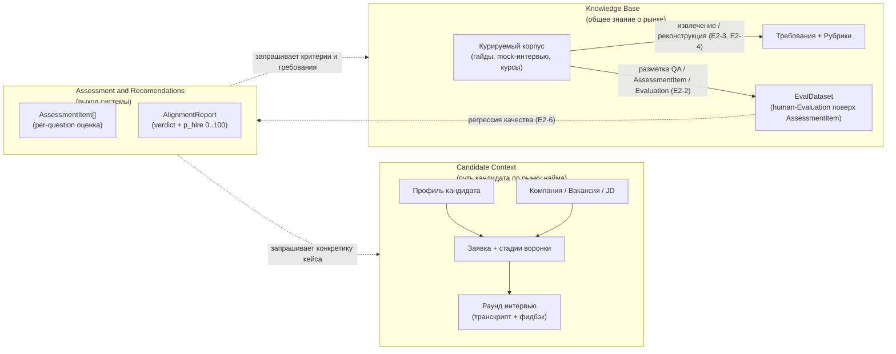
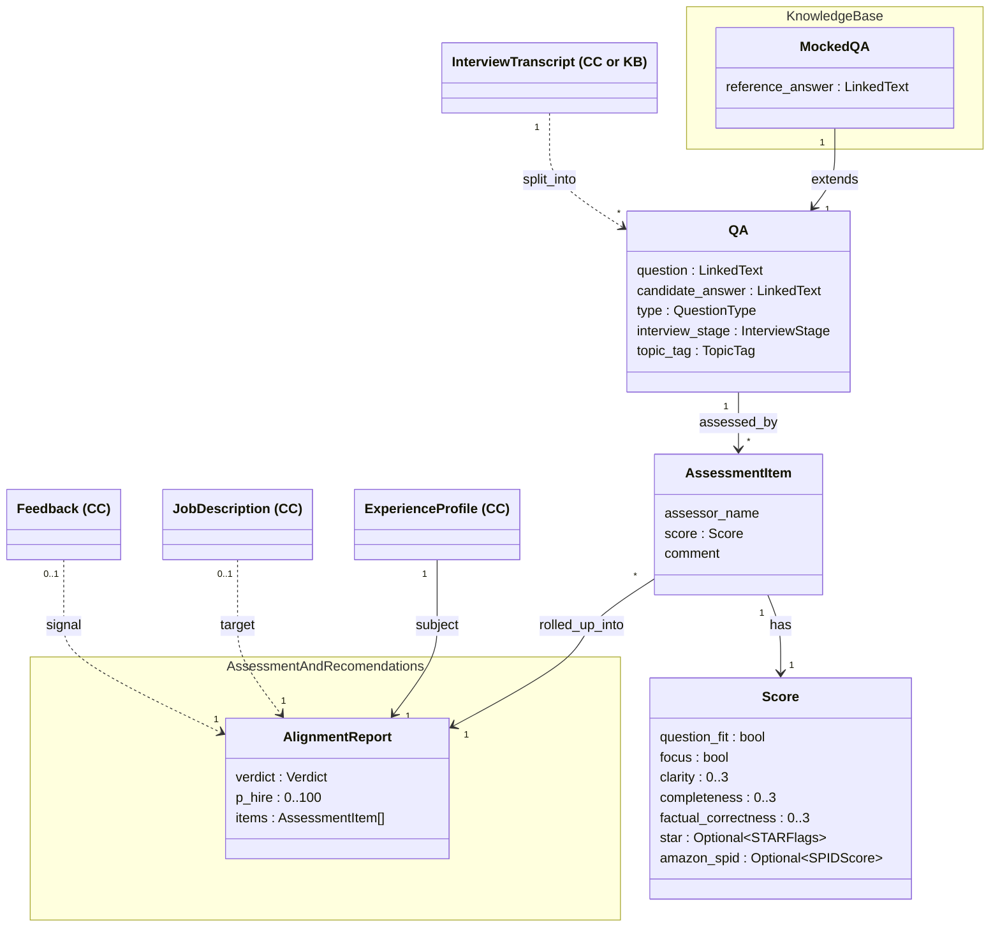
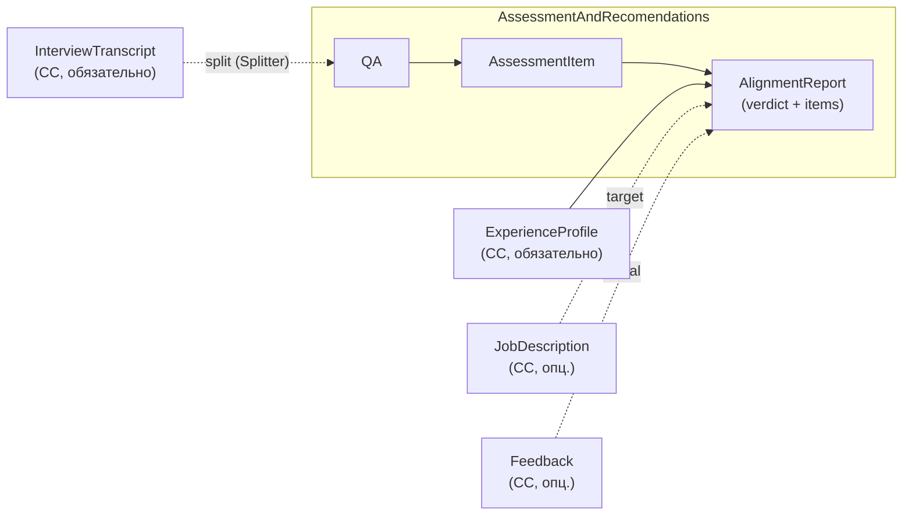

# Спецификация: Interview & Role Alignment Coach

## 1. Контекст и видение

Делаем ассистента, который помогает кандидату на пути «поиск вакансий → подготовка → интервью → рефлексия → следующий раунд».
Видение после встречи 2026-04-25 (Anton + Rita): инструмент строит **мост между двумя концептами** — **Candidate Context** (путь конкретного кандидата по рынку найма: его опыт, заявки, интервью) и **Knowledge Base** (общее знание о рынке: рубрики, типовые требования, курируемые материалы).
Узкая постановка из [[project]] — JD + CV + transcript → структурированный отчёт — остаётся ядром MVP, но обрастает функциями реконструкции рубрик из корпуса и контроля качества рекомендаций.
Минимальный вход системы — профиль кандидата (точка входа в Candidate Context): даже без Knowledge Base ассистент полезен, опираясь на общие знания LLM; добавление курируемого корпуса делает рекомендации обоснованными источниками.
Пользователи первой волны — сама команда (Anton, Rita): инструмент мы делаем в первую очередь под себя, поэтому собственные кейсы — основной источник требований и тестовых данных. Архитектура должна допускать обобщение на «внешнего кандидата» позже.

Горизонт MVP короткий и зафиксирован дедлайнами курса: чекпоинт-репорт **2026-05-14**, кодфриз **2026-05-21**, защита **2026-05-23** (см. [[project-hub]]). После встречи с ментором 2026-04-30 ([[2026-04-30_AMxMentor]]) scope в §5 и §8 явно сужен под этот горизонт: ментор просил «минимальное число сценариев, которые работают хорошо», и предупредил, что «система может делать слишком много» — это риск не доделать ничего хорошо.

### 1.1. Prerequisite: ручной ввод кейса

В MVP **пользователь сам создаёт папку кейса** в `transcripts/<person>-<company>-YYYYMMDD/` и кладёт туда CV, vacancy, transcript, feedback по схеме CLAUDE.md. Система не реализует автоматическое создание профиля и регистрацию заявки — это prerequisite на стороне пользователя. Полноценные UI / автоматический ingest вынесены в [[requirements_postponed]] (E1-1 «Профиль», E1-2 «Новая заявка»).

## 2. Ключевые понятия

Основной тип данных с которым работает система - это транскрипты интервью, так как там содержится основная информация о интервью. На данном этапе система не работает без транскрипта, поэтому cv, информация о компании, вакансии и т.д. - это дополнительный контекст, который может быть использован для обогащения анализа транскрипта, но бесполезен без него.

**KB-пригодность транскрипта.** Не любой транскрипт пригоден для пополнения KB. KB-pipeline (S3, см. §5) принимает только транскрипты с **per-QA разбором** — mock-интервью, где инструктор по ходу даёт reasoning, привязываемый к отдельным QA: ожидаемый ответ, типичные ошибки, корректировки.  Транскрипты с коротким интервьюерским feedback'ом по интервью в целом (формат «hire/no-hire + пара комментариев») достаточны для AR-отчёта (E3-4 with-feedback mode), но **не** для KB.

Mock-интервью при этом могут жить в **обоих** модулях: в KB как курируемый корпус (общее знание о рынке), в CC как тренировочные сессии конкретного кандидата (часть его пути по найму). Структурно это одна сущность `InterviewTranscript (CC or KB)` (§4.1); различие — по привязке к субъекту, не по форме файла.

Система оперирует тремя концептами. Каждому концепту соответствует один модуль.
- **Assessment and Recomendations** — основной модуль оценка и рекомендации кандидату по подготовке и развитию, а также структурированный отчёт о соответствии профиля кандидата требованиям вакансии.  Модуль запрашивает необходимые данные из Candidate Context, может как опираться на Knowledge Base, так и работать без него
- **Candidate Context** — чисто информационный модуль, путь конкретного кандидата по рынку найма. Сюда попадает всё, что привязано к кандидату или возникает в его взаимодействии с рынком: профиль, компании, к которым он подаётся, их вакансии и JD, заявки и их стадии, прошедшие раунды интервью с транскриптами и фидбэком. Эволюционирует во времени по мере **событий воронки**: новая заявка, смена стадии, прошедший раунд, полученный фидбэк, обновление профиля.
- **Knowledge Base** — общее знание о рынке найма, не привязанное к конкретному кандидату: курируемые внешние материалы (гайды, mock-интервью с YouTube, курсы), извлечённые из них рубрики и типовые требования. Меняется медленно, общее для всех пользователей.
 Отвечает за генерацию и структурирование общих знаний.

### 2.1 Прогрессия зрелости:
- только Assessment and Recomendations  на знаниях агента (полезно);
- Assessment and Recomendations на основе Knowledge Base -> оценка строится на базе источников (хорошо);
- Assessment and Recomendations на основе Knowledge Base + eval → оценка строится на базе источников и есть метрика работы системы (отлично).

### 2.2. Helicopter view

Высокоуровневая карта: является активным модулем Assessment and Recomendations и он использует два остальных (Candidate Context, Knowledge Base)

Различия трёх модулей при беглом сравнении:

| Модуль | Что это                                                                 | Кто меняет                        | Скорость изменения | Пример |
|--------|-------------------------------------------------------------------------|-----------------------------------|--------------------|--------|
| **Candidate Context** | Путь конкретного кандидата по рынку найма                               | Сам кандидат через события (E1)   | Высокая — каждое событие | Профиль, заявка на Avito, раунд 2 поведенческого интервью с транскриптом |
| **Knowledge Base** | Общее знание о рынке: курируемый корпус и извлечённые рубрики/требования | Курация и обработка корпуса (E2)  | Низкая — медленно растёт от добавления источников | Рубрика behavioral-интервью, типовые вопросы для DA-junior |
| **Assessment and Recomendations** | Выход системы: транскрипт → per-question оценка + общий verdict          | оценка и формирование отчёта (E3) | Производный: пересчитывается на каждый раунд | `AssessmentItem[]` по раунду + `AlignmentReport` (`verdict ∈ {HIRE, NO_HIRE}` + `p_hire ∈ [0, 100]`) |

Замечание: одна и та же сущность (например, JD на роль DA Senior) встречается в Candidate Context и Knowledge Base **по-разному**. Конкретный JD на вакансию Avito, на которую подался Anton, — Candidate Context (он привязан к заявке). А типовой профиль роли «DA Senior», агрегированный из 10 mock-интервью, — Knowledge Base. Разделение по ownership/привязке, а не по «сущность объективная или субъективная».

## 2.3 Архитектурное соображение

Так как основное, что обрабатывает система — это транскрипты интервью, то KB и AR переиспользуют компонент Splitter. Он делает из транскрипта массив вопрос-ответ.

- **AR-pipeline** (S4) — делает оценку QA, то есть сопоставляет каждому QA `AssessmentItem` (он же Score) с `assessor_kind = ai`. Это делается с помощью prompt-а.
С точки зрения machine learning системы - это predict
- **KB-pipeline** (S3) — подбирает эффективный промпт таким образом, чтобы LLM при его использовании давала максимально близкие оценки с референсными human-оценками. С точки зпения machine learning системы - это обучение модели

Общая часть документирована в [[arch_pipeline]]; AR-pipeline целиком — в [[arch_agents]]. KB-pipeline в MVP-горизонте до 14.05 не имеет отдельного entry-point'а — общая часть готова, KB наполняется через human-курацию её выходов вне этого pipeline'а.

## 3. Артефакты

Все сущности, с которыми оперирует система. Раздел 4 показывает связи между ними.

### **Generic**
- **Транскрипт раунда** — сырой текст вопросов и ответов одного интервью.
- **Фидбэк раунда** — обратная связь интервьюера по интервью.
  **QA** — сырая пара вопрос-ответ. Содержит классификацию, но не содержит оценку 
- **AssessmentItem** — оценка QA конкретным assessor'ом. Один QA может быть оценен несколькими ассессорами. 

### **Candidate Context** (информация о конкретном кандидате и его пути по рынку найма):
- **Профиль кандидата** — расширенный контекст: ценности, принципы, background, soft/hard skills. Объединяет `Candidate` + `ExperienceProfile` в модели.
- **CV** — формальная проекция профиля под направление (роли, summary, skills).
- **Компания** — потенциальный работодатель (попадает в систему, когда кандидат к ней присматривается или подаётся).
- **Вакансия** — конкретная позиция в компании.
- **Job Description (JD)** — формальное описание ожиданий вакансии.
- **Заявка (Application)** — связь `Кандидат × Вакансия` с текущей стадией воронки.
- **Раунд интервью (InterviewRound)** — отдельное интервью внутри заявки, с типом и порядком.

### **Knowledge Base**:
  Cюда попадают Mocked QA, то есть по которым есть референсные ответы.

### **Assessment and Recomendations**

AR — **активный** модуль (см. §2): сам запрашивает данные из CC (всегда) и KB (опционально). Использует Generic-артефакты, добавляя один свой:

- **QA** *(Generic, см. выше)* — извлекается Splitter'ом из транскрипта; точка входа AR.
- **AssessmentItem** *(Generic, см. выше)* — оценка одного `QA` внутренним AI-assessor'ом по критериям [[assessors]]; `assessor_kind = ai`.
- **AlignmentReport** — минимальный interview-level rollup. Поля: `verdict ∈ {HIRE, NO_HIRE}` + `p_hire: 0..100` (целое; уверенность модели в blind-режиме E3-4; согласованы с verdict — `≥50` ⇔ HIRE) + `items: AssessmentItem[]`. **Без** `AssessmentTopic`, **без** `Recommendation[]`, **без** `strengths_summary` / `gaps_summary` — это вынесено в [[requirements_postponed]] §5 как Advanced AR.

Запрашиваемый контекст из CC: `InterviewTranscript` (обязательно), опц. `JobDescription` / `ExperienceProfile` / `Feedback` (см. §3.1 матрица заполненности).

**Общие value-objects** (не принадлежат ни одному модулю, используются несколькими):
- **LinkedText** — `{text, transcript_time}`. Цитата с привязкой к таймкоду в транскрипте. Используется в `AssessmentItem.{question, candidate_answer}`.

### Матрица заполненности

Для конкретного раунда интервью артефакты `{CV, JD, Transcript, Feedback}` заполнены не всегда. Система должна работать на любом непустом подмножестве, опционально достраивая недостающее реконструкцией.

Колонка `Feedback` неоднородна по семантике:
- **per-QA разбор** (mock с инструктором: разбор по ходу или таймкоды-привязка к отдельным QA) — годится для KB-pipeline (S3) и AR (with-feedback);
- **итоговый рекрутерский feedback** (короткое заключение «hire/no-hire + комментарий по интервью в целом») — годится только для AR (with-feedback), не для KB.

Это различие отражено в колонке «Источник для» матрицы ниже.

| Кейс                              | CV | JD | Transcript | Feedback              | Источник для              | Что может сделать система                                   |
|-----------------------------------|----|----|------------|-----------------------|---------------------------|-------------------------------------------------------------|
| Mock Карпова с YouTube            | —  | —  | ✓          | ✓ (per-QA разбор)     | KB + AR                   | агрегирует в корпус (E2-3), реконструирует псевдо-JD (E2-4) |
| Anton: ApprovalMax (без feedback) | ✓  | ✓  | ✓          | —                     | AR (blind)                | полный отчёт в blind mode (E3-4)                            |
| Anton: интервью Avito             | ✓  | ✓  | ✓          | ✓ (рекрутерский)      | AR (blind / with-feedback)| полный отчёт в blind или with-feedback mode (E3-4)          |

Кейсы «Состояние до отклика» (соответствует S1) и «Новая заявка, до интервью» (S2) вынесены в [[requirements_postponed]] — в MVP не делаем.

### Критерии работы assessor-ов

[[md/assessors.md]] описывает критерии, по которым human или AI assessor выставляет оценки в `AssessmentItem`.

## 4. Концептуальная модель

Диаграмма Фаулера (концептуальная, не имплементационная). Связи типизированы. Воронка найма представлена через `Application.stage` и упорядоченные `InterviewRound`.

Полная модель содержит много связей, поэтому разбита на три фокусных вида (по правилу модульности и снижения когнитивной нагрузки):

- **§4.1** — единая class-диаграмма (Generic + KB + minimal AR) с package-контурами; 
- **§4.2** — AR rollup-flow view (компактный flow вместо class-структуры);
- **§4.3** — интра-структура **Candidate Context** (пассивный источник, CC не «толкает» данные — AR сам запрашивает).

AR — **активная** сторона: запрашивает данные из CC (всегда) и KB (опционально, для grounding). См. §2 «обратная зависимость».

Ключевой инвариант (см. §2): между CC и KB нет стрелок ни в одну сторону — CC и KB ничего не знают друг о друге; встреча — только внутри AR, и только по инициативе AR.

### 4.1. Концептуальная модель данных (Generic + KB + AR)

Единая class-диаграмма всех артефактов системы. Логические границы показаны **package-контурами** (mermaid `namespace`):
- **`KnowledgeBase`** package — KB-specific: курируемый корпус ответов 
- **`AssessmentAndRecomendations`** package — минимальный AR-output: `AlignmentReport` (verdict + p_hire + items). Расширения (AssessmentTopic / Recommendation / topic_assessments / strengths_summary / gaps_summary) вынесены в [[requirements_postponed]] §5.
- **Generic** (вне package'ов) — `QA`, `AssessmentItem`, `Score`: используются и KB (наполняется ими в режиме S3, см. §5), и AR (rollup'ятся в `AlignmentReport` в режиме S4). Согласуется с §2.3 (общий pipeline).
- **CC refs** (вне package'ов, помечены `(CC)`) — внешние классы из §4.3, к которым AR обращается за контекстом; внутрь Generic / KB не приходят (инвариант §2).

| Enum | Где используется | Значения |
|------|------------------|----------|
| `QuestionType` | `QA.type` | `hard`, `soft`, `behavioral` |
| `InterviewStage` | `QA.interview_stage` | `fit_hr`, `technical_qna`, `technical_coding`, `technical_case`, `system_design`, `behavioral`, `manager_round` |
| `TopicTag` | `QA.topic_tag` | `SQL`, `Python`, `Statistics`, `Experimentation`, `Product Metrics`, `ML`, `Data Modeling`, `Communication`, `Stakeholder Management`, `Prioritization`, `Conflict`, `Leadership`, `Ownership`, `Collaboration`, `Adaptability` |
| `ActorKind` | `AssessmentItem.assessor_kind` | `ai`, `human` |
| `Verdict` | `AlignmentReport.verdict` | `HIRE`, `NO_HIRE` |

### 4.2. Assessment and Recomendations (rollup-flow view)

Полная class-структура AR — в §4.1 (там же KB и Generic, чтобы видеть rollup-чейн в едином контексте). Здесь — компактный flow rollup'ов и явная семантика «активного AR» (см. §2 «обратная зависимость»).

Обязательная привязка `AlignmentReport` к `ExperienceProfile` (сплошная стрелка от CC_P) — без `subject` отчёт некому адресовать. Остальные CC-входы опциональны по §3.1.

### 4.3. Candidate Context (интра)

Две ветви воронки сходятся в `Application`: слева кандидат со своим профилем и CV, справа компания со своей вакансией и JD. Раунды интервью растут вниз от заявки.

`InterviewRound.type` — **доминирующий тип** раунда (как заявлен компанией в приглашении). Реальный микс типов внутри раунда фиксируется на уровне `QA.interview_stage` (Generic, см. §3): в одном «техническом» раунде могут попасться вопросы tech_qa, tech_coding и behavioral одновременно (встреча 2026-05-06).

## 5. Сценарии использования

В MVP — два сценария: **S3** (наполняет KB) и **S4** (ядро). Решение по итогам встречи с ментором 2026-04-30: «минимальное число сценариев, которые работают хорошо». Сценарии **S1** (только профиль → общие рекомендации) и **S2** (ранжирование вакансий) вынесены в [[requirements_postponed]].

| ID | Группы | Что есть на входе | Что хочет пользователь | Наш кейс | Роль в MVP |
|----|--------|-------------------|-------------------------|----------|------------|
| **S3** | KB | Корпус mock-интервью с **per-QA разбором** инструктора (Transcript + структурированный per-QA feedback), без своего CV/JD | Эксплораторный анализ: типовые вопросы, рубрики, критерии оценки | Анализ mock-интервью Карпова и YouTube | наполняет KB |
| **S4** | CC + KB | Любой раунд интервью кандидата: профиль + JD + Transcript + опц. Feedback (mock или реальное интервью) | Структурированный отчёт по конкретному интервью с цитатами | Anton: интервью Avito, ApprovalMax, тренировочные mock'и | ядро |

- **S3 (KB-pipeline)** запускается без JD (E2-4 «Анализ без JD»); По результатам получается эффективный промпт
- **S4 (AR-pipeline)** запускается с помощью промпта из S3, S4-Aggregator выдаёт `AlignmentReport` для пользователя.

Общая часть — [[arch_pipeline]]; AR-pipeline целиком — [[arch_agents]] §4.

## 6. Эпики

| ID | Модуль | Эпик | Граница ответственности |
|----|--------|------|-------------------------|
| **E1** | CC | Candidate Context | привязка артефактов кейса к раунду интервью (транскрипт, фидбэк); создание профиля и регистрация заявки — prerequisite (см. §1.1) |
| **E2** | KB | Knowledge Base | курация источников, разметка `EvalDataset`, извлечение/реконструкция требований и рубрик, контроль качества (Eval) |
| **E3** | AR | Assessment and Recomendations | связка Candidate Context и Knowledge Base в `AssessmentItem[]` + минимальный `AlignmentReport` (verdict: HIRE/NO_HIRE) |

## 10. Связи

- [[project]] — `md/project.md` — постановка ядра MVP (alignment report)
- [[project-hub]] — `docs/project-hub.md` — цели, дедлайны, риски, лог встреч
- [[arch]] — `md/arch.md` — архитектурный выбор (pipelines в Claude Code, runtime в LangGraph), §5 хранилища
- [[arch_pipeline]] — `md/arch_pipeline.md` — общая часть обработки транскрипта (Splitter + Evaluator), переиспользуемая AR-pipeline'ом (S4, E3-4) и KB-pipeline'ом (S3, E2-3/E2-4)
- [[arch_agents]] — `md/arch_agents.md` — AR-pipeline целиком (transcript → AlignmentReport): включает общую часть [[arch_pipeline]] плюс AR-specific S4-Aggregator
- [[assessors]] — `md/assessors.md` — критерии работы assessor'ов (generic + behavioral расширения), на которые ссылается §3.2
- [[requirements_postponed]] — `md/requirements_postponed.md` — сценарии и user stories, вынесенные за пределы MVP-горизонта
- [[2026-04-25-Deli-sandwiches-meeting]] — `internal-notes/2026-04-25-Deli-sandwiches-meeting.md` — первоисточник этой спецификации
- [[2026-04-30_AMxMentor]] — `internal-notes/2026-04-30_AMxMentor.txt` — встреча с ментором, источник правок ревизии 2026-05-02 (артефакты `Recommendation` / `AssessmentItem`, низкоуровневые критерии, сужение MVP)
- [[2026-04-30-martin-meeting]] — `internal-notes/2026-04-30-martin-meeting.md` — рабочие заметки по структуре `AssessmentItem`
- [[2026-05-06_Architecture_meeting]] — `internal-notes/2026-05-06_Architecture_meeting.txt` — архитектурная встреча с Маргаритой, источник правок ревизии 2026-05-06 (трёх-слойная модель `QA` / `AssessmentItem` / `Evaluation`, `interview_stage` / `topic_tag`, вынос критериев в [[assessors]], единый pipeline S3+S4 как §2.3, highlighter; AR-Advanced — `AssessmentTopic`, `Recommendation`, `topic_assessments`, `strengths/gaps_summary` — последующим решением вынесены в [[requirements_postponed]] §5 для «попроще». `verdict + p_hire` — оставлены в MVP как минимальный AlignmentReport.)
- [[grading]] — `grading/Project Criteria & Scoring.docx` — критерии оценки финального проекта
