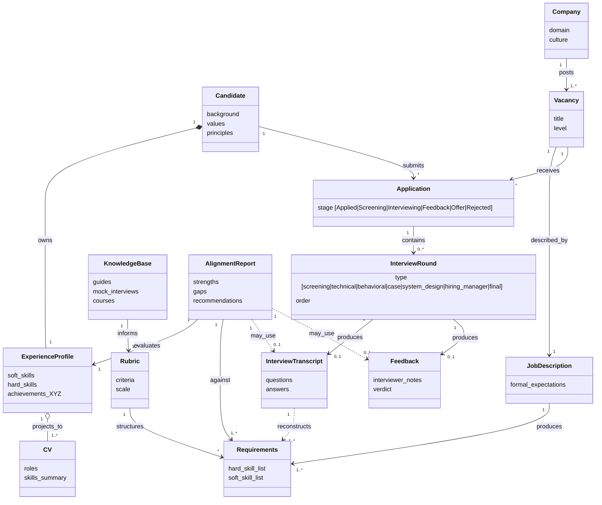

# Спецификация: Interview & Role Alignment Coach

## 1. Контекст и видение

Делаем ассистента, который помогает кандидату на пути «поиск вакансий → подготовка → интервью → рефлексия → следующий раунд».
Видение после встречи 2026-04-25 (Anton + Rita): инструмент строит **мост между субъективной стороной** (опыт, ценности, hard/soft skills конкретного кандидата) и **объективной стороной** (требования рынка, рубрики оценки, типовые вопросы).
Узкая постановка из [[project]] — JD + CV + transcript → структурированный отчёт — остаётся ядром MVP, но обрастает функциями реконструкции требований из корпуса и контроля качества рекомендаций.
Минимальный вход системы — субъективный профиль кандидата: даже без объективного слоя ассистент полезен (опираясь на общие знания LLM); добавление корпуса материалов делает рекомендации обоснованными источниками.
Пользователи первой волны — сама команда (Anton, Rita): инструмент мы делаем в первую очередь под себя, поэтому собственные кейсы — основной источник требований и тестовых данных. Архитектура должна допускать обобщение на «внешнего кандидата» позже.

## 2. Концептуальная модель

Диаграмма Фаулера (концептуальная, не имплементационная). Связи типизированы. В модели — **взаимодействия в воронке найма**: компании публикуют вакансии, кандидаты подаются (Application), Application проходит стадии (`Applied → Screening → Interviewing → Feedback → Offer/Rejected`), внутри стадии «Interviewing» происходят раунды интервью разного типа.

Ключевое следствие модели — **матрица артефактов** `{CV, JD, Transcript, Feedback}` для конкретного `Application`/`InterviewRound`: часть может отсутствовать (например, у mock-интервью с YouTube есть Transcript+Feedback, но нет CV+JD; у новой вакансии есть JD, но ещё нет Transcript). Система должна работать на любом непустом подмножестве, опционально достраивая недостающее реконструкцией (`Requirements` ← `Transcript`).

## 3. Сценарии использования

Сценарии отличаются заполненностью матрицы артефактов и фокусом (subjective ↔ objective). В колонке «Наш кейс» указано, у кого из команды этот сценарий уже встречается.

| ID | Что есть на входе | Что хочет пользователь | Наш кейс |
|----|-------------------|-------------------------|----------|
| **S1** | Только профиль (CV + ценности + background) | Общие рекомендации по поиску, опираясь на знания агента | Rita до начала отклика |
| **S2** | Профиль + список вакансий | Ранжирование вакансий, акценты для отклика, упражнение «карьерный шкаф» | Anton при выборе, куда откликаться |
| **S3** | Корпус mock-интервью (Transcript + Feedback) без своего CV/JD | Эксплораторный анализ: типовые вопросы, рубрики, критерии оценки | Rita: mock-интервью Карпова и YouTube |
| **S4** | Полный набор: профиль + JD + Transcript + Feedback | Структурированный отчёт по конкретному интервью с цитатами | Anton: интервью Avito, ApprovalMax и т.д. |
| **S5** | Профиль + Transcript без JD | Реконструкция псевдо-JD из вопросов и далее как S4 | Anton: ранние интервью без сохранённого JD |

## 4. Эпики

| ID | Эпик | Граница ответственности |
|----|------|-------------------------|
| **E1** | Субъективный профиль | расширенный профиль кандидата (CV + ценности + background + XYZ) — минимально необходимый вход |
| **E2** | Сбор и нормализация материалов | retrieval, ingest, метаданные источников |
| **E3** | Объективный слой | требования и рубрики, извлечённые/реконструированные из корпуса |
| **E4** | Матчинг, рекомендации, контроль качества | связка subjective ↔ objective, отчёты, ранжирование, free-form Q&A, LLM-as-judge |

Прогрессия зрелости системы: `E1 → S1` (даёт что-то полезное на одних знаниях LLM) → `+E2,E3 → S2-S5` (рекомендации обоснованы корпусом).

## 5. User stories

### E1. Субъективный профиль (минимально необходимое)

**E1-1.** Как кандидат, я хочу загрузить CV и свободные заметки о ценностях, принципах и background, чтобы профиль был богаче «сухого» CV и отражал то, что обычно не помещается в формальный документ.
- [ ] профиль включает блок «ценности/принципы» отдельно от CV
- [ ] поддерживается несколько источников ввода: CV-файл, свободные заметки, выписки из предыдущих рабочих контекстов
- [ ] ничего из этого не обязательно — система деградирует gracefully при отсутствии частей

**E1-2.** Как кандидат, я хочу формулировать достижения в формате XYZ (`сделал X через действие Y → результат Z`), чтобы опыт был сразу пригоден к собеседованию.
- [ ] ассистент помогает переформулировать «сырые» описания работы в XYZ
- [ ] результат сохраняется как часть профиля и может быть переиспользован

**E1-3.** Как кандидат, я хочу иметь несколько версий CV под разные направления (например, IC vs leadership), чтобы один профиль порождал адаптированные проекции.
- [ ] версия CV — проекция профиля, а не независимая сущность
- [ ] видна связь «эта версия → эти достижения профиля»

### E2. Сбор и нормализация материалов

**E2-1.** Как пользователь, я хочу добавлять курируемые источники (mock-интервью с YouTube, гайды, материалы курсов) в общую базу знаний, чтобы корпус был воспроизводимым и без обхода анти-бот защит.
- [ ] поддерживается источник: ссылка + локально сохранённый транскрипт (`transcripts/mock-*`)
- [ ] для каждого источника фиксируется метаданные: домен (DA/PA/DS), уровень, тип интервью
- [ ] добавление источника не требует ручной правки кода — достаточно положить папку по шаблону `mock-template/`

**E2-2.** Как пользователь, я хочу складывать собственные интервью (CV + vacancy + transcript + feedback) в `transcripts/<person>-<company>-YYYYMMDD/`, чтобы система автоматически подхватывала их при следующем запуске.
- [ ] схема папки соответствует CLAUDE.md
- [ ] частичные кейсы (без vacancy или feedback) обрабатываются без падения

### E3. Объективный слой (требования и рубрики)

**E3-1.** Как пользователь, я хочу запустить эксплораторный анализ корпуса транскриптов, чтобы получить агрегированные рубрики и типовые блоки вопросов.
- [ ] на выходе — таблица: тема × частота × hard/soft × тип раунда (screening / technical / behavioral / case / system_design / hiring_manager / final)
- [ ] для каждой темы — 2-3 примера-цитаты из корпуса
- [ ] результат сохраняется в артефакт, а не теряется в чате

**E3-2.** Как пользователь, я хочу реконструировать псевдо-JD из вопросов интервью, когда настоящего JD нет (Karpov-кейс), чтобы матрица артефактов заполнялась обратной инженерией.
- [ ] вход: транскрипт без JD → выход: набор `Requirements` с разметкой hard/soft
- [ ] явно помечено, что JD реконструированный, а не оригинальный
- [ ] результат можно сравнивать с оригинальным JD, если он позднее появится

**E3-3.** Как пользователь, я хочу видеть критерии оценки ответа (рубрику) для конкретного типа раунда, чтобы понимать, на что смотрит интервьюер.
- [ ] рубрика опирается на корпус (E3-1), а не на «здравый смысл» LLM
- [ ] есть ссылки на источники в KnowledgeBase

### E4. Матчинг, рекомендации, контроль качества

**E4-1.** Как кандидат, я хочу спросить ассистента в свободной форме («на чём сделать акцент в собесе на роль X», «как рассказать о слабом месте Y»), чтобы получать ответы, опирающиеся на профиль и/или корпус.
- [ ] доступно при наличии только профиля (S1) — фолбэк на знания агента
- [ ] при наличии корпуса ответ цитирует профиль (E1) и/или KnowledgeBase (E3)
- [ ] нет «чистой галлюцинации» из общих знаний LLM без указания источника

**E4-2.** Как кандидат, я хочу скинуть N вакансий и получить ранжированный список «куда откликаться первой», чтобы экономить мышление при отклике.
- [ ] метрика ранжирования объяснена (overlap по навыкам, наличие критичных гэпов)
- [ ] для каждой вакансии — на чём сделать акцент в CV/cover letter
- [ ] поддерживается случай, когда у вакансий есть только короткий заголовок без полного JD

**E4-3.** Как кандидат, я хочу провести упражнение «карьерный шкаф» (≈10 вакансий → ранжированный список навыков → метч с собственными), чтобы увидеть зону развития.
- [ ] выход: топ-N навыков с частотой и метчем «есть / частично / нет» относительно профиля
- [ ] использует словарь навыков из E3-1
- [ ] предлагает 2-3 направления развития на основе гэпов

**E4-4 (ядро MVP).** Как кандидат, я хочу получить структурированный отчёт по конкретному интервью (transcript + профиль + опц. JD + опц. feedback), чтобы понять, что было сильно и что просело.
- [ ] секции отчёта: aligned / partial / missing относительно `Requirements`
- [ ] сильные кейсы — с цитатами из транскрипта, пригодными к повторному использованию
- [ ] слабые места — с цитатами и формулировкой проблемы (vague / off-topic / factual error)
- [ ] рекомендации: как переформулировать имеющийся опыт под эту вакансию

**E4-5.** Как пользователь, я хочу, чтобы LLM-as-judge оценивал качество отчёта по фиксированным критериям, чтобы был минимальный quality gate.
- [ ] судья — отдельный prompt/модель от основного пайплайна
- [ ] критерии судьи зафиксированы (clarity, evidence, relevance)
- [ ] оценка судьи логируется вместе с отчётом

## 6. Не в scope

- [-] массовый парсинг интернета с обходом анти-бот защит — используем только курируемые источники
- [-] полноценный UI/веб-приложение — допустимы skill-точка входа в Claude, drop-папка или CLI
- [-] долгоживущий интерактивный агент с собственным циклом — пайплайн запускается на событие
- [-] юридические / HR-советы и замена коучу — disclaimer как в `project.md`
- [-] эволюция состояния (`MemoryState`, diff между раундами) — отложено, может вернуться после MVP
- [-] quiz / тренажёр по слабым местам — отложено, может вернуться после MVP
- [-] ролевая игра «диалог с интервьюером» — backlog

## 7. Открытые вопросы

- [ ] Один домен (DS / Product Analytics / Market Research) или универсально? — упирается в полноту корпуса (E3-1)
- [ ] Как мерджить subjective ↔ objective, когда часть матрицы артефактов отсутствует (S1, S3, S5)?
- [ ] Достаточно ли курируемого корпуса (Карпов + 3-5 mock на YouTube) для устойчивых рубрик E3-1?
- [ ] Минимальный набор критериев LLM-as-judge (E4-5) — берём ли из материалов курса или формулируем свои?
- [ ] Как разделить работу над общими документами между двумя людьми + агентами без merge-конфликтов (процессный риск из встречи)?

## 8. Связи

- [[project]] — `md/project.md` — постановка ядра MVP (alignment report)
- [[project-hub]] — `docs/project-hub.md` — цели, дедлайны, риски, лог встреч
- [[2026-04-25-Deli-sandwiches-meeting]] — `internal-notes/2026-04-25-Deli-sandwiches-meeting.md` — первоисточник этой спецификации
- [[grading]] — `grading/Project Criteria & Scoring.docx` — критерии оценки финального проекта
