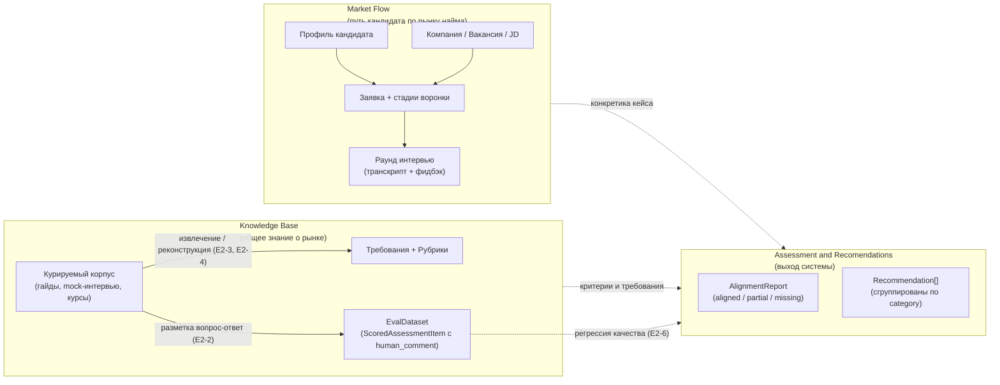
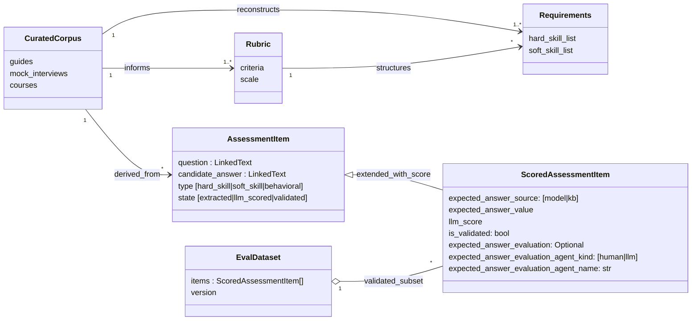
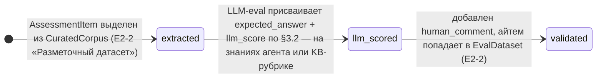
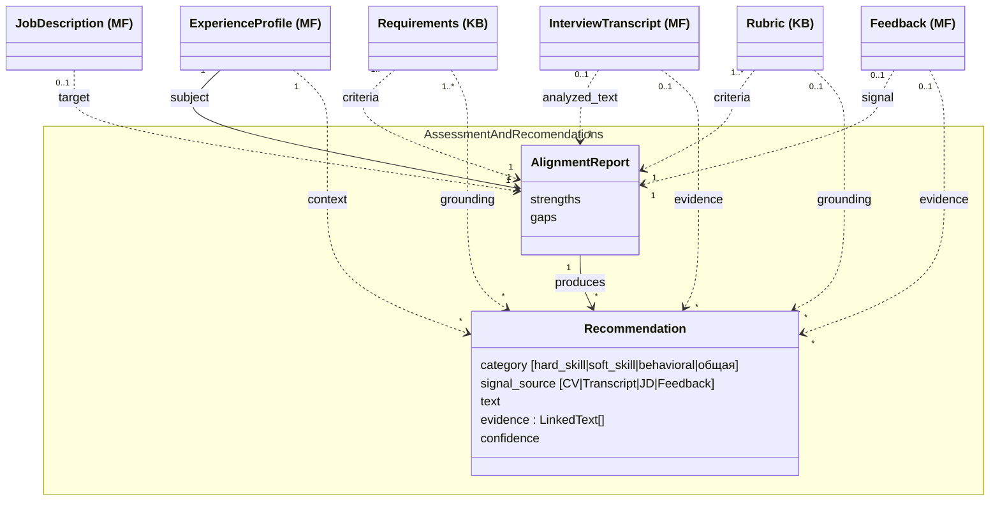

# Спецификация: Interview & Role Alignment Coach

## 1. Контекст и видение

Делаем ассистента, который помогает кандидату на пути «поиск вакансий → подготовка → интервью → рефлексия → следующий раунд».
Видение после встречи 2026-04-25 (команда проекта): инструмент строит **мост между двумя концептами** — **Market Flow** (путь конкретного кандидата по рынку найма: его опыт, заявки, интервью) и **Knowledge Base** (общее знание о рынке: рубрики, типовые требования, курируемые материалы).
Узкая постановка из [[project]] — JD + CV + transcript → структурированный отчёт — остаётся ядром MVP, но обрастает функциями реконструкции рубрик из корпуса и контроля качества рекомендаций.
Минимальный вход системы — профиль кандидата (точка входа в Market Flow): даже без Knowledge Base ассистент полезен, опираясь на общие знания LLM; добавление курируемого корпуса делает рекомендации обоснованными источниками.
Пользователи первой волны — сама команда (команда проекта): инструмент мы делаем в первую очередь под себя, поэтому собственные кейсы — основной источник требований и тестовых данных. Архитектура должна допускать обобщение на «внешнего кандидата» позже.

Горизонт MVP короткий и зафиксирован дедлайнами курса: чекпоинт-репорт **2026-05-14**, кодфриз **2026-05-21**, защита **2026-05-23** (см. [[project-hub]]). После встречи с ментором 2026-04-30 ([[2026-04-30_AMxMentor]]) scope в §5 и §8 явно сужен под этот горизонт: ментор просил «минимальное число сценариев, которые работают хорошо», и предупредил, что «система может делать слишком много» — это риск не доделать ничего хорошо.

### 1.1. Prerequisite: ручной ввод кейса

В MVP **пользователь сам создаёт папку кейса** в `transcripts/<person>-<company>-YYYYMMDD/` и кладёт туда CV, vacancy, transcript, feedback по схеме CLAUDE.md. Система не реализует автоматическое создание профиля и регистрацию заявки — это prerequisite на стороне пользователя. Полноценные UI / автоматический ingest вынесены в [[requirements_postponed]] (E1-1 «Профиль», E1-2 «Новая заявка»).

## 2. Ключевые понятия

Система оперирует тремя концептами. Каждому концепту соответствует один модуль.

- **Market Flow** — путь конкретного кандидата по рынку найма. Сюда попадает всё, что привязано к кандидату или возникает в его взаимодействии с рынком: профиль, компании, к которым он подаётся, их вакансии и JD, заявки и их стадии, прошедшие раунды интервью с транскриптами и фидбэком. Эволюционирует во времени по мере **событий воронки**: новая заявка, смена стадии, прошедший раунд, полученный фидбэк, обновление профиля.
- **Knowledge Base** — общее знание о рынке найма, не привязанное к конкретному кандидату: курируемые внешние материалы (гайды, mock-интервью с YouTube, курсы), извлечённые из них рубрики и типовые требования. Меняется медленно, общее для всех пользователей.
- **Assessment and Recomendations** — выход системы: рекомендации кандидату по подготовке и развитию, а также структурированный отчёт о соответствии профиля кандидата требованиям вакансии. Рекомендации формируются на основе матчинга между Market Flow и Knowledge Base, а также могут быть провалидированы через EvalDataset.

Ключевой инвариант: **Knowledge Base не зависит от Market Flow**. Свои транскрипты кандидата не вливаются в общий корпус. Knowledge Base строится только из курируемых внешних источников.

Ценность ассистента — в **матчинге** на выходе: применить рубрики и требования из Knowledge Base к текущему состоянию Market Flow и получить персонализированный отчёт или рекомендацию.

Прогрессия зрелости:
- только Market Flow + Assessment and Recomendations на знаниях агента (полезно);
- Market Flow + Assessment and Recomendations на основе Knowledge Base -> оценка строится на базе источников (хорошо);
- Market Flow + Assessment and Recomendations на основе Knowledge Base + eval → оценка строится на базе источников и есть метрика работы системы (отлично).

### 2.1. Helicopter view

Высокоуровневая карта: три модуля — два входных (Market Flow, Knowledge Base) и один выходной (Assessment and Recomendations). Поток ценности — от двух источников к итоговой рекомендации. Подробности — в §3 (артефакты), §4 (полная модель связей).

Различия трёх модулей при беглом сравнении:

| Модуль | Что это | Кто меняет | Скорость изменения | Пример |
|--------|---------|------------|--------------------|--------|
| **Market Flow** | Путь конкретного кандидата по рынку найма | Сам кандидат через события (E1) | Высокая — каждое событие | Профиль, заявка на Avito, раунд 2 поведенческого интервью с транскриптом |
| **Knowledge Base** | Общее знание о рынке: курируемый корпус и извлечённые рубрики/требования | Курация и обработка корпуса (E2) | Низкая — медленно растёт от добавления источников | Рубрика behavioral-интервью, типовые вопросы для DA-junior |
| **Assessment and Recomendations** | Выход системы: матчинг MF×KB → отчёт + рекомендации | Матчинг и формирование отчёта (E3) | Производный: пересчитывается на каждый раунд | `AlignmentReport` по конкретному раунду + `Recommendation[]` с цитатами |

Замечание: одна и та же сущность (например, JD на роль DA Senior) встречается в Market Flow и Knowledge Base **по-разному**. Конкретный JD на вакансию Avito, на которую подался Anton, — Market Flow (он привязан к заявке). А типовой профиль роли «DA Senior», агрегированный из 10 mock-интервью, — Knowledge Base. Разделение по ownership/привязке, а не по «сущность объективная или субъективная».

## 3. Артефакты

Все сущности, с которыми оперирует система. Раздел 4 показывает связи между ними.

**Market Flow** (привязаны к конкретному кандидату):
- **Профиль кандидата** — расширенный контекст: ценности, принципы, background, soft/hard skills. Объединяет `Candidate` + `ExperienceProfile` в модели.
- **CV** — формальная проекция профиля под направление (роли, summary, skills).
- **Компания** — потенциальный работодатель (попадает в систему, когда кандидат к ней присматривается или подаётся).
- **Вакансия** — конкретная позиция в компании.
- **Job Description (JD)** — формальное описание ожиданий вакансии.
- **Заявка (Application)** — связь `Кандидат × Вакансия` с текущей стадией воронки.
- **Раунд интервью (InterviewRound)** — отдельное интервью внутри заявки, с типом и порядком.
- **Транскрипт раунда** — текст вопросов и ответов одного раунда.
- **Фидбэк раунда** — обратная связь интервьюера по раунду.

**Knowledge Base** (общее, не привязано к кандидату):
- **Курируемый корпус (CuratedCorpus)** — внешние материалы: гайды, mock-интервью с YouTube, курсы (Карпов и т.п.).
- **Требования (Requirements)** — типовые ожидания по ролям, извлечённые/реконструированные из корпуса (hard/soft skill lists).
- **Рубрика (Rubric)** — структурированные критерии оценки ответа на тип вопроса.
- **AssessmentItem** — единица, выведенная из конкретного эпизода `CuratedCorpus` (вопрос-ответ из mock-интервью). Поля: `question` (LinkedText), `candidate_answer` (LinkedText), `type` ∈ {hard_skill, soft_skill, behavioral}, `state` ∈ {extracted, llm_scored, validated} — текущий этап жизненного цикла (см. §4.2.1). На стадии `extracted` это сырой айтем без эталона и оценки.
- **ScoredAssessmentItem** — расширяет `AssessmentItem` симметричной парой **эталон + оценка**. Дополнительные поля: `expected_answer` (текст эталонного ответа; может быть пустым для open questions), `llm_score` (оценка модели по критериям §3.2 — насколько `candidate_answer` близок к `expected_answer`), `human_comment` (опциональный комментарий разметчика для валидации `llm_score`). Симметрия: `expected_answer` — что должно было быть сказано; `llm_score` — насколько ответ кандидата приблизился к этому. Без эталона нет оценки.
  - **Источник эталона и оценки.** `expected_answer` + `llm_score` присваиваются LLM-eval по двум возможным путям: (а) **на общих знаниях модели** — fallback, когда KB пуста или нерелевантна, и (б) **на основе KB** — рубрика/требования из Knowledge Base подаются в промпт как ground для эталона. Артефакт `ScoredAssessmentItem` от этого выбора не меняется; меняется только обоснованность эталона (см. прогрессию зрелости §2). Само присвоение **не требует** EvalDataset — это разные слои.
  - **Связь с EvalDataset.** `human_comment` опционален и заполняется только для айтемов, попадающих в `EvalDataset` для регрессии E2-6. ScoredAssessmentItem без `human_comment` существует самостоятельно (например, как промежуточный артефакт LLM-eval) и не обязан попадать в EvalDataset.
- **Размеченный датасет (EvalDataset)** — курируемое подмножество `ScoredAssessmentItem` с непустым `human_comment`; используется для автоматической оценки качества (§7, E2-6). Не все `ScoredAssessmentItem` принадлежат EvalDataset — только те, что отобраны и размечены человеком.

**Assessment and Recomendations** (AR — выход системы, см. §2):
- **Отчёт (AlignmentReport)** — структурированный артефакт: aligned / partial / missing, цитаты, набор `Recommendation`.
- **Рекомендация (Recommendation)** — единица того, что система советует кандидату. Поля: `category` ∈ {hard_skill, soft_skill, behavioral, общая}, `signal_source` ∈ {CV, Transcript, JD, Feedback}, `text` (формулировка), `evidence` (список LinkedText), `confidence` (оценка по критериям §3.2). Без явного определения этой сущности невозможно сформулировать критерии оценки качества (фидбэк ментора 2026-04-30: «от этого исходит всё остальное, в том числе оценка»).

**Общие value-objects** (не принадлежат ни одному модулю, используются несколькими):
- **LinkedText** — `{text, transcript_time}`. Цитата с привязкой к таймкоду в транскрипте. Используется в `Recommendation.evidence` (AR) и в `AssessmentItem.{question, candidate_answer}` (KB).

### 3.1. Матрица заполненности

Для конкретного раунда интервью артефакты `{CV, JD, Transcript, Feedback}` заполнены не всегда. Система должна работать на любом непустом подмножестве, опционально достраивая недостающее реконструкцией.

| Кейс                              | CV | JD | Transcript | Feedback | Что может сделать система                                   |
|-----------------------------------|----|----|------------|----------|-------------------------------------------------------------|
| Mock Карпова с YouTube            | — | — | ✓ | ✓ | агрегирует в корпус (E2-3), реконструирует псевдо-JD (E2-4) |
| Кандидат A: Company A (без feedback) | ✓ | ✓ | ✓ | — | полный отчёт в blind mode(E3-4)                             |
| Кандидат A: Company B             | ✓ | ✓ | ✓ | ✓ | полный отчёт в blind или feedback mode (E3-4)               |

Кейсы «Состояние до отклика» (соответствует S1) и «Новая заявка, до интервью» (S2) вынесены в [[requirements_postponed]] — в MVP не делаем.

### 3.2. Низкоуровневые критерии оценки

Ментор 2026-04-30: «начать с очень простых критериев, для которых даже не надо знать про hard/soft skills». Стартовый набор, общий для `Recommendation.confidence` и `ScoredAssessmentItem.llm_score`:
- **clarity** — был ли ответ внятным/понятным;
- **completeness** — был ли ответ полным;
- **factual_correctness** — есть ли фактические ошибки.

Высокоуровневые критерии (матрица компетенций аналитика Авито, программа курса Карпова, hard/soft-skill списки) — следующий слой, надстраиваемый поверх низкоуровневых после MVP. Если на низком уровне критерии не различают «хороший» и «плохой» ответ — высокоуровневые тоже не различат.

## 4. Концептуальная модель

Диаграмма Фаулера (концептуальная, не имплементационная). Связи типизированы. Воронка найма представлена через `Application.stage` и упорядоченные `InterviewRound`.

Полная модель содержит много связей, поэтому разбита на три фокусных вида (по правилу модульности и снижения когнитивной нагрузки):

- **§4.1** — интра-структура **Market Flow**;
- **§4.2** — интра-структура **Knowledge Base** (включая Eval-артефакты `AssessmentItem`, `ScoredAssessmentItem`, `EvalDataset` — они KB по природе данных: общие, выводятся из `CuratedCorpus`);
- **§4.3** — модуль **Assessment and Recomendations** (AR) — единственное место, где MF и KB встречаются и сшиваются в `AlignmentReport` + `Recommendation[]`.

Ключевой инвариант (см. §2): между §4.1 и §4.2 нет стрелок ни в одну сторону. Они встречаются только в §4.3 (AR).

Замечание про изоляцию Eval-вызова: требование ментора («дело не в том, чтобы это были разные архитектуры, а чтобы контекст не шарили») — это **операционная** изоляция LLM-вызова (отдельный промпт, отдельное окно контекста), а не структурная изоляция артефактов. Артефакты `AssessmentItem` / `ScoredAssessmentItem` / `EvalDataset` остаются в KB; операционные требования к их использованию — в E2-6 (§7).

### 4.1. Market Flow (интра)

Две ветви воронки сходятся в `Application`: слева кандидат со своим профилем и CV, справа компания со своей вакансией и JD. Раунды интервью растут вниз от заявки.

### 4.2. Knowledge Base (интра)

Корпус — источник всего: рубрики, требования и Eval-айтемы — производные. Все стрелки замкнуты внутри Knowledge Base. Operational-аспект использования `EvalDataset` (отдельная дешёвая модель, изолированный контекст) — в E2-6 (§7), не в концептуальной модели.

#### 4.2.1. State machine `AssessmentItem`

Айтем проходит три состояния, каждое сопровождается **сменой типа**: bare `AssessmentItem` → `ScoredAssessmentItem` (с парой `expected_answer` + `llm_score`) → тот же `ScoredAssessmentItem` с `human_comment`. Стартовое состояние — `extracted` (айтем выделен из `CuratedCorpus`, заполнены `question` / `candidate_answer` / `type`); `llm_scored` — присвоена пара эталон+оценка LLM-eval-вызовом (источник: общие знания модели или рубрика из KB — см. §3, «Источник эталона и оценки»); терминальное — `validated` — добавлен `human_comment`, айтем попадает в `EvalDataset` и пригоден для регрессии E2-6.

Важно: переход `extracted → llm_scored` **не требует** EvalDataset — это самостоятельный LLM-eval. EvalDataset фигурирует только на переходе `llm_scored → validated`, где человек верифицирует score.

Триггеры переходов выражены через эпики/истории, не через имена реализационных компонентов (компоненты — в [[arch_agents]]).

Поле `AssessmentItem.state` явно отражает текущий этап. Без него невозможно отличить «свежевыделенный» айтем от «оценённого моделью» от «провалидированного человеком» — а это ключ для метрик E2-6 (регрессия только на `validated` подмножестве). Тип (`AssessmentItem` vs `ScoredAssessmentItem`) и state скоррелированы: `extracted` ↔ bare AssessmentItem, `llm_scored` / `validated` ↔ ScoredAssessmentItem (без / с `human_comment`).

### 4.3. Assessment and Recomendations (AR)

Модуль AR — единственная точка встречи Market Flow и Knowledge Base. Содержит два артефакта-выхода: `AlignmentReport` и `Recommendation`. Подписи `(MF)` и `(KB)` на внешних классах показывают, откуда тянется каждая ссылка. `Recommendation` вынесена явно — она и есть основной интересующий пользователя выход (см. §3 и фидбэк ментора).

Диаграмма ориентирована top-down (как §2.1): источники сверху (MF, KB), AR — внизу. Стрелки читаются как **поток данных** в AR: что в него попадает и в каком качестве.

Сплошная стрелка (`subject` от `ExperienceProfile`, `produces` к `Recommendation`) — обязательная зависимость отчёта; пунктирные — опциональные/применяемые в зависимости от заполненности матрицы (см. §3.1).

`Recommendation` сама по себе не имеет состояний: она производится `AlignmentReport`-ом одномоментно. Жизненный цикл со стадиями есть у пары `AssessmentItem` → `ScoredAssessmentItem` (KB, см. §4.2.1): сначала айтем выделяется как bare `AssessmentItem`, затем расширяется до `ScoredAssessmentItem` с `expected_answer` + `llm_score`, и наконец валидируется добавлением `human_comment`. Именно эта цепочка используется в регрессии E2-6.

## 5. Сценарии использования

В MVP — два сценария: **S3** (наполняет KB) и **S4** (ядро). Решение по итогам встречи с ментором 2026-04-30: «минимальное число сценариев, которые работают хорошо». Сценарии **S1** (только профиль → общие рекомендации) и **S2** (ранжирование вакансий) вынесены в [[requirements_postponed]].

| ID | Группы | Что есть на входе | Что хочет пользователь | Наш кейс | Роль в MVP |
|----|--------|-------------------|-------------------------|----------|------------|
| **S3** | KB | Корпус mock-интервью (Transcript + Feedback) без своего CV/JD | Эксплораторный анализ: типовые вопросы, рубрики, критерии оценки | Анализ mock-интервью Карпова и YouTube | наполняет KB |
| **S4** | MF + KB | Полный набор: профиль + JD + Transcript + Feedback | Структурированный отчёт по конкретному интервью с цитатами | Кандидат A: Company A/B и т.д. | ядро |

## 6. Эпики

| ID | Модуль | Эпик | Граница ответственности |
|----|--------|------|-------------------------|
| **E1** | MF | Market Flow | привязка артефактов кейса к раунду интервью (транскрипт, фидбэк); создание профиля и регистрация заявки — prerequisite (см. §1.1) |
| **E2** | KB | Knowledge Base | курация источников, разметка `EvalDataset`, извлечение/реконструкция требований и рубрик, контроль качества (Eval) |
| **E3** | AR | Assessment and Recomendations | связка Market Flow и Knowledge Base в `AlignmentReport`, формирование и представление `Recommendation[]` |

## 7. User stories

Каждая история имеет короткое имя — на него удобно ссылаться из других секций (формат: `E2-3 «Эксплораторный анализ»`).

### E1. Market Flow (события воронки)

Пререквизит: пользователь сам создаёт папку кейса в `transcripts/<person>-<company>-YYYYMMDD/` и кладёт туда CV, vacancy, transcript, feedback по схеме CLAUDE.md (см. §1.1).

**E1-4 «Транскрипт раунда».** Как кандидат, я хочу прикрепить к раунду интервью транскрипт (например, выгрузку из MacWhisper), чтобы появилась входная точка для разбора.
- [ ] раунд создаётся внутри существующей заявки с типом и порядком
- [ ] транскрипт привязан к раунду, а не «болтается» в общем хранилище
- [ ] поддерживаются несколько раундов в одной заявке

**E1-5 «Фидбэк раунда».** Как кандидат, я хочу прикрепить к раунду фидбэк интервьюера, чтобы система учитывала его при разборе.
- [ ] фидбэк опционален: бывают раунды без него
- [ ] разбор E3-4 «Отчёт по интервью» явно отличается при наличии фидбэка vs без него

### E2. Knowledge Base (рубрики и требования)

**E2-1 «Курируемые источники».** Как администратор KB, я хочу добавлять курируемые источники (mock-интервью с YouTube, гайды, материалы курсов) в Knowledge Base, чтобы корпус был воспроизводимым и без обхода анти-бот защит.
- [ ] поддерживается источник: ссылка + локально сохранённый транскрипт (`transcripts/mock-*`)
- [ ] для каждого источника фиксируется метаданные: домен (DA/PA/DS), уровень, тип интервью
- [ ] добавление источника не требует ручной правки кода — достаточно положить папку по шаблону `mock-template/`

**E2-2 «Разметочный датасет».** Как администратор KB, я хочу вести `EvalDataset` (Google Sheets со `ScoredAssessmentItem`), чтобы автоматическая оценка качества (E2-6) опиралась на воспроизводимую человеческую разметку.
- [ ] schema листа совпадает с артефактом `ScoredAssessmentItem` (§3): `question`, `candidate_answer`, `type` (от `AssessmentItem`) + `expected_answer`, `llm_score`, `human_comment`, плюс `transcript_time` для обоих LinkedText-полей
- [ ] стартовый объём — 5–10 размеченных айтемов (фидбэк ментора: «нет ответа на сколько хватит, начните с 5–10 + edge cases»)
- [ ] явно покрыты edge cases: правдоподобный, но фактически неверный ответ; ответ-вода без сигнала; ответ на смежный вопрос
- [ ] перегенерация LLM-оценок не теряет ранее размеченных `human_comment`

**E2-3 «Эксплораторный анализ».** Как администратор KB, я хочу запустить эксплораторный анализ корпуса, чтобы получить агрегированные рубрики и типовые блоки вопросов.
- [ ] на выходе — таблица: тема × частота × hard/soft × тип раунда (screening / technical / behavioral / case / system_design / hiring_manager / final)
- [ ] для каждой темы — 2-3 примера-цитаты из корпуса
- [ ] результат сохраняется в артефакт, а не теряется в чате
- [ ] **риск (mentor 2026-04-30):** в источниках без CV/JD непонятен уровень кандидата — могли спрашивать сеньора там, где это джун, или наоборот. Реконструированные рубрики помечать как «реконструированы», а не «извлечены», и сверять с реальными источниками (открытая матрица компетенций аналитика Авито, программа курса Карпова) — это отдельный валидационный шаг, point-of-failure которого фиксируется в §9.

**E2-4 «Анализ без JD».** Как администратор KB, я хочу извлекать рубрики и требования из материалов корпуса даже когда официального JD нет (mock-интервью с YouTube — частый случай), чтобы такие источники оставались полезными для Knowledge Base.
- [ ] вход: транскрипт из корпуса без JD → выход: набор `Requirements` с разметкой hard/soft
- [ ] под капотом — реконструкция псевдо-JD из вопросов транскрипта; явно помечено, что результат реконструирован, а не извлечён из оригинального JD
- [ ] результат можно сравнивать с оригинальным JD, если он позднее появится

**E2-5 «Рубрика типа раунда».** Как пользователь, я хочу видеть критерии оценки ответа (рубрику) для конкретного типа раунда, чтобы понимать, на что смотрит интервьюер.
- [ ] рубрика опирается на корпус (E2-3 «Эксплораторный анализ»), а не на «здравый смысл» LLM
- [ ] есть ссылки на источники в курируемом корпусе

**E2-6 «Контроль качества».** Как разработчик, я хочу видеть автоматическую оценку качества `Recommendation` и `ScoredAssessmentItem`, чтобы понимать, не деградирует ли система между итерациями промпта (фидбэк ментора 2026-04-30: пользователю эта оценка не нужна и не показывается).
- [ ] вход — `EvalDataset` (KB-артефакт §4.2) и/или `Recommendation`, выход — оценка по низкоуровневым критериям §3.2 (clarity, completeness, factual_correctness)
- [ ] **операционная изоляция вызова** (mentor: «дело не в том, чтобы это были разные архитектуры, а чтобы контекст не шарили»): отдельный (дешёвый) вызов LLM (Haiku / локальная Gemma 27B), собственный промпт, отдельное окно контекста — не разделяет state с основным пайплайном E3-4
- [ ] метрика — соответствие автоматической оценки `human_comment` на отложенном `EvalDataset`; цель — отсутствие регресса между итерациями
- [ ] оценка логируется (Logs Store, см. [[arch]]) для ретроспективного анализа просадок
- [ ] терминологическая оговорка: ментор отметил различие между Eval (регрессия на отложенном датасете) и LLM-as-judge (модель-судья оценивает выход в момент исполнения) и сам пометил, что не эксперт — конкретный механизм фиксируем в §9 как открытый

### E3. Assessment and Recomendations (матчинг, рекомендации, контроль качества)

**E3-4 «Отчёт по интервью» (ядро MVP).** Как кандидат, я хочу получить структурированный отчёт по конкретному раунду интервью (transcript + профиль + опц. JD + опц. feedback), чтобы понять, что было сильно и что просело.
- [ ] секции отчёта: aligned / partial / missing относительно `Requirements` из Knowledge Base + `JD` из Market Flow
- [ ] сильные кейсы — с цитатами из транскрипта, пригодными к повторному использованию
- [ ] слабые места — с цитатами и формулировкой проблемы (vague / off-topic / factual error)
- [ ] на выходе — `Recommendation[]` (см. §3) с заполненными `category` и `signal_source`; рекомендация без `evidence` — баг
- [ ] если все ответы в транскрипте behavioral, а в MVP под behavioral нет рубрик — отчёт явно сообщает: «оценка категории behavioral в текущей версии не выполнена»

**E3-5 «Структура рекомендаций».** Как кандидат, я хочу видеть рекомендации сгруппированными и со ссылками на источник, чтобы понимать, на основании чего они выданы.
- [ ] рекомендации сгруппированы по `category` (hard_skill / soft_skill / behavioral / общая)
- [ ] для каждой рекомендации видна цитата (`evidence`) и пометка `signal_source` (CV / Transcript / JD / Feedback)
- [ ] рекомендация без `evidence` или без `signal_source` считается багом и не отдаётся пользователю

## 8. Не в scope

- [-] массовый парсинг интернета с обходом анти-бот защит — используем только курируемые источники
- [-] полноценный UI/веб-приложение — допустимы skill-точка входа в Claude, drop-папка или CLI
- [-] долгоживущий интерактивный агент с собственным циклом — пайплайн запускается на событие
- [-] юридические / HR-советы и замена коучу — disclaimer как в `project.md`
- [-] эволюция состояния (`MemoryState`, diff между раундами рекомендаций) — отложено, может вернуться после MVP
- [-] quiz / тренажёр по слабым местам — отложено, может вернуться после MVP
- [-] ролевая игра «диалог с интервьюером» — backlog
- [-] несколько версий CV под разные направления — backlog (профиль один, проекции — потом)
- [-] вливание собственных транскриптов кандидата в Knowledge Base — нарушает инвариант §2
- [-] **behavioral как первичный фокус MVP** — поддерживается на уровне модели (`Recommendation.category`, `AssessmentItem.type`), но рубрики и Eval под behavioral в MVP не строим; пересмотр после 14.05
- [-] **S2 «Ранжирование вакансий» в MVP-горизонте** — отложено до после чекпоинта 14.05 (mentor: «минимальное число сценариев, которые работают хорошо»)
- [-] **полноценный Streamlit Cloud деплой в MVP** — на горизонт до 14.05 ядро запускается в Claude Code skill (POC), детальная архитектура и стретч-цель деплоя — в [[arch]]

## 9. Открытые вопросы

Закрытые вопросы (по итогам встречи 2026-04-30 с ментором):
- [x] **Где физически хранить состояние Market Flow.** Решение: git + filesystem на этапе POC (для curated own-interview-кейсов в `transcripts/<person>-<company>-*`); session-scoped — позднее в Streamlit. Детали — в [[arch]] §5.
- [x] **Минимальный набор критериев контроля качества.** Решение: низкоуровневые — clarity / completeness / factual_correctness (см. §3.2). Высокоуровневые надстройки — после MVP.

Открытые вопросы:
- [ ] Один домен (DS / Product Analytics / Market Research) или универсально? — упирается в полноту корпуса (E2-3 «Эксплораторный анализ»)
- [ ] Как мерджить Market Flow и Knowledge Base, когда часть матрицы артефактов отсутствует (S3 — без CV/JD)?
- [ ] Достаточно ли курируемого корпуса (Карпов + 3-5 mock на YouTube) для устойчивых рубрик E2-3 «Эксплораторный анализ»?
- [ ] Сколько `ScoredAssessmentItem` (с `human_comment`) в `EvalDataset` достаточно для устойчивой автоматической оценки качества? Mentor: «нет ответа, начните с 5–10 + edge cases» — нужен эмпирический критерий стабилизации.
- [ ] Источник эталонных рубрик для валидации S3: открытая матрица компетенций аналитика Авито + программа курса Карпова — пробуем как ground truth, но соответствие не гарантировано.
- [ ] **Eval vs LLM-as-judge — разные техники.** Ментор отметил различие, но не уточнил, какая нам нужна (или нужны обе). Eval = регрессия на отложенном размеченном датасете; LLM-as-judge = модель-судья оценивает выход в момент исполнения. Нужно решить: какую технику применяем для §3.2-критериев, к каким артефактам (`Recommendation` / `ScoredAssessmentItem` / `AlignmentReport`), и нужна ли вторая.
- [ ] Behavioral в выходе — давать пользователю явный disclaimer «не оцениваем» или молча не возвращать рекомендации этой категории?
- [ ] Как разделить работу над общими документами между двумя людьми + агентами без merge-конфликтов (процессный риск из встречи)?

## 10. Связи

- [[project]] — `md/project.md` — постановка ядра MVP (alignment report)
- [[project-hub]] — `docs/project-hub.md` — цели, дедлайны, риски, лог встреч
- [[arch]] — `md/arch.md` — архитектурный выбор (pipelines в Claude Code, runtime в LangGraph), §5 хранилища
- [[requirements_postponed]] — `md/requirements_postponed.md` — сценарии и user stories, вынесенные за пределы MVP-горизонта
- [[2026-04-25-Deli-sandwiches-meeting]] — `internal-notes/2026-04-25-Deli-sandwiches-meeting.md` — первоисточник этой спецификации
- [[2026-04-30_AMxMentor]] — `internal-notes/2026-04-30_AMxMentor.txt` — встреча с ментором, источник правок ревизии 2026-05-02 (артефакты `Recommendation` / `AssessmentItem`, низкоуровневые критерии, сужение MVP)
- [[2026-04-30-martin-meeting]] — `internal-notes/2026-04-30-martin-meeting.md` — рабочие заметки по структуре `AssessmentItem`
- [[grading]] — `grading/Project Criteria & Scoring.docx` — критерии оценки финального проекта
