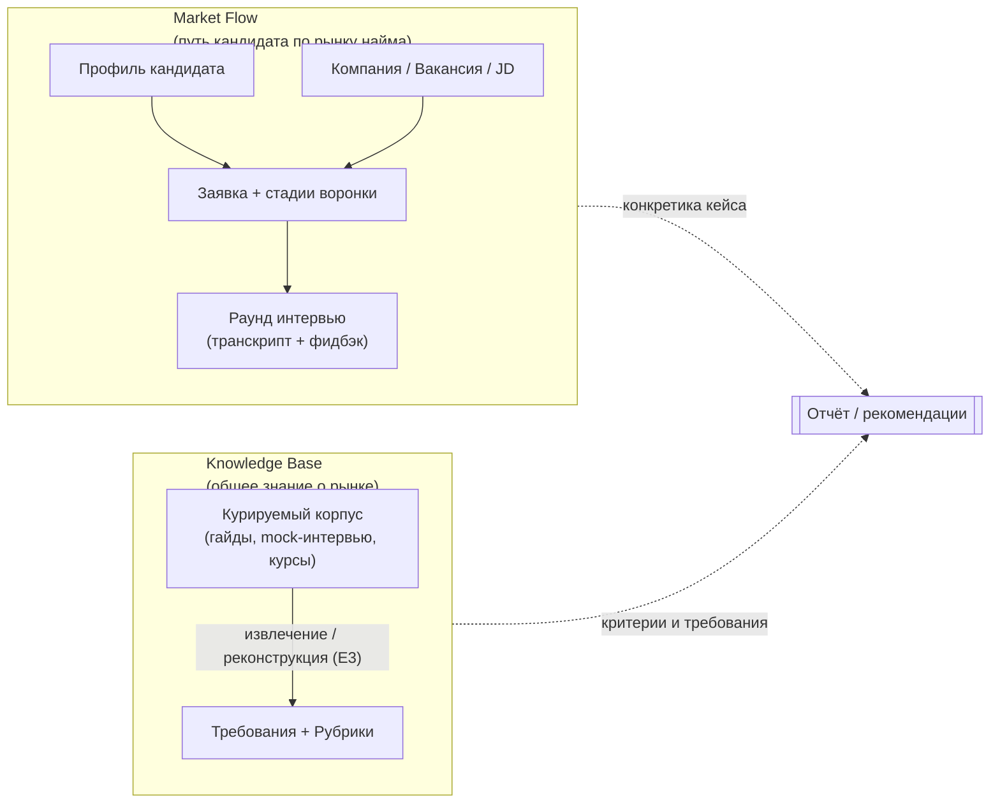
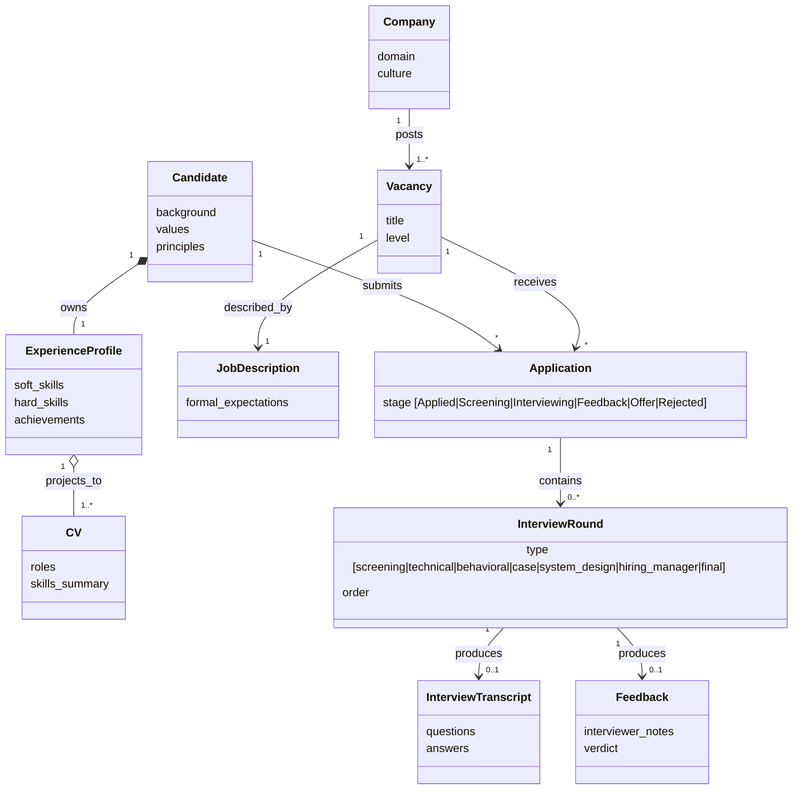
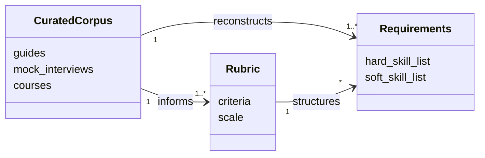
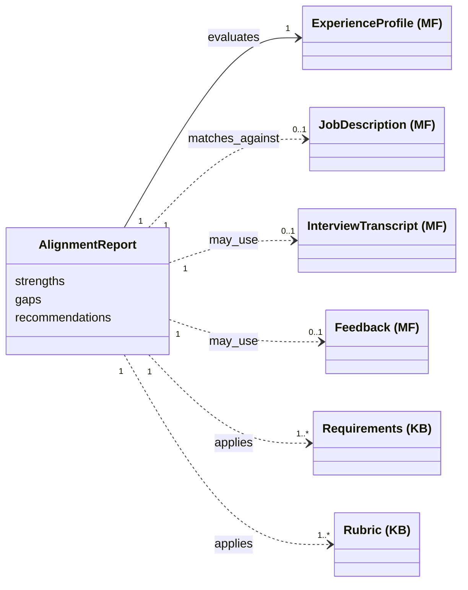

# Спецификация: Interview & Role Alignment Coach

## 1. Контекст и видение

Делаем ассистента, который помогает кандидату на пути «поиск вакансий → подготовка → интервью → рефлексия → следующий раунд».
Видение после встречи 2026-04-25 (команда проекта): инструмент строит **мост между двумя концептами** — **Market Flow** (путь конкретного кандидата по рынку найма: его опыт, заявки, интервью) и **Knowledge Base** (общее знание о рынке: рубрики, типовые требования, курируемые материалы).
Узкая постановка из [[project]] — JD + CV + transcript → структурированный отчёт — остаётся ядром MVP, но обрастает функциями реконструкции рубрик из корпуса и контроля качества рекомендаций.
Минимальный вход системы — профиль кандидата (точка входа в Market Flow): даже без Knowledge Base ассистент полезен, опираясь на общие знания LLM; добавление курируемого корпуса делает рекомендации обоснованными источниками.
Пользователи первой волны — сама команда (команда проекта): инструмент мы делаем в первую очередь под себя, поэтому собственные кейсы — основной источник требований и тестовых данных. Архитектура должна допускать обобщение на «внешнего кандидата» позже.

## 2. Market Flow и Knowledge Base

Система оперирует двумя концептами:

- **Market Flow** — путь конкретного кандидата по рынку найма. Сюда попадает всё, что привязано к кандидату или возникает в его взаимодействии с рынком: профиль, компании, к которым он подаётся, их вакансии и JD, заявки и их стадии, прошедшие раунды интервью с транскриптами и фидбэком. Эволюционирует во времени по мере **событий воронки**: новая заявка, смена стадии, прошедший раунд, полученный фидбэк, обновление профиля.
- **Knowledge Base** — общее знание о рынке найма, не привязанное к конкретному кандидату: курируемые внешние материалы (гайды, mock-интервью с YouTube, курсы), извлечённые из них рубрики и типовые требования. Меняется медленно, общее для всех пользователей.

Ключевой инвариант: **Knowledge Base не зависит от Market Flow**. Свои транскрипты кандидата не вливаются в общий корпус. Knowledge Base строится только из курируемых внешних источников.

Ценность ассистента — в **матчинге** на выходе: применить рубрики и требования из Knowledge Base к текущему состоянию Market Flow и получить персонализированный отчёт или рекомендацию.

Прогрессия зрелости:
- только Market Flow → рекомендации на общих знаниях агента (полезно);
- Market Flow + Knowledge Base → рекомендации обоснованы источниками (хорошо);
- Market Flow + Knowledge Base + eval → рекомендации обоснованы и провалидированы (отлично).

### 2.1. Helicopter view

Высокоуровневая карта: две группы артефактов и поток ценности к итоговой рекомендации. Подробности — в §3 (артефакты), §4 (полная модель связей).

Различия двух групп при беглом сравнении:

| Группа | Что это | Кто меняет | Скорость изменения | Пример |
|--------|---------|------------|--------------------|--------|
| **Market Flow** | Путь конкретного кандидата по рынку найма | Сам кандидат через события (E1) | Высокая — каждое событие | Профиль, заявка на Avito, раунд 2 поведенческого интервью с транскриптом |
| **Knowledge Base** | Общее знание о рынке: курируемый корпус и извлечённые рубрики/требования | Курация корпуса (E2) + извлечение/реконструкция (E3) | Низкая — медленно растёт от добавления источников | Рубрика behavioral-интервью, типовые вопросы для DA-junior |

Замечание: одна и та же сущность (например, JD на роль DA Senior) встречается в обеих группах **по-разному**. Конкретный JD на вакансию Avito, на которую подался Anton, — Market Flow (он привязан к заявке). А типовой профиль роли «DA Senior», агрегированный из 10 mock-интервью, — Knowledge Base. Разделение по ownership/привязке, а не по «сущность объективная или субъективная».

## 3. Артефакты

Все сущности, с которыми оперирует система. Раздел 4 показывает связи между ними.

**Market Flow** (привязаны к конкретному кандидату):
- **Профиль кандидата** — расширенный контекст: ценности, принципы, background, soft/hard skills. Объединяет `Candidate` + `ExperienceProfile` в модели.
- **CV** — формальная проекция профиля под направление (роли, summary, skills).
- **Компания** — потенциальный работодатель (попадает в систему, когда кандидат к ней присматривается или подаётся).
- **Вакансия** — конкретная позиция в компании.
- **Job Description (JD)** — формальное описание ожиданий вакансии.
- **Заявка (Application)** — связь `Кандидат × Вакансия` с текущей стадией воронки.
- **Раунд интервью (InterviewRound)** — отдельное интервью внутри заявки, с типом и порядком.
- **Транскрипт раунда** — текст вопросов и ответов одного раунда.
- **Фидбэк раунда** — обратная связь интервьюера по раунду.

**Knowledge Base** (общее, не привязано к кандидату):
- **Курируемый корпус (KnowledgeBase)** — внешние материалы: гайды, mock-интервью с YouTube, курсы (Карпов и т.п.).
- **Требования (Requirements)** — типовые ожидания по ролям, извлечённые/реконструированные из корпуса (hard/soft skill lists).
- **Рубрика (Rubric)** — структурированные критерии оценки ответа на тип вопроса.

**Выход системы**:
- **Отчёт (AlignmentReport)** — структурированный артефакт: aligned / partial / missing, цитаты, рекомендации.

### 3.1. Матрица заполненности

Для конкретного раунда интервью артефакты `{CV, JD, Transcript, Feedback}` заполнены не всегда. Система должна работать на любом непустом подмножестве, опционально достраивая недостающее реконструкцией.

| Кейс                              | CV | JD | Transcript | Feedback | Что делает система |
|-----------------------------------|----|----|------------|----------|---------------------|
| Состояние до отклика              | ✓ | — | — | — | общие рекомендации (сценарий S1) |
| Новая заявка, до интервью         | ✓ | ✓ | — | — | рекомендации к подготовке (E4-1, E4-2) |
| Mock Карпова с YouTube            | — | — | ✓ | ✓ | агрегирует в корпус (E3-1), реконструирует псевдо-JD (E3-2) |
| Кандидат A: Company A (без feedback) | ✓ | ✓ | ✓ | — | разбор без блока verdict (E4-4) |
| Кандидат A: Company B             | ✓ | ✓ | ✓ | ✓ | полный отчёт (E4-4) |

## 4. Концептуальная модель

Диаграмма Фаулера (концептуальная, не имплементационная). Связи типизированы. Воронка найма представлена через `Application.stage` и упорядоченные `InterviewRound`.

Полная модель содержит много связей, поэтому разбита на три фокусных вида (по правилу модульности и снижения когнитивной нагрузки):

- **§4.1** — интра-структура **Market Flow**;
- **§4.2** — интра-структура **Knowledge Base**;
- **§4.3** — **матчинг** через `AlignmentReport` (единственное место, где обе группы встречаются).

Ключевой инвариант (см. §2): между §4.1 и §4.2 нет стрелок ни в одну сторону. Они встречаются только в §4.3.

### 4.1. Market Flow (интра)

Две ветви воронки сходятся в `Application`: слева кандидат со своим профилем и CV, справа компания со своей вакансией и JD. Раунды интервью растут вниз от заявки.

### 4.2. Knowledge Base (интра)

Корпус — источник; рубрики и требования — производные. Все стрелки замкнуты внутри Knowledge Base.

### 4.3. Матчинг через AlignmentReport

`AlignmentReport` — единственная точка встречи двух групп. Подписи `(MF)` и `(KB)` показывают, откуда тянется каждая ссылка.

Сплошная стрелка (`evaluates` к `ExperienceProfile`) — обязательная зависимость отчёта; пунктирные — опциональные/применяемые в зависимости от заполненности матрицы (см. §3.1).

## 5. Сценарии использования

Сценарии отличаются заполненностью матрицы артефактов и тем, какие группы (MF / KB) задействованы. В колонке «Наш кейс» указано, у кого из команды этот сценарий уже встречается.

| ID | Группы | Что есть на входе | Что хочет пользователь | Наш кейс                                  |
|----|--------|-------------------|-------------------------|-------------------------------------------|
| **S1** | MF | Только профиль (CV + ценности + background) | Общие рекомендации по поиску, опираясь на знания агента | Мы до начала отклика                      |
| **S2** | MF + KB | Профиль + список вакансий | Ранжирование вакансий, акценты для отклика, упражнение «карьерный шкаф» | Мы при выборе, куда откликаться           |
| **S3** | KB | Корпус mock-интервью (Transcript + Feedback) без своего CV/JD | Эксплораторный анализ: типовые вопросы, рубрики, критерии оценки | Анализ mock-интервью Карпова и YouTube    |
| **S4** | MF + KB | Полный набор: профиль + JD + Transcript + Feedback | Структурированный отчёт по конкретному интервью с цитатами | Кандидат A: Company A/B и т.д. |

## 6. Эпики

| ID | Группы | Эпик | Граница ответственности |
|----|--------|------|-------------------------|
| **E1** | MF | Market Flow | состояние кандидата, обновляемое событиями воронки (профиль, компании/вакансии/JD, заявки, раунды, транскрипты, фидбэки) |
| **E2** | KB | Сбор и нормализация материалов | retrieval, ingest курируемого корпуса в Knowledge Base, метаданные источников |
| **E3** | KB | Knowledge Base | требования и рубрики, извлечённые/реконструированные из курируемого корпуса |
| **E4** | MF + KB | Матчинг, рекомендации, контроль качества | связка Market Flow и Knowledge Base, отчёты, ранжирование, free-form Q&A, контроль качества |

## 7. User stories

Каждая история имеет короткое имя — на него удобно ссылаться из других секций (формат: `E3-1 «Эксплораторный анализ»`).

### E1. Market Flow (события воронки)

Состояние кандидата обновляется событиями. Каждое событие — это либо обновление профиля, либо движение по воронке найма.

**E1-1 «Профиль».** Как кандидат, я хочу создать или обновить расширенный профиль (CV + ценности + принципы + background), чтобы система знала, что я умею, чего хочу и чем отличаюсь от типового кандидата на роль.
- [ ] профиль создаётся инкрементально: можно загрузить только CV, потом добавить заметки
- [ ] обновления накапливаются, не перетирают предыдущее
- [ ] профиль — единственная сущность, без которой система не работает (см. прогрессию в §2)

**E1-2 «Новая заявка».** Как кандидат, я хочу зарегистрировать новую заявку (`Кандидат × Вакансия → Application`), чтобы система знала о моём текущем поиске и могла подсказать что-то прицельно под эту компанию.
- [ ] заявка создаётся со стадией `Applied` по умолчанию
- [ ] требуется минимум: заголовок + компания; полный JD опционален
- [ ] новые `Company` / `Vacancy` создаются лениво при первом упоминании

**E1-3 «Смена стадии».** Как кандидат, я хочу зафиксировать смену стадии заявки (`Applied → Screening → Interviewing → Feedback → Offer/Rejected`), чтобы воронка отражала актуальное состояние.
- [ ] переход стадий явный, с датой
- [ ] закрытые заявки (`Offer`/`Rejected`) остаются как история, но не попадают в активные рекомендации

**E1-4 «Транскрипт раунда».** Как кандидат, я хочу прикрепить к раунду интервью транскрипт (например, выгрузку из MacWhisper), чтобы появилась входная точка для разбора.
- [ ] раунд создаётся внутри существующей заявки с типом и порядком
- [ ] транскрипт привязан к раунду, а не «болтается» в общем хранилище
- [ ] поддерживаются несколько раундов в одной заявке

**E1-5 «Фидбэк раунда».** Как кандидат, я хочу прикрепить к раунду фидбэк интервьюера, чтобы система учитывала его при разборе.
- [ ] фидбэк опционален: бывают раунды без него
- [ ] разбор E4-4 «Отчёт по интервью» явно отличается при наличии фидбэка vs без него

### E2. Сбор и нормализация материалов

**E2-1 «Курируемые источники».** Как пользователь, я хочу добавлять курируемые источники (mock-интервью с YouTube, гайды, материалы курсов) в Knowledge Base, чтобы корпус был воспроизводимым и без обхода анти-бот защит.
- [ ] поддерживается источник: ссылка + локально сохранённый транскрипт (`transcripts/mock-*`)
- [ ] для каждого источника фиксируется метаданные: домен (DA/PA/DS), уровень, тип интервью
- [ ] добавление источника не требует ручной правки кода — достаточно положить папку по шаблону `mock-template/`

**E2-2 «Свои интервью».** Как пользователь, я хочу складывать собственные интервью (CV + vacancy + transcript + feedback) в `transcripts/<person>-<company>-YYYYMMDD/`, чтобы система автоматически подхватывала их в Market Flow при следующем запуске.
- [ ] схема папки соответствует CLAUDE.md
- [ ] частичные кейсы (без vacancy или feedback) обрабатываются без падения
- [ ] свои интервью попадают в Market Flow, а не в Knowledge Base (инвариант §2)

### E3. Knowledge Base (рубрики и требования)

**E3-1 «Эксплораторный анализ».** Как пользователь, я хочу запустить эксплораторный анализ корпуса, чтобы получить агрегированные рубрики и типовые блоки вопросов.
- [ ] на выходе — таблица: тема × частота × hard/soft × тип раунда (screening / technical / behavioral / case / system_design / hiring_manager / final)
- [ ] для каждой темы — 2-3 примера-цитаты из корпуса
- [ ] результат сохраняется в артефакт, а не теряется в чате

**E3-2 «Анализ без JD».** Как пользователь, я хочу извлекать рубрики и требования из материалов корпуса даже когда официального JD нет (mock-интервью с YouTube — частый случай), чтобы такие источники оставались полезными для Knowledge Base.
- [ ] вход: транскрипт из корпуса без JD → выход: набор `Requirements` с разметкой hard/soft
- [ ] под капотом — реконструкция псевдо-JD из вопросов транскрипта; явно помечено, что результат реконструирован, а не извлечён из оригинального JD
- [ ] результат можно сравнивать с оригинальным JD, если он позднее появится

**E3-3 «Рубрика типа раунда».** Как пользователь, я хочу видеть критерии оценки ответа (рубрику) для конкретного типа раунда, чтобы понимать, на что смотрит интервьюер.
- [ ] рубрика опирается на корпус (E3-1 «Эксплораторный анализ»), а не на «здравый смысл» LLM
- [ ] есть ссылки на источники в курируемом корпусе

### E4. Матчинг, рекомендации, контроль качества

**E4-1 «Свободный диалог».** Как кандидат, я хочу спросить ассистента в свободной форме («на чём сделать акцент в собесе на роль X», «как рассказать о слабом месте Y»), чтобы получать ответы, опирающиеся на Market Flow и/или Knowledge Base.
- [ ] доступно при наличии только профиля (S1) — фолбэк на знания агента
- [ ] при наличии корпуса ответ цитирует Market Flow (E1) и/или Knowledge Base (E3)
- [ ] нет «чистой галлюцинации» из общих знаний LLM без указания источника

**E4-2 «Ранжирование вакансий».** Как кандидат, я хочу скинуть N вакансий и получить ранжированный список «куда откликаться первой», чтобы экономить мышление при отклике.
- [ ] метрика ранжирования объяснена (overlap по навыкам, наличие критичных гэпов)
- [ ] для каждой вакансии — на чём сделать акцент в CV/cover letter
- [ ] поддерживается случай, когда у вакансий есть только короткий заголовок без полного JD

**E4-3 «Карьерный шкаф».** Как кандидат, я хочу провести упражнение «карьерный шкаф» (≈10 вакансий → ранжированный список навыков → метч с собственными), чтобы увидеть зону развития.
- [ ] выход: топ-N навыков с частотой и метчем «есть / частично / нет» относительно профиля
- [ ] использует словарь навыков из E3-1 «Эксплораторный анализ»
- [ ] предлагает 2-3 направления развития на основе гэпов

**E4-4 «Отчёт по интервью» (ядро MVP).** Как кандидат, я хочу получить структурированный отчёт по конкретному раунду интервью (transcript + профиль + опц. JD + опц. feedback), чтобы понять, что было сильно и что просело.
- [ ] секции отчёта: aligned / partial / missing относительно `Requirements` из Knowledge Base + `JD` из Market Flow
- [ ] сильные кейсы — с цитатами из транскрипта, пригодными к повторному использованию
- [ ] слабые места — с цитатами и формулировкой проблемы (vague / off-topic / factual error)
- [ ] рекомендации: как переформулировать имеющийся опыт под эту вакансию

**E4-5 «Контроль качества».** Как пользователь, я хочу видеть автоматическую оценку качества отчёта, чтобы понимать, насколько ему можно доверять, прежде чем действовать на его основе.
- [ ] оценка по фиксированным критериям (clarity, evidence, relevance), критерии видны пользователю
- [ ] под капотом — LLM-as-judge: отдельный prompt/модель от основного пайплайна
- [ ] оценка логируется вместе с отчётом для ретроспективного анализа просадок

## 8. Не в scope

- [-] массовый парсинг интернета с обходом анти-бот защит — используем только курируемые источники
- [-] полноценный UI/веб-приложение — допустимы skill-точка входа в Claude, drop-папка или CLI
- [-] долгоживущий интерактивный агент с собственным циклом — пайплайн запускается на событие
- [-] юридические / HR-советы и замена коучу — disclaimer как в `project.md`
- [-] эволюция состояния (`MemoryState`, diff между раундами рекомендаций) — отложено, может вернуться после MVP
- [-] quiz / тренажёр по слабым местам — отложено, может вернуться после MVP
- [-] ролевая игра «диалог с интервьюером» — backlog
- [-] несколько версий CV под разные направления — backlog (профиль один, проекции — потом)
- [-] вливание собственных транскриптов кандидата в Knowledge Base — нарушает инвариант §2

## 9. Открытые вопросы

- [ ] Один домен (DS / Product Analytics / Market Research) или универсально? — упирается в полноту корпуса (E3-1 «Эксплораторный анализ»)
- [ ] Как мерджить Market Flow и Knowledge Base, когда часть матрицы артефактов отсутствует (S1, S3)?
- [ ] Достаточно ли курируемого корпуса (Карпов + 3-5 mock на YouTube) для устойчивых рубрик E3-1 «Эксплораторный анализ»?
- [ ] Где физически хранить состояние Market Flow (E1-2 «Новая заявка» … E1-5 «Фидбэк раунда»): md-файлы по заявкам, JSON, граф в Obsidian-стиле?
- [ ] Минимальный набор критериев контроля качества (E4-5 «Контроль качества») — берём ли из материалов курса или формулируем свои?
- [ ] Как разделить работу над общими документами между двумя людьми + агентами без merge-конфликтов (процессный риск из встречи)?

## 10. Связи

- [[project]] — `md/project.md` — постановка ядра MVP (alignment report)
- [[project-hub]] — `docs/project-hub.md` — цели, дедлайны, риски, лог встреч
- [[2026-04-25-Deli-sandwiches-meeting]] — `internal-notes/2026-04-25-Deli-sandwiches-meeting.md` — первоисточник этой спецификации
- [[grading]] — `grading/Project Criteria & Scoring.docx` — критерии оценки финального проекта
