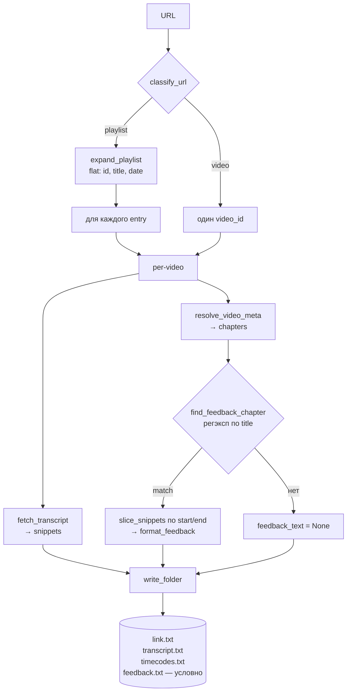

# Architecture

Парная документация к [`spec.md`](spec.md).

## Tooling

- `youtube-transcript-api` — субтитры (unofficial: скрапит внутренний endpoint YouTube; официальный `captions.download` требует OAuth + владения каналом).
- `yt-dlp` как библиотека, в двух режимах:
  - **Раскрытие плейлиста** — `YoutubeDL({'extract_flat': True})` отдаёт `[{id, title, upload_date}]` (быстро, без chapters).
  - **Per-video метаданные** — полный `extract_info` по одному видео, чтобы получить `chapters`. Вызывается в single-mode один раз и в playlist-mode по одному на каждый entry.
- Один `main.py` + `pyproject.toml` (PEP 621).

## CLI

```
single:    python main.py <video-url>    --slug SLUG --date YYYYMMDD   [--lang ru,en] [--overwrite]
playlist:  python main.py <playlist-url> --playlist-name NAME          [--lang ru,en] [--overwrite]
```

- **Single video**: `--slug` и `--date` обязательны. `--playlist-name` запрещён. Папка → `transcripts/single_videos/<slug>-<YYYYMMDD>/`.
- **Playlist**: `--playlist-name` обязателен. `--slug`/`--date` запрещены. Для каждого видео создаётся своя папка: `slug` = slugified title из YouTube, `date` = `upload_date` из yt-dlp в формате `YYYYMMDD`. Папка → `transcripts/<playlist-name>/<slug>-<YYYYMMDD>/`. Пользователь при необходимости переименовывает вложенные папки под convention (`mock-<company>-<role>-<level>-YYYY-MM-DD/` и т.п.) руками.
- `--lang` — приоритетный список языков, default `ru,en`.
- `--overwrite` — иначе skip+warn при существующей папке.

Корень репо определяется через `git rev-parse --show-toplevel`.

## Выход

### Корень бакета плейлиста (`transcripts/<playlist-name>/`)

- `link.txt` — URL самого плейлиста. Записывается всегда при запуске в playlist-режиме, чтобы бакет был самодостаточен и повторная выкачка не требовала внешних источников. В single-режиме не создаётся.

### Папка каждого видео

Совпадает с `transcripts/mock-template/`, плюс условный `feedback.txt`:

- `link.txt` — исходный URL видео
- `transcript.txt` — плейн-текст (snippets склеены пробелами, нормализованы)
- `timecodes.txt` — построчно `[mm:ss] text` (или `[hh:mm:ss]` если длительность > часа)
- `feedback.txt` — плейн-текст, срез `transcript.txt` по таймкодам чаптера с фидбеком. Формат файла фиксированный:
  ```
  # section: <chapter.title как есть>
  # timecode: [mm:ss]-[mm:ss]     # либо [hh:mm:ss]-[hh:mm:ss], если длина видео ≥ 1 ч (консистентно с timecodes.txt)

  <плейн-текст сниппетов в диапазоне чаптера>
  ```
  Шапка — audit trail: по ней видно, какой именно чаптер сматчился и с каких таймкодов взят текст. Создаётся **только если** у видео есть chapters И хотя бы один chapter матчится детектором И после нарезки остаётся непустой текст. Иначе файла нет — никаких заглушек и «best-effort» по хвосту видео.

Первые три файла создаются всегда; `feedback.txt` — условный.

## Поток исполнения



Функции (однострочно):

- `classify_url(url)` — `video` или `playlist`. `list=` без `v=` → playlist; `v=` (даже с `list=`) → video. Video_id ловим также из `youtu.be/<id>`, `shorts/<id>`, `embed/<id>`.
- `expand_playlist(url)` — yt-dlp `extract_flat=True`, возвращает `[{id, title, upload_date}]`. Быстро, без chapters.
- `resolve_video_meta(video_id)` — полный yt-dlp `extract_info` per-video ради `chapters`. В playlist-режиме `title`/`upload_date` для именования папки по-прежнему берём из `expand_playlist`.
- `fetch_transcript(video_id, lang_priority)` — manual(priority) → generated(priority) → first manual → first generated.
- `find_feedback_chapter(chapters)` — регэксп `обратн\w*\s+связ\w*|фидб[еэ]к|feedback` (case-insensitive) по `chapter.title`; первый матч → `{title, start, end}`, иначе `None`. Это и есть «детерминированная детекция» из `spec.md`.
- `slice_snippets(snippets, start, end)` — сниппеты с `start <= s.start < end`.
- `format_feedback(match, snippets, use_hours)` — шапка `# section: …` + `# timecode: [..]-[..]` + пустая строка + `to_plain_text(snippets)`. `use_hours` — тот же флаг, что в `to_timestamped`, чтобы формат таймкодов в `feedback.txt` и `timecodes.txt` совпадал.
- `write_folder(out_dir, url, snippets, overwrite, feedback_text=None)` — `mkdir -p`, три обязательных файла + `feedback.txt` если `feedback_text` непустой. Skip+warn при конфликте без `--overwrite`.

Ошибки: в single любая из `resolve_video_meta` / `fetch_transcript` → `return 1`. В playlist — stderr + `continue` + `failed += 1`; summary в конце.

Сеть: playlist = `1 + N + N` вызовов (flat + meta + транскрипт) вместо `1 + N`. Осознанный trade-off за единообразие single/playlist.

## Exit codes

- `0` — всё ок (single: папка записана; playlist: ≥1 папка записана). Отсутствие `feedback.txt` — **не ошибка**.
- `1` — транскрипт или метаданные не получены (single) / ни одной папки не записано (playlist). Ошибка `resolve_video_meta` трактуется так же, как ошибка транскрипта: в single → `return 1`; в playlist → stderr + `continue` + `failed += 1`.
- `2` — невалидный URL / конфликт флагов (отсутствуют `--slug`/`--date` для single; отсутствует `--playlist-name` для playlist; либо переданы флаги не того режима).

## Не делаем

- Режимов lecture/universal нет.
- Whisper / ASR fallback.
- Кеш.
- Скачивание видео/аудио.
- Авто-ретраи.
- **Fuzzy-fallback на фидбек**, если подходящего чаптера нет: не режем «по последним N минутам», не ищем ключевые слова по тексту транскрипта, не гадаем по структуре. Нет чаптера → нет `feedback.txt`. (Принцип «детерминированная детекция, без LLM» зафиксирован в `spec.md`; здесь — только запреты реализации.)
- Fallback с chapters на парсинг description (строк вида `MM:SS Title`).
- Удаление фидбек-сниппетов из `transcript.txt`/`timecodes.txt` — фидбек дублируется, не вырезается.
- Флаг `--feedback` / `--no-feedback` — триггер только по контенту (наличие подходящего чаптера).
