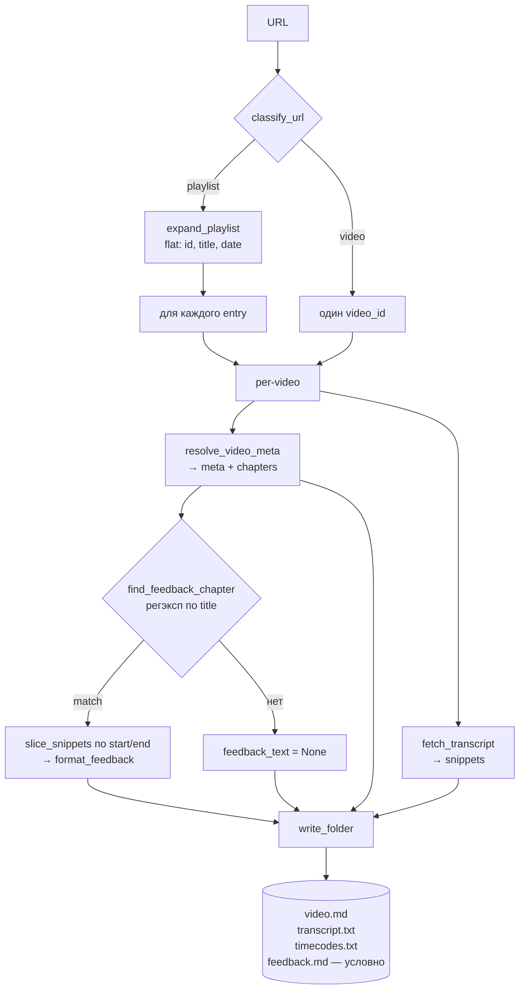

# Architecture

Парная документация к [`spec.md`](spec.md).

## Tooling

- `youtube-transcript-api` — субтитры (unofficial: скрапит внутренний endpoint YouTube; официальный `captions.download` требует OAuth + владения каналом).
- `yt-dlp` как библиотека, в двух режимах:
  - **Раскрытие плейлиста** — `YoutubeDL({'extract_flat': True})` отдаёт `[{id, title, upload_date}]` (быстро, без chapters).
  - **Per-video метаданные** — полный `extract_info` по одному видео; из него берём всё, что нужно для `video.md` и детектора фидбека (title, upload_date, duration, channel, description, chapters, counts, tags, thumbnail, language). Вызывается в single-mode один раз и в playlist-mode по одному на каждый entry.
- Один `main.py` + `pyproject.toml` (PEP 621).

## CLI

```
single:    python main.py <video-url>    --slug SLUG --date YYYYMMDD [--bucket PATH] [--lang ru,en] [--overwrite]
playlist:  python main.py <playlist-url> --playlist-name PATH         [--lang ru,en] [--overwrite]
```

Именование leaf и дерево каталогов: [`NAMING.md`](NAMING.md).

- **Single video**: `--slug` и `--date` обязательны. `--playlist-name` запрещён. Папка → `transcripts/<bucket>/<slug>-<YYYY-MM-DD>/` (default bucket: `single_videos`).
- **Playlist**: `--playlist-name` обязателен (может быть вложенным: `mock-interviews/karpov`). `--slug`/`--date` запрещены. Per-video папка: slugified title + `YYYY-MM-DD`; затем ручное переименование в hiring-паттерн из NAMING.md.
- `--lang` — приоритетный список языков, default `ru,en`.
- `--overwrite` — иначе skip+warn при существующей папке.

Корень репо определяется через `git rev-parse --show-toplevel`.

## Выход

### Корень бакета плейлиста (`transcripts/<playlist-name>/`)

- `link.txt` — URL самого плейлиста. Записывается всегда при запуске в playlist-режиме, чтобы бакет был самодостаточен и повторная выкачка не требовала внешних источников. В single-режиме не создаётся.

### Папка каждого видео

- `video.md` — общая метадата видео: YAML frontmatter + markdown body
- `transcript.txt` — плейн-текст (snippets склеены пробелами, нормализованы)
- `timecodes.txt` — построчно `[mm:ss] text` (или `[hh:mm:ss]` если длительность ≥ часа)
- `feedback.md` — срез `transcript.txt` по таймкодам чаптера с фидбеком, с frontmatter-шапкой

`video.md`, `transcript.txt`, `timecodes.txt` создаются всегда; `feedback.md` — условный.

#### `video.md`

Плоские скалярные поля — в frontmatter; многострочные (`chapters`, `description`) — секциями в body:

```
---
url: https://www.youtube.com/watch?v=XXX
title: "Full video title"
upload_date: 2024-01-19
duration: 3725
channel: "Karpov Courses"
view_count: 12345
like_count: 678
language: ru
thumbnail_url: https://i.ytimg.com/vi/XXX/maxresdefault.jpg
tags: [ml, interview, karpov]
---

## Chapters
- [00:00] Intro
- [47:10] Обратная связь

## Description

<raw description as-is>
```

Правила:

- Пустые / `None` / `0` / `[]` поля — **опускать ключ целиком**, никаких `null`. Детектируемо-пустое поле = ключа нет.
- `title` / `channel` / `thumbnail_url` — всегда в двойных кавычках (escape внутреннего `"` → `\"`).
- `upload_date` во frontmatter — `YYYY-MM-DD` (конвертим из `YYYYMMDD`, который yt-dlp отдаёт). Суффикс папки остаётся `YYYYMMDD` — внутри `video.md` приоритет читаемости.
- `duration` — сырые секунды (int).
- `tags` — YAML flow-list; пустой список = опустить ключ.
- `language` — `info.get("language")` из yt-dlp. Единственное поле языка; язык транскрипта отдельно не фиксируем (см. «Не делаем»).
- `## Chapters` секция: `[mm:ss] title` для каждого чаптера, или `[hh:mm:ss]` если `use_hours_for(snippets)` = true. Нет чаптеров → секция не пишется.
- `## Description` секция: сырое `info["description"]` as-is, включая переносы строк. Пусто → секция не пишется.

#### `feedback.md`

```
---
section: "Обратная связь"
start: "47:10"
end: "58:42"
start_seconds: 2830
end_seconds: 3522
---

<плейн-текст сниппетов в диапазоне чаптера>
```

- Квадратные скобки вокруг таймкодов убраны (в YAML `[47:10]` парсится как flow-list).
- `start` / `end` — строки, формат консистентен с `timecodes.txt` (`hh:mm:ss` если длина ≥ часа, иначе `mm:ss`).
- `start_seconds` / `end_seconds` — int, для скриптинга без парсинга строк.
- `section` — `chapter.title` as-is, в двойных кавычках; это audit-trail, по нему видно, какой именно чаптер сматчился.
- Создаётся **только если** у видео есть chapters И хотя бы один chapter матчится детектором И после нарезки остаётся непустой текст. Иначе файла нет — никаких заглушек и «best-effort» по хвосту видео.

## Поток исполнения



Функции (однострочно):

- `classify_url(url)` — `video` или `playlist`. `list=` без `v=` → playlist; `v=` (даже с `list=`) → video. Video_id ловим также из `youtu.be/<id>`, `shorts/<id>`, `embed/<id>`.
- `expand_playlist(url)` — yt-dlp `extract_flat=True`, возвращает `[{id, title, upload_date}]`. Быстро, без chapters и прочей метадаты.
- `resolve_video_meta(video_id)` — полный yt-dlp `extract_info` per-video. Возвращает `{url, title, upload_date, duration, channel, description, view_count, like_count, tags, thumbnail_url, language, chapters}`. Всё из одного вызова, дополнительных запросов нет. Пустые поля — `None` / `""` / `[]`; сериализатор `format_video_md` сам решает, что опускать. В playlist-режиме `title`/`upload_date` для именования папки по-прежнему берём из `expand_playlist` (быстрее и консистентно при перезапусках).
- `fetch_transcript(video_id, lang_priority)` — manual(priority) → generated(priority) → first manual → first generated.
- `find_feedback_chapter(chapters)` — регэксп `обратн\w*\s+связ\w*|фидб[еэ]к|feedback` (case-insensitive) по `chapter.title`; первый матч → `{title, start, end}`, иначе `None`. Это и есть «детерминированная детекция» из `spec.md`.
- `slice_snippets(snippets, start, end)` — сниппеты с `start <= s.start < end`.
- `format_video_md(meta, use_hours)` — рендерит `video.md`: YAML frontmatter из непустых плоских полей (пропускает `None` / `""` / `0` / `[]`) + `## Chapters` (если `meta["chapters"]` непуст) + `## Description` (если `meta["description"]` непуст). `use_hours` определяет формат таймкодов чаптеров. Строки в frontmatter всегда quoted (`"…"`), внутренние `"` экранируются.
- `format_feedback(match, snippets, use_hours)` — YAML frontmatter с полями `section` / `start` / `end` / `start_seconds` / `end_seconds` + пустая строка + `to_plain_text(snippets)`. `use_hours` — тот же флаг, что в `to_timestamped`, чтобы формат `start`/`end` в `feedback.md` и `timecodes.txt` совпадал.
- `write_folder(out_dir, meta, snippets, overwrite, feedback_text=None)` — `mkdir -p`; пишет `video.md` (через `format_video_md`), `transcript.txt`, `timecodes.txt` всегда, плюс `feedback.md` если `feedback_text` непустой. Per-video `link.txt` не создаётся. Skip+warn при конфликте без `--overwrite`.

Ошибки: в single любая из `resolve_video_meta` / `fetch_transcript` → `return 1`. В playlist — stderr + `continue` + `failed += 1`; summary в конце.

Сеть: playlist = `1 + N + N` вызовов (flat + meta + транскрипт) вместо `1 + N`. Осознанный trade-off за единообразие single/playlist.

## Exit codes

- `0` — всё ок (single: папка записана; playlist: ≥1 папка записана). Отсутствие `feedback.md` — **не ошибка**.
- `1` — транскрипт или метаданные не получены (single) / ни одной папки не записано (playlist). Ошибка `resolve_video_meta` трактуется так же, как ошибка транскрипта: в single → `return 1`; в playlist → stderr + `continue` + `failed += 1`.
- `2` — невалидный URL / конфликт флагов (отсутствуют `--slug`/`--date` для single; отсутствует `--playlist-name` для playlist; либо переданы флаги не того режима).

## Не делаем

- Режимов lecture/universal нет.
- Whisper / ASR fallback.
- Кеш.
- Скачивание видео/аудио.
- Авто-ретраи.
- **Fuzzy-fallback на фидбек**, если подходящего чаптера нет: не режем «по последним N минутам», не ищем ключевые слова по тексту транскрипта, не гадаем по структуре. Нет чаптера → нет `feedback.md`. (Принцип «детерминированная детекция, без LLM» зафиксирован в `spec.md`; здесь — только запреты реализации.)
- Fallback с chapters на парсинг description (строк вида `MM:SS Title`).
- Удаление фидбек-сниппетов из `transcript.txt`/`timecodes.txt` — фидбек дублируется, не вырезается.
- Флаг `--feedback` / `--no-feedback` — триггер только по контенту (наличие подходящего чаптера).
- Миграция уже выкачанных папок старого формата (`link.txt` + `feedback.txt`). `--overwrite` перезаписывает только канонические файлы нового формата (`video.md`, `transcript.txt`, `timecodes.txt`, `feedback.md`); посторонние артефакты прошлого формата остаются и чистятся вручную.
- Отдельное поле для языка транскрипта. `language` во frontmatter `video.md` — `info.get("language")` из yt-dlp, единственный источник истины; язык, фактически выбранный `fetch_transcript`, не сериализуется.
